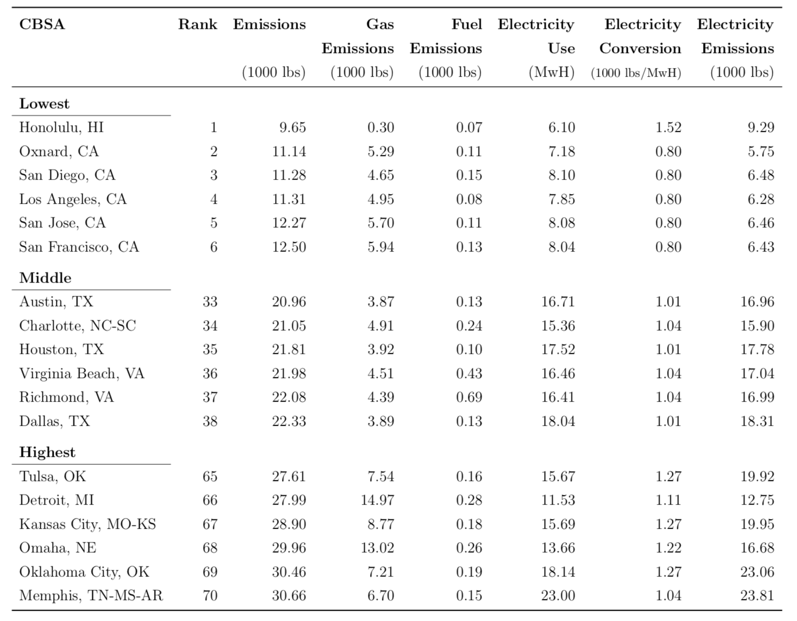

class: inverse, center, middle

```{R, setup, include = F}
options(htmltools.dir.version = FALSE)
# Load packages
pacman::p_load(
  broom, here, tidyverse, latex2exp, ggplot2, ggthemes, viridis, extrafont,
  gridExtra, kableExtra, dplyr, magrittr, knitr, parallel, tufte, emo, ggrepel,
  sf, hrbrthemes, lwgeom, maps, mapdata, spData, leaflet
)

# Define colors
## source color script from local directory
## comment out and replace colors if user is not Andrew
source("~/Documents/scripts/colors/colors.R")
# XaringanExtra functions
## Tile view
xaringanExtra::use_tile_view()
## Scribble
xaringanExtra::use_scribble()
# Knitr options
opts_chunk$set(
  comment = "#>",
  fig.align = "center",
  fig.height = 7,
  fig.width = 10.5,
  warning = F,
  message = F
)
options(device = function(file, width, height) {
  svg(tempfile(), width = width, height = height)
})
# A blank theme for ggplot
theme_empty <- theme_bw() + theme(
  line = element_blank(),
  rect = element_blank(),
  strip.text = element_blank(),
  axis.text = element_blank(),
  plot.title = element_blank(),
  axis.title = element_blank(),
  plot.margin = structure(c(0, 0, -0.5, -1), unit = "lines", valid.unit = 3L, class = "unit"),
  legend.position = "none"
)
theme_simple <- theme_bw() + theme(
  line = element_blank(),
  panel.grid = element_blank(),
  rect = element_blank(),
  strip.text = element_blank(),
  axis.text.x = element_text(size = 18, family = "STIXGeneral"),
  axis.text.y = element_blank(),
  axis.ticks = element_blank(),
  plot.title = element_blank(),
  axis.title = element_blank(),
  # plot.margin = structure(c(0, 0, -1, -1), unit = "lines", valid.unit = 3L, class = "unit"),
  legend.position = "none"
)
theme_axes_math <- theme_void() + theme(
  text = element_text(family = "MathJax_Math"),
  axis.title = element_text(size = 22),
  axis.title.x = element_text(hjust = .95, margin = margin(0.15, 0, 0, 0, unit = "lines")),
  axis.title.y = element_text(vjust = .95, margin = margin(0, 0.15, 0, 0, unit = "lines")),
  axis.line = element_line(
    color = "grey70",
    size = 0.25,
    arrow = arrow(angle = 30, length = unit(0.15, "inches")
  )),
  plot.margin = structure(c(1, 0, 1, 0), unit = "lines", valid.unit = 3L, class = "unit"),
  legend.position = "none"
)
theme_axes_serif <- theme_void() + theme(
  text = element_text(family = "MathJax_Main"),
  axis.title = element_text(size = 22),
  axis.title.x = element_text(hjust = .95, margin = margin(0.15, 0, 0, 0, unit = "lines")),
  axis.title.y = element_text(vjust = .95, margin = margin(0, 0.15, 0, 0, unit = "lines")),
  axis.line = element_line(
    color = "grey70",
    size = 0.25,
    arrow = arrow(angle = 30, length = unit(0.15, "inches")
  )),
  plot.margin = structure(c(1, 0, 1, 0), unit = "lines", valid.unit = 3L, class = "unit"),
  legend.position = "none"
)
theme_axes <- theme_void() + theme(
  text = element_text(family = "Fira Sans Book"),
  axis.title = element_text(size = 18),
  axis.title.x = element_text(hjust = .95, margin = margin(0.15, 0, 0, 0, unit = "lines")),
  axis.title.y = element_text(vjust = .95, margin = margin(0, 0.15, 0, 0, unit = "lines")),
  axis.line = element_line(
    color = grey_light,
    size = 0.25,
    arrow = arrow(angle = 30, length = unit(0.15, "inches")
  )),
  plot.margin = structure(c(1, 0, 1, 0), unit = "lines", valid.unit = 3L, class = "unit"),
  legend.position = "none"
)

```

```{r, echo = FALSE, cache = TRUE, results = FALSE, message = FALSE}
income <-  tidycensus::get_acs(
  geography = "county", variables = "B19013_001",
  state = c("WA", "OR", "CA"), geometry = TRUE
)
```


# Day One: Welcome!

---
#Introduction: About me

.hi[Name:] [Andrew Dickinson](https://github.com/ajdickinson) (call me Andrew)

- Office: 823 PLC, Office Hours: TBD, Email: .pink[adickin3@uoregon.edu]

--

- Third year Ph.D student researching:
  - Applied micro topics surrounding environmental economics
  - Causal inference, ML, and data science

--

.hi[Not school:]

  - From San Diego, CA

  - I enjoy spending time outside `r emo::ji("call me hand")`
  
--

      - `r emo::ji("person running")`, `r emo::ji("camping")`, `r emo::ji("person climbing")`, `r emo::ji("person surfing")`, `r emo::ji("skier")`, `r emo::ji("canoe")`, `r emo::ji("man mountain biking")`, etc.
  
---
# Introduction: About you

I hope that you:

--

- Are an eager student ready to learn about urban econ .hi-pink[synchronously<sup>.pink[†]</sup>]

.footnote[.pink[†] we will discuss this more soon]

--

- Has passed EC-201 with at least .hi-pink[some recollection] of the material

--

- Are ready to hit the ground running - this class is going to go fast


---
class: inverse
name: schedule
# Schedule

.pull-left[
.ul[.bigger[.hi-gold[Today:]]]

.hi-white[(i). Syllabus + Course Policies]

.hi-white[(ii). General Economics Discussion]

.hi-white[(iii). Intro to Urban Economics]
]

--

.pull-right[
.ul[.bigger[.hi-gold[Upcoming:]]]

  - .hi-white[EC201 review]
  
  - .hi-white[Reading]
  
  - .hi-white[PS01]
]

---
name:syllabus
# Syllabus

.biggest[[.hi-pink[All information is on the syllabus]](https://www.youtube.com/watch?v=aOIvB2YtAhY)]

- Please read the syllabus and consult it first before sending emails!

--

.hi[I want to discuss the following:]

--

.pull-left[
.hi[(i).] Course policies
]
.pull-right[
.hi[(ii).] Grades and grading]

---
# Syllabus: Zoom ground rules

--

.hi[(i).] Turn your camera on

--

.hi[(ii).] Mute mics when not talking

--

.hi[(iii).] Do not share images or recordings

--

.hi[(iv).] Feel free to interupt me or "raise hand"

.hi[(v).] Keep the chat open and use it

.hi[(vi).] If there is any technical difficulties tell me

--

No passwords are turned on for now but we will see if we get bombed

--

I will try and start the meeting a little early + stay on for OH


---
# Syllabus: Attendence

--

This class .hii[is not] asynchonous:

  - I will not make special accomodations
  - The expectation is that you attend class every day
  - Obviously, given the circumstances there exists some flexibility
    - ie. recorded lectures
  - The midterm \& final will be administered during class time
    
--

.hi[The quality of these lectures increase with participation and attendence]

.hi.orange[Complete] slides will be posted to [GitHub](https://github.com/johnmorehouse/EC330_UrbanEcon) _sometime_ after lecture<sup>.hi-pink[†]</sup>

- Will not include any annotations made during lecture


.footnote[
.hi-pink[†] This might vary from class to class, but they will be posted within a week of the lecture. 
]

---
# Syllabus: Grading

There are .hii[500] points total.  .hi[Your grade will be determined by:]

--

- 35%: Final Exam (1x): 175 points

- 30%: Midterm Exam (1x): 150 points

- 15%: Problem sets (2x): 37.5 points each

- 10%: Book Report (1x): 50 points

- 10%: Quizzes (x.hii[?]): 50 points

--

<br>

.center[.qa[Q]: Is there a curve?]

--

.center[.qa[A]: Maybe]

---
class: middle
# Syllabus: Grading

Following department policies, for 300 and 400 level classes roughly 65% of the class will receive A’s and B’s.

From the syllabus:

> Your grade will be determined relative to your peers, so during the course, I will not be able to tell you what your exact letter grade is at any point in time, because it depends on everyone’s overall scores of the class.

---
# Syllabus: Exams

.hi[Midterm:] Monday of week 03 (.pink[August 02])

.hi[Final]: Thursday of week 04 (.pink[August 12])

--

.center[.hi[Absolutely no makeups]]
  
--

Under .hi[extraordinary circumstances] I will shift midterm weight to the final
- Entirely by my discretion
- Must contact me before the exam via email
    
--

.hi[Drop this course if you are unable to take the scheduled midterm]

--

Roughly 10% of points on the exam will be given for neatness + readability
- I will take points off for poor: Image quality, handwriting

---

#Syllabus: Triumph of the City

Required reading [Triumph of the City](https://www.amazon.com/Triumph-City-Greatest-Invention-Healthier/dp/0143120549) by Ed. Glaeser. 

- .hi[Problem sets:] Several questions (gifts) from assigned reading

--

- .hi[Exams:] Several questions (gifts) from the book 

  - the questions will be pretty easy

--

- .hi[Book Report:] Due Sunday following the final exam (August 15)

  - Instructions and a rubric are posted on the course github + canvas
  
  - Syllabus has the reading schedule. Feel free to read ahead
  
--

.hi[This is a suuuuper interesting book and easy to read. Read every night.]

---
# Syllabus: Quizzes

Several .hii[pop] quizzes will be given out during lecture

--

No quizzes will be announced ahead of time

--

<br>

.hi[They will be easy practice questions with a 24 hour time limit]

--

- Incentivize keeping up with the current course material

--

- I have not determined the number of quizzes

--

This class will move very very fast in 4 weeks
- Quizzes are designed to keep you on top of the material

---
#Syllabus: Homework

There will be .hi[2 problem sets] throughout the term:

- Each one is worth .hii[7.5%] of your grade

- You must submit a .hi[pdf] document on Canvas

--

.center[.hii[No late homework assignments will be accepted]]

--

.hi[Start them early], they will cover a lot of material

--

<br>

.hi[Geared to prepare you for the exams. Think of them as a .ul[study guide.]]

---
# Syllabus: Canvas + Github

--

.hi[Canvas:]

- I hate canvas

--

- But I don't have a better alternative

  - On my to-do list
  
--

- Predominate use is for submitting PS/Quizzes and announcements

--

[Github:](https://github.com/ajdickinson/ec330-summer21)

--

- Light, public course page with links to all course material

- Do not need an account. It is just easier for me

---
class: inverse, middle, center
# What is economics?

---
# What is economics?

.hi[_The Wealth of Nations_] _by_ [Adam Smith](https://www.adamsmith.org/about-adam-smith) (1776)

--

- Seminal work on economics, four volumes; as important to its field as:

  - Newton’s _Principia Mathematica_
  
  - Darwin’s _Origin of Species_
  
--

- "Wealth" ("weal")

  - Money and other assets
  
  - But also well-being, welfare
  
--
  
- Archaic use of "wealth" make it seem like economics is merely the study of how to get rich

---
# What is economics?

In a nutshell:

.center[.hi[Economics is the study of how people make allocation decisions to maximize their happiness when facing limit resources (budgets)]]

--

There is never enough resources to fulfill all human wants

Scarcity gives us constraints and we do the best _we can_ s.t. constraints

--

.hi[Not just money:]
.pull-left[
  - Time
- Health]
.pull-right[
  - Land
- Natural resources]

--

.hi[Economics is very general]; the market lens can be used across many topics

---
# Economics "wheelhouse"

Explain how people and firms .hi[actually behave]; less about how they _should behave_

- Normative vs positive statements

--

  - Normative statements: Matters of opinion that may never be resolved
  
  - .hii[Positive statements:] Matters of fact that can be resolved by data
  
--

- Figure out what the data say for evidence-based policy making

--

.hi[Opportunity cost:] What you have to give up by not putting a resource to its _next-best_ alternative use

- Economist use the word .hii[cost] differently than the general public
  - "Cost" is different than "price"

---
class: inverse, center, middle
# Intro to Urban Economics

---
name:what_is_it
# Intro to Urban Economics

A mashup between .hi[geography] and .hi[economics].


.hi[Economics:] Study of how people and firms allocate scarce resources.

--

.hii[Geography:] Studies effects of location and the environment 
- Hydrology, climate, resources, etc.

--

.hi[Economics] + .hii[Geography]  : Study of how individuals and firms choose utility and profit maximizing locations, and consequences of these decisions

---
# Intro to Urban Economics

We will study how the .hi[distribution] of people & firms across space impacts:

--

.pull-left[
  - City growth `r emo::ji("cityscape")`
- Crime `r emo::ji("policewoman")`
- The environment `r emo::ji("recycle")`]
.pull-right[
  - Income growth & inequality  `r emo::ji("chart increasing")`
- Education `r emo::ji("school")`
- Employment + wages `r emo::ji("money-mouth face")`]
  
--

We will also examine the efficacy of various .hi[place - based policies]
.pull-left[
  - Minimum Wage
- Rent Control]
.pull-right[
  - Land Use Restrictions
- Sustainability]

--

<br>

.hi[What are the economic drivers behind urban development?]

---
# This Course

This class has two fairly distinct halves:

1. .hi[Philosophy & Tools]

  - Why do cities exist? Why do they grow? Why do they decline?
  
  - Fundamental tools of labor & urban econ (supply and demand)
  
--

2. .hi[Application]

  - Rent Control & Minimum Wage
  
  - Highways and urban transportation
  
  - Income inequality and environmental issues

---
# What is a city?

--

.hi[The Census Bureau Says...]

--

- .hi[Urban Area:] a .hii[densely settled geographical area] with:
  - Minimum population of .hi[2,500]
  - Minimum density of .hi[500 people per square mile]

--

- Metropolitan Area: an urbanized area with at - least .hi[50k population]
- Micropolitan Area: an urbanized area with at least .hi[10k] but not as many as .hi[50k] people
- MSA: abbrev. for .slate[both] .hi[metropolitan] and .hi[micropolitan] statistical area
- Principal City: the .hi.orange[largest municipality in an MSA]

--

.hi[City:] .blue[Dense collection of people in specific geographic area]

---
# Intro to Urban: Cities

The majority of the US population lives in cities<sup>.smallest[.hi-pink[†]]</sup> and more people will continue to migrate into urban areas

.footnote[.hi-pink[†]. 80 - ish percent, according to the Census Bureau]

.hi[Questions:]

--

1. Do you like cities?

2. What are favorite city .hii[amenities]?

3. Are cities at odds with the natural world?

--

.hi[Why do cities exist?]

--

.center[.hi[Location matters]]

--

Let's look at some data

---
# Intro to Urban: Wages
```{r westcoast_income, include=FALSE, echo=FALSE, message=F, cache=TRUE}

income_cty <-  tidycensus::get_acs(
  geography = "county", variables = "B19013_001",
  state = c("WA", "OR", "CA"), geometry = TRUE
)

income_tct <-  tidycensus::get_acs(
  geography = "tract", variables = "B19013_001",
  state = "OR", geometry = TRUE
)

col_pal <- leaflet::colorQuantile(palette = "viridis", domain = income$estimate, n = 10)
```


```{r, wage_leaflet, echo=F, eval=FALSE}

income_cty %>%
  mutate(county = gsub(",.*", "", NAME)) %>% ## Get rid of everything after the first comma
  st_transform(crs = "+init=epsg:4326") %>%
  leaflet(width = "100%") %>%
  addProviderTiles(provider = "CartoDB.Positron") %>%
  addPolygons(
    popup = ~paste0(county, "<br>", "HH Income: ", prettyNum(estimate, big.mark=",")),
    stroke = FALSE,
    smoothFactor = 0,
    fillOpacity = 0.8,
    color = ~col_pal(estimate)
  ) %>%
  addLegend(
    "bottomright", 
    pal = col_pal, 
    values = ~estimate,
    title = "Income percentiles",
    opacity = 1
  )

```

---
# Intro to Urban: Wages

```{r, wage_leaflet2, echo=F, eval=FALSE}

income_tct %>%
  mutate(county = gsub(",.*", "", NAME)) %>% ## Get rid of everything after the first comma
  st_transform(crs = "+init=epsg:4326") %>%
  leaflet(width = "100%") %>%
  addProviderTiles(provider = "CartoDB.Positron") %>%
  addPolygons(
    popup = ~paste0(county, "<br>", "HH Income: ", prettyNum(estimate, big.mark=",")),
    stroke = FALSE,
    smoothFactor = 0,
    fillOpacity = 0.8,
    color = ~col_pal(estimate)
  ) %>%
  addLegend(
    "bottomright", 
    pal = col_pal, 
    values = ~estimate,
    title = "Income percentiles",
    opacity = 1
  )

```

---
# Intro to Urban: Income & Population

```{R, data, echo = F, cache=T}
rent<-  tidycensus::get_acs(
  geography = "county", variables = "DP04_0134",
  state = c("WA", "OR", "CA"), geometry = TRUE
)

pop<-tidycensus::get_acs(
  geography = "county", variables = "B01003_001",
  state = c("WA", "OR", "CA"), geometry = TRUE
)

#rent
rent_tib <-
  rent %>% as_tibble() %>%
  dplyr::select(-geometry) %>%
  dplyr::rename(rent = estimate)

#clean and renmae
pop_tib <-  pop %>% as_tibble() %>%
  dplyr::select(-geometry, -moe) %>%
  dplyr::rename(population = estimate)

#clean and rename
income_tib <-
  income %>% as_tibble() %>%
  dplyr::select(-geometry) %>%
  dplyr::rename(income = estimate)

#add income and rent levels to pop df
pop_tib$rent <- rent_tib$rent
pop_tib$income <- income_tib$income

#finish dataframe
pop_tib_f <- pop_tib %>% 
  mutate(log_pop = log(population),
         log_rent = log(rent),
         log_inc = log(income))


```


```{R, inc_plot, echo=F,fig.height = 5, fig.width = 8, dev = "svg", cache=T}

ggplot(data = pop_tib_f,aes(x =log_pop, y= log_inc))+
  geom_point(col = "red", alpha =.8)+
  geom_smooth(col = "black", se = F, method  =lm, size = .5)+
  theme_classic()+
  labs(x= "Log(Population)", y= "Log(HH Income)",title = "West Coast HH Income and Population", "Observations are counties\n", subtitle = "Data: American Community Survey\n")+
  theme(axis.text.x=element_text(size=rel(2)),
        axis.title.x = element_text(size=rel(2)),
        axis.text.y=element_text(size=rel(2)),
        axis.title.y = element_text(size=rel(2)),
        legend.position="none")
```

---
  
  
# Intro to Urban: Rent and Population
  
  
```{R, rent_plot, echo=F,fig.height = 5, fig.width = 8, dev = "svg", cache=T}
ggplot(data= pop_tib_f,aes(x =log_pop, y= log_rent))+
  geom_point(col = "purple", alpha =.8)+
  geom_smooth(col = "black", se = F, method =lm, size = .5)+
  theme_classic()+
  labs(x= "Log(Population)", y= "Log(Rents)", title = "West Coast Rent and Population", "Observations are counties\n", subtitle = "Data: American Community Survey\n")+
  theme(axis.text.x=element_text(size=rel(2)),
        axis.title.x = element_text(size=rel(2)),
        axis.text.y=element_text(size=rel(2)),
        axis.title.y = element_text(size=rel(2)),
        legend.position="none")
```

---

# Intro to Urban: Economic Oppurtunity


```{R, chetty, out.width = "90%", echo = F}
include_graphics("figures/chetty_map.png")
```


Source: [The Equality of Oppurtunity Project](http://www.equality-of-opportunity.org/neighborhoods/) 

---

# Intro to Urban: Carbon Emissions

```{R, cm, out.width = "80%", echo = F}

```

Source: [Colas & Morehouse (2019)](https://drive.google.com/file/d/1-Cn6OiwNJeWksrKi7WG-58th77odfNm4/view)


---
# Intro to Urban: Location...

Where you live has implications for

--

- Your contribution to .hi[global carbon emissions] 

  - _Why does this vary across cities?_

--

- Your .hi[wage] and .hi[rent] 

  - _Why does this vary across cities?_

--

- Your .hii[economic mobility]

  - _Why does this vary across cities?_
  
--

.hi[We will answer these questions as we progress through this course]

---
name:what_is_model
# Our Toolkit

In this class we will make use of various .hi[mathematical models]

--

1. What is a .hi[mathematical model]?

  - A model is a desciription of a system using .... .hi[math]
  
  - Useful to help .hi[explain] and .hi[predict] behavior

--

.hi[The Canonical Example]

\begin{align*}
\text{Supply}:\hspace{.1in} P(Q_s) &= 10 + 5*Q_s\\
\text{Demand}: \hspace{.1in}P(Q_d) &= 20 - 2*Q_d
\end{align*}

--

This model allows us to make predictions about prices and quantities (from the supply & demand side), _and_ the .hi[equilibrium] price and quantity


---
# Models

1. What are the .hii[pros] of models?

  - Allows for us to be very percise with our language
  
  - Gives us the ability to .hi[predict] the various aspects of the economy
  
  - Can shed insight on .hi[mechanisms] through which procceses interact
  
--
  
2. What are the .hii[cons] of models?

  - They require assumptions
  
  - Claim: .hi[Almost] all assumptions are wrong

--
  - .hi[Follow up:] Not all wrong assumptions are useless
    
--

The ability of the model to .hii[predict data] and .hii[understand mechanisms] determines how useful it is

---

# Models Part II

Did we make assumptions our supply/demand model? .hi.purple[Discuss]


\begin{align*}
\text{Supply}:\hspace{.1in} P(Q_s) &= 10 + 5*Q_s\\
\text{Demand}: \hspace{.1in}P(Q_d) &= 20 - 2*Q_d
\end{align*}

--

1. .hi[Marginal values] are diminishing and .hi[marginal costs] are increasing <sup>.hi[†]</sup>

  - Generates downward demand and upward supply
  
.footnote[.hi[†]: Marginal = Adding one additional unit]
  
2. Demand and Supply are .hi[linear]

3. Demand and Supply are .hi[deterministic]

--

Are these reasonable? Can your behavior be explained by a simple .hi[linear function]?

--

.center[.hi[Does a function even exist?]]

---
class: inverse, middle
# Planning

.pull-left[
.hi-white[Next Class]:

- EC201 Review

- 5 Axioms of Urban Economics]

--

.pull-right[
.hi-white[Reading]:

- Get the book ASAP!!

- Read the introduction]

---


#Table of Contents

.col-left[
###Admin
.smallest[
1. [Schedule](#schedule)
1. [Syllabus](#syllabus)
]


###Intro to Urban Economics
.smallest[

1. [What is Urban Economics?](#what_is_it)

1. [What is a city?](#what_is_city)
  
1. [What is a model and why are they useful?](#what_is_model)

]
]


