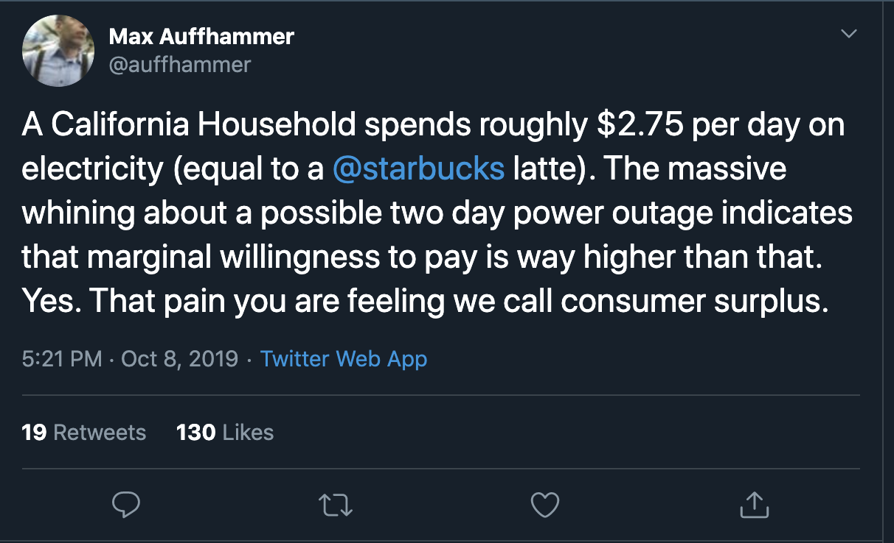

class: inverse, center, middle

```{R, setup, include = F}
options(htmltools.dir.version = FALSE)
# Load packages
pacman::p_load(
  broom, here, tidyverse, latex2exp, ggplot2, ggthemes, viridis, extrafont,
  gridExtra, kableExtra, dplyr, magrittr, knitr, parallel, tufte, emo, ggrepel,
  sf, hrbrthemes, lwgeom, maps, mapdata, spData, leaflet, huxtable
)

# Define colors
## source color script from local directory
## comment out and replace colors if user is not Andrew
source("~/Documents/scripts/colors/colors.R")
# XaringanExtra functions
## Tile view
xaringanExtra::use_tile_view()
## Scribble
xaringanExtra::use_scribble()
# Knitr options
opts_chunk$set(
  comment = "#>",
  fig.align = "center",
  fig.height = 7,
  fig.width = 10.5,
  warning = F,
  message = F
)
options(device = function(file, width, height) {
  svg(tempfile(), width = width, height = height)
})
# A simple theme for supply + demand curves
# A blank theme for ggplot
theme_empty <- theme_bw() + theme(
  line = element_blank(),
  rect = element_blank(),
  strip.text = element_blank(),
  axis.text = element_blank(),
  plot.title = element_blank(),
  axis.title = element_blank(),
  plot.margin = structure(c(0, 0, -0.5, -1), unit = "lines", valid.unit = 3L, class = "unit"),
  legend.position = "none"
)
theme_simple <- theme_bw() + theme(
  line = element_blank(),
  panel.grid = element_blank(),
  rect = element_blank(),
  strip.text = element_blank(),
  axis.text.x = element_text(size = 18, family = "STIXGeneral"),
  axis.text.y = element_blank(),
  axis.ticks = element_blank(),
  plot.title = element_blank(),
  axis.title = element_blank(),
  # plot.margin = structure(c(0, 0, -1, -1), unit = "lines", valid.unit = 3L, class = "unit"),
  legend.position = "none"
)
theme_axes_math <- theme_void() + theme(
  text = element_text(family = "MathJax_Math"),
  axis.title = element_text(size = 22),
  axis.title.x = element_text(hjust = .95, margin = margin(0.15, 0, 0, 0, unit = "lines")),
  axis.title.y = element_text(vjust = .95, margin = margin(0, 0.15, 0, 0, unit = "lines")),
  axis.line = element_line(
    color = "grey70",
    size = 0.25,
    arrow = arrow(angle = 30, length = unit(0.15, "inches")
  )),
  plot.margin = structure(c(1, 0, 1, 0), unit = "lines", valid.unit = 3L, class = "unit"),
  legend.position = "none"
)
theme_axes_serif <- theme_void() + theme(
  text = element_text(family = "MathJax_Main"),
  axis.title = element_text(size = 22),
  axis.title.x = element_text(hjust = .95, margin = margin(0.15, 0, 0, 0, unit = "lines")),
  axis.title.y = element_text(vjust = .95, margin = margin(0, 0.15, 0, 0, unit = "lines")),
  axis.line = element_line(
    color = "grey70",
    size = 0.25,
    arrow = arrow(angle = 30, length = unit(0.15, "inches")
  )),
  plot.margin = structure(c(1, 0, 1, 0), unit = "lines", valid.unit = 3L, class = "unit"),
  legend.position = "none"
)
theme_axes <- theme_void() + theme(
  text = element_text(family = "Fira Sans Book"),
  axis.title = element_text(size = 18),
  axis.title.x = element_text(hjust = .95, margin = margin(0.15, 0, 0, 0, unit = "lines")),
  axis.title.y = element_text(vjust = .95, margin = margin(0, 0.15, 0, 0, unit = "lines")),
  axis.line = element_line(
    color = grey_light,
    size = 0.25,
    arrow = arrow(angle = 30, length = unit(0.15, "inches")
  )),
  plot.margin = structure(c(1, 0, 1, 0), unit = "lines", valid.unit = 3L, class = "unit"),
  legend.position = "none"
)
theme_curves <- theme_ipsum() + theme(axis.line = element_line(),
        panel.grid.minor = element_blank())

```


# Lecture 02: Review & The 5 Axioms of Urban Economics

---
class: inverse
name: schedule

# Schedule

.pull-left[
.ul[.bigger[.hi-white[Today:]]]

.hi-white[(i). EC-201 review]

.hi-white[(ii). The five axioms of urban econ]
]

--

.pull-right[
.ul[.bigger[.hi-white[Upcoming:]]]

  - .hi-white[EC-201 Review Quiz on Canvas]
  
  - .hi-white[Letter of Intro on Canvas]
  
  - [Reading:](https://rawcdn.githack.com/ajdickinson/ec330-summer21/db71091164ea554b0bb7c7bb90528ece563e0bac/resources/Triumph-of-the-City-Edward-Glaeser.pdf) intro + chapter 1
]

---
class:inverse
name: ec201_review
# Review

Resources for more EC-201 review

- [Khan academy](https://www.khanacademy.org/economics-finance-domain/microeconomics/basic-economic-concepts-gen-micro#economics-introduction)

---

name:utility

# Review 010: Utility

.ul[.hi[Definitions:]]

- .hi[Utility:] Satisfaction one receives from consuming a good or a service

  - Ordinal not cardinal; only know order of preference not how much
  
--

- .hi[Utility function:] $U(x)$ A function that describes utility given from $x$
  
--
  
- .hi[Marginal Utility:] Additional utility received from one additional good

--

- .hi[The Law of Diminishing Marginal Utility:] Marginal utility decreases as one consumes more and more goods or services

---
name:demand
# Review 011: Demand

.hi[Definition:] The relationship between price and quantities (demanded)

--

.pull-left[

.hi[The Law of Demand]

- $P \uparrow \longrightarrow Q_d \downarrow$

- When prices increase, quantity demanded decreases

<br>

The key players are .hii[consumers]

]

--

.pull-right[
.hi-orange[Example:] Demand schedule

```{r, table01, echo = FALSE}
ex01 <- tibble(
  p = seq(2, 10, 2),
  q = 1250 - p*250/2
)

ex01 %>% kable(
  col.names = c("Price", "Quantity"),
  align = c("l", "c")
) %>%
kable_styling(font_size = 18) %>%
row_spec(1:5, background = "white", color = slate)
```
]

--
  
  - .hi[Demand curves] are constructed from .hi[consumers] making optimal purchase decisions

---

# Review 011: Demand

```{r, plot01, echo = FALSE, fig.width = 10, fig.height = 7}
ggplot(ex01, aes(x = q, y = p)) +
  geom_point(size = 2) +
  geom_line() +
  theme_curves +
  geom_text(x = 250, y=4, label = "Quantity = 1250 - 125*Price", vjust=2) +
  labs(x = "Quantity",
       y = "Price",
       title = "Demand schedule")
```

--

Movement vs shift in demand

---

# Review 011: Demand

```{r, plot01b, echo = FALSE, fig.width = 10, fig.height = 7}
tibble(
  p = 1:20,
  q = 4/p
) |> ggplot(aes(x = q, y = p)) +
  geom_point(size = 2) +
  geom_line() +
  theme_curves +
  geom_text(x = 1, y=10, label = "Quantity = 4/P", vjust=2) +
  labs(x = "Quantity",
       y = "Price",
       title = "Demand schedule")
```

---

# Review 012: Supply

.hi[Definition:] The relationship between prices and quanitities (supplied)

--

.pull-left[
.hi[The Law of Supply:]

- When prices increase, the quantity supplied increases

- $P \uparrow \longrightarrow Q_s \uparrow$

<br>

The key players are .hi[firms]
]

--

.pull-right[
.hi-orange[Example:] Supply schedule
```{r, table02, echo = FALSE}
ex02 <- tibble(
  p = seq(2, 10, 2),
  q = p*250/2
)

ex02 %>% kable(
  col.names = c("Price", "Quantity"),
  align = c("l", "c")
) %>%
kable_styling(font_size = 18) %>%
row_spec(1:5, background = "white", color = slate)
```
]

--


.hi[Supply curves] are constructed from .hii[producers] making optimal pruduction decisions

---

# Review 012: Supply 

.center[
```{r, plot02a, echo = FALSE, fig.width = 10, fig.height = 7}
ggplot(ex02, aes(x = q, y = p)) +
  geom_point(size = 2) +
  geom_line() +
  geom_text(x = 500, y=8, label = "Quantity = 125*Price", vjust=2) +
  theme_curves +
  theme(axis.line = element_line()) +
  labs(x = "Quantity",
       y = "Price",
       title = "Supply schedule")
```
]

--

Movement vs shift in demand

---

# Review 012: Supply

.center[
```{r, plot02b, echo = FALSE, fig.width = 10, fig.height = 7}

tibble(
  p = 1:20,
  q = (p)^(1/3)
) |> ggplot(aes(x = q, y = p)) +
      geom_point(size = 2) +
      geom_line() +
      geom_text(x = 1.5, y=15, label = "Quantity = Price^(1/3)", vjust=2) +
      theme_curves +
      theme(axis.line = element_line()) +
      labs(x = "Quantity",
           y = "Price",
           title = "Supply schedule")
```
]


---
# Review 013: Equilibrium + surplus

.ul[.hi[Definitions:]]

--

- .hi[Equilibrium:] A pair of points $(Q*,P*)$ such that there is no excess supply or demand

  - Supply = Demand
  
  - .ul[.blue[Fundamental Assumptions:]] Marginal value (utility) is decreasing and marginal cost is increasing
  
--
  
- .hi[Consumer Surplus:] The difference between a conumers .hi-gold[maximum] willingness to pay (WTP) and the market price

--

- .hi[Producer Surplus:] The difference between the price producers .hii[minimum] willingness to sell and the market price

---
# Review 013: Market equilibrium

--

.center[
```{r, plot03, echo = FALSE, fig.width = 10, fig.height = 7}

ggplot() +
  geom_line(data = ex01, aes(x = q, y = p), color = red_pink) +
  geom_line(data = ex02, aes(x = q, y = p), color = purple) +
  geom_text(x = 500, y=8, label = "Quantity = 125*Price", vjust=2) +
  geom_point(aes(y = 5, x = 625), size = 3) +
  theme_curves +
  theme(axis.line = element_line()) +
  labs(x = "Quantity",
       y = "Price",
       title = "Equilibrium")
```
]

---
# Review 013: Market equilibrium shifts

--

---
# Example: Consumer surplus

--




Source: [@auffhammer](https://twitter.com/auffhammer)

---

# Example: Solve for the equilibrium


.hi[Example]

Suppose we are given the following:

- Supply: $\color{#e64173} {P(Q_s) = 10 + Q_s}$

- Demand: $\color{#6A5ACD} {P(Q_d)  = 20 - 4*Q_d}$

--

.hi[Task:]

.hii[(i).] Carefully graph and label both curves

.hii[(ii).] Compute the Equilibrium

.hii[(iii).] Compute Consumer and Producer Surplus

---
# Example: Solve for the equilibrium

- Supply: $\color{#e64173} {P(Q_s) = 10 + Q_s}$

- Demand: $\color{#6A5ACD} {P(Q_d)  = 20 - 4*Q_d}$

--

```{R, supply_demand, echo=F,fig.height = 4.5, fig.width = 8, dev = "svg", cache=T}
#supply and demand example
supply_one <- function(x) 10+ x
demand_one <- function(x) 20 - 4*x

#create supply and demand graph
ggplot(data.frame(x=c(0, 10)), aes(x)) + 
  stat_function(fun=supply_one, col = red_pink)+
  stat_function(fun = demand_one, col = "purple")+
  geom_vline(xintercept =0, size = 0.5)+
  geom_hline(yintercept =0, size = 0.5)+
  geom_segment(x = 2, xend=2, y=0, yend=12, linetype = "dashed")+
  geom_segment(x = 0, xend=2, y=12, yend=12, linetype = "dashed")+
  geom_text(aes(x=2.4, label= "(2,12)", y=11.9))+
  geom_text(aes(x = .5, y= 13, label = "CS"))+
  geom_text(aes(x = .5, y=11, label = "PS"))+
  ggthemes::theme_pander()+
  ylim(0,20)+
  xlim(0,7)+
  labs(x = "Quantity", y= "Price")


```


---
# Example: Solve for the equilibrium

- .hi[Equilibrium]:

\begin{align*}
10 + Q^\star &= 20 - 4*Q^\star\\
5Q^\star &= 10\\
Q^\star &= 2
\end{align*}

Plug this into either supply or demand equation to get:

\begin{align*}
P^\star = 10 + 2 = 12
\end{align*}

--

- .hi[Consumer Surplus]: 

  - $CS= \frac{1}{2}*(20-12)*(2-0) = 8$
  
--

- .hi[Producer Surplus]: 

  - $PS = \frac{1}{2}*(12-10)(2-0) = 2$
  
---
# Quiz 01:

Using the follow supply + demand functions

.hii[Supply:] $Q(p_s) = 15 + \frac{1}{2} * p_s$

.hi[Demand:] $Q(p_d) = 40 - \frac{2}{3} * p_d$

Determine:

- (i) Graph each curve and label carefully
- (ii). Equilibrium prices ( $p^*$ ) and quantities ( $q^*$ )
- (iii). Consumer surplus
- (iv). Producer surplus

---
name:elasticites
# Review 014: Elasticities

.hi[Elasticity:] A measure of responsiveness of one variable to another

- .hii[in percentage terms]

--

.hi[Common elasticities:]

--

- .hi[Own price elasticity (good x)]: Measures how much quantity demanded for .hi[x] will respond to a one percent change in the price of good .hi[x]
  
    - Formula: $\varepsilon_{x, P_x} = \frac{\%\Delta Q_x}{\%\Delta P_x}$
--

- .hi[Cross price elasticity (goods x,y)]: Measures how much quantity demanded for .hi[x] will respond to a one percent change in the price of .hii[y]
    
    - Formula: $\varepsilon_{x,P_y} = \frac{\%\Delta Q_x}{\%\Delta P_y}$
    
---
# Review 014: Elasticities (examples)

Own price elasticity:

--

Cross price elasticity:

---
# Review 014: Elasticities

Suppose $\varepsilon_{x, P_x}= -0.5$. What does this mean in words?

--

A 1% change in the .hi[price of good x] will lead to a .5% change in the _opposite_ direction in the .hi[quantity demanded for good x]

--

The equation can be helpful. If $\varepsilon_{x, P_x}= -0.5$, then:

\begin{align*}
\frac{\%\Delta Q_x}{\%\Delta P_x}&= -0.5\\
\%\Delta Q_x &= -0.5 * \%\Delta P_x
\end{align*}


---
exclude: false
# Review 014: Elasticities (questions)


.hi[Review Questions:]

- If $\varepsilon_{x,y}>0$, are these goods complements or substitutes?

--

  - Substitutes, because an increase in the price of $y$ .hi[increases] demand for $x$
  
  - Lame example: cheerios and other cereal
  
--

-  If $\varepsilon_{x,y}<0$, are these goods complements or substitutes?

--

  - Complements, because an increase in the price of $y$ .hi[decreases] demand for $x$
  
  - Lame example: Left and right shoes; pb and bananas
  
---
name:profit
# Review 015: Cost functions

.ul[.hi[Defintions:]]

- .hi[Total Revenue (TR)]: Total money firm brings in from selling $Q$ units. 
  
  - $TR = P*Q$
  
--

- .hi[Total Cost (TC)]: The cost of producing $Q$ units units

--

- .hi[Average Cost (AC)] = $\frac{TC}{Q}$

--

- .hi[Profit] (denoted as $\Pi$): 

.center[$\Pi = TR-TC$]
  
---
# Review 015: Cost functions

Suppose the price of the output good is $3$ dollars per unit. Suppose a firm's cost function is $TC(Q) = 1+Q$. If the firm produces 8 units of the good, calculate:

- $TR$

- $TC$

- $AC$

- Profit


---

# Review 015: Cost functions

Suppose the price of the output good is $3$ dollars per unit. Suppose a firm's cost function is $TC(Q) = 1+Q$. If the firm produces 8 units of the good, calculate:


- $TR = 3*8 = 24$

- $TC = 1 + 8 = 9$

- $AC = \frac{9}{8}$ 

- Profit $= 24 - 9 = 15$


---

class: inverse, center, middle
name:axioms
# The Five Axioms of Urban Economics

---

# The Five Axioms of Urban Economics

As discussed in [lecture 01](https://rawcdn.githack.com/ajdickinson/ec330-summer21/a75becc5e8f60e4d338d1a81d452b5fd09c2a905/slides/001-intro/01-intro.html), we are after some big questions in this course

- Agree upon a few basics before moving onto more complex problems

--

.hi[.ul[Definition:] Axiom]

- A statement which is regarded as being established or evidently true

- Long agreed upon assumptions

--

Axioms are the building blocks upon which theory is built

--

The 5 axioms of urban econ are 5 assumptions that we will take _as given_ throughout the class

- Almost everything moving forward will be tied to one of these assumptions


---

# The Five Axioms of Urban Economics

Some lectures will focus on refining our understanding of these axioms

--

Almost everything we learn ties back to one of the 5 axioms

--

.ul[.hi[(A1).]] Prices adjust to acheive locational equilibrium

.ul[.hi[(A2).]] Self-reinforcing effects generate extreme outcomes

.ul[.hi[(A3).]] Externalities are inefficient

.ul[.hi[(A4).]] Production is subject to economies of scale

.ul[.hi[(A5).]] Competition generates zero economic profit

---
class: hide-count

# The Five Axioms of Urban Economics

Some lectures will focus on refining our understanding of these axioms

Almost everything we learn ties back to one of the 5 axioms

.ul[.hi[(A1).]] .hi[Prices adjust to acheive locational equilibrium]

.ul[.hi[(A2).]] Self-reinforcing effects generate extreme outcomes

.ul[.hi[(A3).]] Externalities are inefficient

.ul[.hi[(A4).]] Production is subject to economies of scale

.ul[.hi[(A5).]] Competition generates zero economic profit

---


name:axiom_1
#Axiom 1

.hi[A1]: _Prices adjust to acheive .hi[locational equilibrium]_ <sup>.hi[†]</sup>


.footnote[.hi[†]: We will refine this definition later in the term]

--

  - .hi[Locational EQ]: The balance that exists when there is no incentive for firms or households to move
  
--

.hi[Prices] must adjust s.t. there is indifference between locations

$\implies$ No incentive exists

--

.hi[Examples:]

--

- Rents .hi[near] downtown > rents .hii[far] from downtown
- Home prices .hi[near] good schools > home prices .hii[near] bad schools
- Wages in .hi[high-cost] cities > wages in .hii[low-cost] cities
- Amenities in .hi[high-cost] cities > amenities in .hii[low-cost] cities

---
class: hide-count
# The Five Axioms of Urban Economics

Some lectures will focus on refining our understanding of these axioms

Almost everything we learn ties back to one of the 5 axioms

.ul[.hi[(A1).]] Prices adjust to acheive locational equilibrium

.ul[.hi[(A2).]] .hi[Self-reinforcing effects generate extreme outcomes]

.ul[.hi[(A3).]] Externalities are inefficient

.ul[.hi[(A4).]] Production is subject to economies of scale

.ul[.hi[(A5).]] Competition generates zero economic profit


---
name:axiom_2
#Axiom 2

.hi[A2:] _.hi[Self-reinforcing effects] generate extreme outcomes_


.hi[Self-reinforcing effect]: Pattern that leads to changes in the same direction

  - AKA _positive feedback loop_
  
--

.hi[Examples]

--

- Tech firms in the Silicon Valley

--

- Artists in Santa Fe, NM

--

- Hippies in Eugene, OR

--

Explains common pattern of clustering of similar people and firms

---
class: hide-count
# The Five Axioms of Urban Economics

Some lectures will focus on refining our understanding of these axioms

Almost everything we learn ties back to one of the 5 axioms

.ul[.hi[(A1).]] Prices adjust to acheive locational equilibrium

.ul[.hi[(A2).]] Self-reinforcing effects generate extreme outcomes

.ul[.hi[(A3).]] .hi[Externalities are inefficient]

.ul[.hi[(A4).]] Production is subject to economies of scale

.ul[.hi[(A5).]] Competition generates zero economic profit


---
name:axiom_3
# Axiom 3

.hi[A3:] _.hi[Externalities] are inefficient_

.hi[Externality]: A .hii[cost] or .hi[benefit] of a transaction experienced by somebody who is not involved in the transaction

--

.hii[Negative Externalities] (costs)
.pull-left[
- Pollution
- [Car noise](https://www.youtube.com/watch?v=Wy4ZK4qBUrI)]
.pull-right[
- Dilapidated housing
- Second-hand smoke]

--

.hi[Positive Externalities] (benefits)
.pull-left[
- Vaccines
- Public schools]
.pull-right[
- Remodeling housing
- Beekeepers]

---
# Axiom 3: Externalities

--

What do these have to do with .hi[efficiency]?<sup>.hi[†]</sup>

  - Private incentives are not aligned with social costs or benefits
  
.footnote[.hi[†]: Highest total surplus]
  
--
  
  - .hi[Example:] In absence of quotas, do people fish too much or too little?
  
--
    - Too much. This harms future fisheries
--

Negative externalities are .hii[overprovided]

Positive externalities are .hi[underprovided]
  
  - So a market with an externality is .hi[inefficient] 

---

class: hide-count

# The Five Axioms of Urban Economics

Some lectures will focus on refining our understanding of these axioms

Almost everything we learn ties back to one of the 5 axioms

.ul[.hi[(A1).]] Prices adjust to acheive locational equilibrium

.ul[.hi[(A2).]] Self-reinforcing effects generate extreme outcomes

.ul[.hi[(A3).]] Externalities are inefficient

.ul[.hi[(A4).]] .hi[Production is subject to economies of scale]

.ul[.hi[(A5).]] Competition generates zero economic profit


---

name:axiom_4
#Axiom 4

.hi[14]: _Production is subject to .hi[economies of scale]_

--

.hi[Economies of Scale]: Average cost of production decreases as quantity produced increases

  - .hii["Lumpy" inputs:] Capital inputs may be indivisible; cannot scale down
  
  - .hii[Factor specialization:] Larger operations have more employees who then can specialize

--

.hi[Examples:]

--
.pull-left[
- Transportation of goods
- Pizza ovens]
.pull-right[
- Education
- Building CPU]

---

class: hide-count

# The Five Axioms of Urban Economics

Some lectures will focus on refining our understanding of these axioms

Almost everything we learn ties back to one of the 5 axioms

.ul[.hi[(A1).]] Prices adjust to acheive locational equilibrium

.ul[.hi[(A2).]] Self-reinforcing effects generate extreme outcomes

.ul[.hi[(A3).]] Externalities are inefficient

.ul[.hi[(A4).]] Production is subject to economies of scale

.ul[.hi[(A5).]] .hi[Competition generates zero economic profit]

---

name:axiom_5
#Axiom 5

.hi[A5:] _Competition generates zero .hi[economic profit]_

--

- Degree of competition dictates .hi[number of firms] in the market

- Firms enter (drives price down) until .hi[economic profit] $\rightarrow$ zero

  - Enough firms earn enough to stay in business but no more

--

.hi[Economic profit]: Includes .hi[oppurtunity cost]

  - Different from accounting profit; hear on the news/balance sheets
  
--

<br>

.hi[Eugene example:] Marijuana dispensaries

---


# List of the 5 Axioms

.ul[.hi[(A1).]] Prices adjust to acheive locational equilibrium

.ul[.hi[(A2).]] Self-reinforcing effects generate extreme outcomes

.ul[.hi[(A3).]] Externalities are inefficient

.ul[.hi[(A4).]] Production is subject to economies of scale

.ul[.hi[(A5).]] Competition generates zero economic profit


---
class: inverse, middle
# Schedule
.pull-left[
.hi-white[Next Class]:

- Determinants of city size]

--

.pull-right[
.hi-white[Upcoming]:

- [Reading:](https://rawcdn.githack.com/ajdickinson/ec330-summer21/db71091164ea554b0bb7c7bb90528ece563e0bac/resources/Triumph-of-the-City-Edward-Glaeser.pdf) intro + chapter 1]

---

#Table of Contents

.col-left[
###Econ 201 Review
.smallest[
1. [Supply & Demand](#supply_demand)
1. [Elasticities](#elasticities)
1. [Profit, Revenue, & Cost](#profit)
]
]

.col-right[
###5 Axioms of Urban Economics
.smallest[

1. [Axiom 1: Prices adjust to acheive locational equilibrium](#axiom_1)
1. [Axiom 2: Self-reinforcing effects generate extreme outcomes](#axiom_2)
1. [Axiom 3: Externalities are Inefficient](#axiom_3)
1. [Axiom 4: Production is subject to economies of scale](#axiom_4)
1. [Axiom 5: Competition generates zero economic profit](#axiom_5)


]
]


