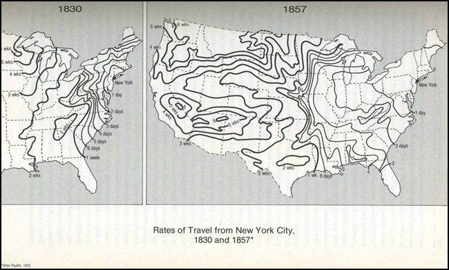

class: inverse, center, middle

```{R, setup, include = F}
options(htmltools.dir.version = FALSE)
# Load packages
pacman::p_load(
  broom, here, tidyverse, latex2exp, ggplot2, ggthemes, viridis, extrafont,
  gridExtra, kableExtra, dplyr, magrittr, knitr, parallel, tufte, emo, ggrepel,
  sf, hrbrthemes, lwgeom, maps, mapdata, spData, leaflet, huxtable
)

# Define colors
## source color script from local directory
## comment out and replace colors if user is not Andrew
source("~/Documents/scripts/colors/colors.R")
# XaringanExtra functions
## Tile view
xaringanExtra::use_tile_view()
## Scribble
xaringanExtra::use_scribble()
# Knitr options
opts_chunk$set(
  comment = "#>",
  fig.align = "center",
  fig.height = 7,
  fig.width = 10.5,
  warning = F,
  message = F
)
options(device = function(file, width, height) {
  svg(tempfile(), width = width, height = height)
})
# A simple theme for supply + demand curves
# A blank theme for ggplot
theme_empty <- theme_bw() + theme(
  line = element_blank(),
  rect = element_blank(),
  strip.text = element_blank(),
  axis.text = element_blank(),
  plot.title = element_blank(),
  axis.title = element_blank(),
  plot.margin = structure(c(0, 0, -0.5, -1), unit = "lines", valid.unit = 3L, class = "unit"),
  legend.position = "none"
)
theme_simple <- theme_bw() + theme(
  line = element_blank(),
  panel.grid = element_blank(),
  rect = element_blank(),
  strip.text = element_blank(),
  axis.text.x = element_text(size = 18, family = "STIXGeneral"),
  axis.text.y = element_blank(),
  axis.ticks = element_blank(),
  plot.title = element_blank(),
  axis.title = element_blank(),
  # plot.margin = structure(c(0, 0, -1, -1), unit = "lines", valid.unit = 3L, class = "unit"),
  legend.position = "none"
)
theme_axes_math <- theme_void() + theme(
  text = element_text(family = "MathJax_Math"),
  axis.title = element_text(size = 22),
  axis.title.x = element_text(hjust = .95, margin = margin(0.15, 0, 0, 0, unit = "lines")),
  axis.title.y = element_text(vjust = .95, margin = margin(0, 0.15, 0, 0, unit = "lines")),
  axis.line = element_line(
    color = "grey70",
    size = 0.25,
    arrow = arrow(angle = 30, length = unit(0.15, "inches")
  )),
  plot.margin = structure(c(1, 0, 1, 0), unit = "lines", valid.unit = 3L, class = "unit"),
  legend.position = "none"
)
theme_axes_serif <- theme_void() + theme(
  text = element_text(family = "MathJax_Main"),
  axis.title = element_text(size = 22),
  axis.title.x = element_text(hjust = .95, margin = margin(0.15, 0, 0, 0, unit = "lines")),
  axis.title.y = element_text(vjust = .95, margin = margin(0, 0.15, 0, 0, unit = "lines")),
  axis.line = element_line(
    color = "grey70",
    size = 0.25,
    arrow = arrow(angle = 30, length = unit(0.15, "inches")
  )),
  plot.margin = structure(c(1, 0, 1, 0), unit = "lines", valid.unit = 3L, class = "unit"),
  legend.position = "none"
)
theme_axes <- theme_void() + theme(
  text = element_text(family = "Fira Sans Book"),
  axis.title = element_text(size = 18),
  axis.title.x = element_text(hjust = .95, margin = margin(0.15, 0, 0, 0, unit = "lines")),
  axis.title.y = element_text(vjust = .95, margin = margin(0, 0.15, 0, 0, unit = "lines")),
  axis.line = element_line(
    color = grey_light,
    size = 0.25,
    arrow = arrow(angle = 30, length = unit(0.15, "inches")
  )),
  plot.margin = structure(c(1, 0, 1, 0), unit = "lines", valid.unit = 3L, class = "unit"),
  legend.position = "none"
)
theme_curves <- theme_ipsum() + theme(axis.line = element_line(),
        panel.grid.minor = element_blank())

```


# Lecture III: Existence of Cities

---
class: inverse
name: schedule

# Schedule

.pull-left[
.ul[.bigger[.hi-white[Today:]]]

.hi-white[(i). Data and history]

.hi-white[(ii). Why do cities exist]

.hi-white[(iii). Introduction to clustering]
]

--

.pull-right[
.ul[.bigger[.hi-white[Upcoming:]]]

  - .hi-white[EC-201 Review Quiz on Canvas]
  
  - .hi-white[Problem set 01 due on TBD*]
  
  - .hi-white[Reading:] intro + chapter 1
]

---


# Housekeeping: PS01*

HW I will be posted after class (tonight or tomorrow morning)

- Due on .hi.orange[TBD] on canvas

--

- HW I _looks_ very long. I want to give everyone sufficient space to write their answers

- Majority of questions are from this week. One question from lecture 6 (next Wednesday)

--

--

## Important

  - Use scratch paper first if needed. __Points will be deducted for messy work__
  
  - Do what you can to make Philip's life easier. 
  
--

---


name: data
# Data: Global urban trends (1960-2017)

*iframe src="https://ourworldindata.org/grapher/urban-and-rural-population?time=2017&country=~OWID_WRL" loading="lazy" style="width: 100%; height: 600px; border: 0px none;"></iframe>

---


# Data: Global urban trends (1960-2017)

*iframe src="https://ourworldindata.org/grapher/share-of-population-urban?time=2017" style="width: 100%; height: 600px; border: 0px none;"></iframe>

---

name: history
#A Brief History Lesson

.hi-slate[Claim:] Over the last few hundred years the world _has become_ .hi-pink[flat]
--
.col-left[
 - .hi[1840s] + : .hi.orange[Rail transit] takes over
]


Source: [Cronon's _Natures Metropolis:  Chicago and the Great West_](https://www.amazon.com/Natures-Metropolis-Chicago-Great-West/dp/0393308731)

---

#A Brief History Lesson


##Claim

Over the last few hundred years the world _has become_ .hi.purple[flat]

.pull-left[
 - .ex[1840s >: Rail transit takes over]

-  .hi[1840s]: .hi.orange[telegraph] .hi[1870's]: .hi.orange[telephone]. Informational distance $\rightarrow$ 0

]

---


#A Brief History Lesson


##Claim

Over the last few hundred years the world _has become_ .hi.purple[flat]

.pull-left[
 - .ex[1840s >: Rail transit takes over]

-  .ex[1840s: telegraph 1870s: telephone. Informational distance] $\rightarrow$ .ex[0]

- .hi[1914]: First commercial .hi.orange[airline flight]. Physical distance shrinks again

]

---

#A Brief History Lesson


##Claim

Over the last few hundred years the world _has become_ .hi.purple[flat]

.pull-left[
- .ex[1840s >: Rail transit takes over]

-  .ex[1840s: telegraph 1870s: telephone. Informational distance] $\rightarrow$ .ex[0]

- .ex[1914: First commercial airline flight. Physical distance shrinks again]

]

.pull-right[
- .hi[1980s] (US): Deregulation of airlines. Competition increases. .hi.orange[Prices plummet]

  - [This guy](https://en.wikipedia.org/wiki/Alfred_E._Kahn) celebrates crowded flights
  
.center[

]
]


---

name: paradox
#A Paradox


.qa[Q]: What is the .hi.orange[paradox] between the things I have just discussed?

--

.qa[A]:  _Despite_ the world "becoming .hi[smaller]" the urban population has rapidly .hi[increased]
  
  - Would you expect the opposite? Why?

--

This is .hi.purple[motivation] to ponder the question: why do cities .hi.purple[exist]?

--

- __Fundamentals__ of this question can also inform why:

  - Some cities have .hi.purple[succeeded]

  - and other have .hi.purple[declined]
  
--

---


class: inverse, middle
# Checklist

.pull-left[
1) .hi[Data & History] `r emo::ji("check")`

  - Growth of urban populations
  
  - Shrinking of the earth
  
  - The paradox

2) .hi.purple[Why do Cities exist?]
]

.pull-right[

3) .hi.purple[Introduction to Clustering]

]

---


name: exist
# Why do Cities Exist?

What do you think? .hi.purple[Discuss]

--

This question has a pretty simple answer. What is it?

--

<center>
<font size="15"> Trade </font>
</center>

--

<center>
<font size="15"> with a few caveats... </font>
</center>

--


Suppose there was .hi[no trade]. What would we need for this to be true? _Would this lead to no cities?_

--

- Even with trade, _possible_ that households trade amongst themselves (still no cities)

--

---


name: trade
# No Cities

--

1) No differences in .hi[productivity] of __land__ _or_ __labor__

  - Differences in either of these generate .hi[comparative advantage]
  
--

--


2) Constant Returns to Scale (CRS) in .hi[Exchange] & transportation

--

  - .hi.purple[Per unit price] to .hi[trade] goods _is the same_ no matter how much is traded 
  
  - No need for distributors/exchange firms
  
--

--

3) CRS in .hi.orange[Production]

--

  - .hi.purple[Per unit price] of .hi.orange[producing] goods is the same no matter how many you produce
  
  - .hi.orange[Factory] (a collection of workers and capital) can make goods _at the same cost_ as .hi.orange[homes]
  
--

---


# Relax Assumption 1

.hi.purple[Question]: Is all land and labor equally productive? 


--
 
.hi.purple[Answer]: Nope. Let's relax this assumption

  - Differences in productivity across cities generate .hi[comparative advantage]

--

---


# Back to 201

##Reminder:


  - .hi.slate[Absolute Advantage] (AA): An economic agent or entity has .hi.purple[AA] in exchange if they can produce more of the good in the same amount of time 
  
      - or the same amount of the good in less time
 
--
 
  - .hi.slate[Comparative Advantage] (CA) : An economic agent or entity has .hi[CA] in exchange if they can produce the good at a lower _oppurtunity cost_

--

--

.hi.slate[Production Possibilities Frontier] (PPF): All possible combinations of goods that an economic agent or entity can produce

--

---

# PPF's

.hi.slate[Example]: 

  - Suppose we have two countries, A & B. They are producing guns and oil
  
Each counties PPF is .note[given] by:

- .hi[County A]: $\color{#e64173} {Guns_A = 10 - 2*Oil_A}$

- .hi[County B]: $\color{#6A5ACD} {Guns_B = 20 - 5*Oil_B}$


--

1) Graph each countries PPF

2) Determine who has the AA in each good and who has the CA in each good

--

---

#PPF's

```{R, ppf, echo = F, fig.height = 5, fig.width = 8, dev = "svg"}
county_one <- function(x) 10-2*x
county_two <- function(x) 20-5*x
ggplot(data.frame(x=c(0, 10)), aes(x)) + 
  stat_function(fun=county_one, col = red_pink)+
  geom_vline(xintercept =0, size = 0.5)+
  geom_hline(yintercept =0, size = 0.5)+
  ggthemes::theme_pander(base_family = "LM Roman 10")+
  ylim(0,22)+
  geom_text(x=0, y=10, label="Country A")+
  labs(x = "Oil", y = "Guns")


```
---

#PPF's

```{R, ppf2, echo = F, fig.height = 5, fig.width = 8, dev = "svg"}
county_one <- function(x) 10-2*x
county_two <- function(x) 20-5*x
ggplot(data.frame(x=c(0, 10)), aes(x)) + 
  stat_function(fun=county_one, col = red_pink)+
  stat_function(fun=county_two, col = "purple")+
  geom_vline(xintercept =0, size = 0.5)+
  geom_hline(yintercept =0, size = 0.5)+
  ggthemes::theme_pander(base_family = "Lm Roman 10")+
  ylim(0,22)+
  geom_text(x=0, y=10, label="Country A")+
  geom_text(x=0, y = 20, label="Country B")+
  labs(x = "Oil", y = "Guns")


```
---

# CA in Oil?
__Idea:__ Whoever _gives up less_ to produce the same amount extra has the comparative advantage. Check: 
```{R, ppf3, echo = F, fig.height = 5, fig.width = 8, dev = "svg"}
ggplot(data.frame(x=c(0, 10)), aes(x)) + 
  stat_function(fun=county_one, col = red_pink)+
  stat_function(fun=county_two, col = "purple")+
  geom_vline(xintercept =0, size = 0.5)+
  geom_hline(yintercept =0, size = 0.5)+
  ggthemes::theme_pander(base_family = "LM Roman 10")+
  ylim(0,22)+
  geom_text(x=0, y=10, label="Country A")+
  geom_text(x=0, y = 20, label="Country B")+
  labs(x = "Oil", y = "Guns")+
  geom_segment(
    x =2.5,xend = 2.5,y = 0, yend = county_one(2.5),
    linetype = "dashed"
  )+
  geom_segment(
    x =2,xend = 2,y = 0, yend = county_one(2),
    linetype = "dashed"
  )+
  geom_segment(
    x =2.5,xend = 2.5,y = 0, yend = county_two(2.5),
    linetype = "dashed"
  )+
  geom_segment(
    x = 2.0, xend = 2.0, y = 0, yend = county_two(2.0),
    linetype = "dashed"
  )+
  geom_segment(
    x = 0, xend = 2.0, y = county_two(2.0), yend = county_two(2.0),
    linetype = "dashed",
    col = "purple"
  )+
  geom_segment(
    x = 0, xend = 2.5, y = county_two(2.5), yend = county_two(2.5),
    linetype = "dashed",
    col = "purple"
  )+
  geom_segment(
    x = 0, xend = 2.0, y = county_one(2.0), yend = county_one(2.0),
    linetype = "dashed",
    col = red_pink
  )+
  geom_segment(
    x = 0, xend = 2.5, y = county_one(2.5), yend = county_one(2.5),
    linetype = "dashed",
    col = red_pink
  )

```
---

# PPF Heuristics

When looking at PPFs, to determine:


1) .hi.purple[AA]: Check .hi[intercepts]
  
  - Whoever has higher - valued .hi[intercept] has the .hi.purple[AA] in production of that good


2) .hi.purple[CA]: Check .hi.orange[slopes]

  - A __steeper__ .hi.orange[slope] indicates .hi.purple[CA] on the vertical axis
  
  - A __shallower__ .hi.orange[slope] indicates .hi.purple[CA] on the horizontal axis

---


# Relax Assumption 2

In absence of scale economies, households trade directly<sup>.hi[†]</sup>


.footnote[
.hi[†] Scale economies: _bigger_ $\rightarrow$ _cheaper per unit_

]

--

- .hi[CRS in Exchange]: $\implies$ households are just as efficient at executing trades as firms (no cost benefits to scaling)

- No reason to pay a firm to do so (and thus no reason to pay for density)
--
---


# Relax Assumption 2

However, firms generally have lower transaction costs than individuals, so individuals are willing to pay firms to facilitate trade (meaning there are economies of scale in exchange). 

- To fully take advantage of scale economies in exchange, firms locate such that they minimize costs of distributing output 
  
  - They locate near rivers, ports, crossroads, etc $\implies$ higher prices of land $\implies$ density

- .hi[Result:] trading cities. This is what we had before the industrial revolution.

---


name: factory
# Relax Assumption 3

Suppose we relax the CRS in production assumption. Specifically, let's suppose workers at a factory can produce a good at a cheaper per-unit cost than at home

--

##Example

Consider a shirt making factory

  - .hi[Home] production: $20$  p shirt. .hi[Factory]:  $12$ p shirt
    
    - economies of scale
  
--

  - Locates in a town with 50 miles to east and west of villages
  
    - 50 cents/mile to ship west.  20 cents/mile to ship east
--

--

---


#Factory Towns

Under what condition will a consumer purchase the shirt from a factory over home?

\begin{align*}
\underbrace{p_f}_\text{factory price} + \underbrace{t \times d}_\text{transit cost = cost p mile$\times$miles} \leq \underbrace{p_h}_\text{Home Price}
\end{align*}

--

.qa[Questions]:

1. Graph the cost of shirts throughout the entire region

2. Find the .hi.orange[market area] of the town

--

  - Find the __sum__ of the .hi.orange[maximum distances] to the east and west that consumers will purchase the shirt from the factory
--

--

---

#Regional Costs


```{R, factory_town, echo=F,fig.height = 5, fig.width = 8, dev = "svg", cache=T}

#create functions. didnt really end up using. probably better way to create this figure
west <- function(x) 37 - .5*x
east <- function(x) 12 +.2*x

ggplot(data.frame(x=c(0, 100)), aes(x)) + 
  stat_function(fun=west, col = NA)+
  geom_segment(x = 0, xend =   50, y = 37, yend = 12)+
  geom_segment(x=  50, xend = 100, y = 12, yend = 22)+
  geom_segment(x = 50, xend = 50, y= 0, yend = 12)+
  geom_segment(x=0, xend = 50, y= 12, yend = 12, linetype =  "dashed")+
  geom_vline(xintercept =0, size = 0.5)+
  geom_hline(yintercept =0, size = 0.5)+
  xlim(0,100)+
  ylim(-3,40)+
  ggthemes::theme_pander(base_family = "LM Roman 10")+
  scale_x_discrete(name ="Distance")+
  geom_text(aes(x = 25, y= -1, label = "West"))+
  geom_text(aes(x = 75, y= -1, label = "East"))+
  geom_text(aes(x = 2, y= 37.5, label = "$37"))+
  geom_text(aes(x = 98, y= 22.5, label = "$22"))+
  labs(y=  "Cost (in Dollars)", title = "Factory Town Graph")+
  geom_text(aes(x = 97, y= -2, label = "50 mi E"))+
    geom_text(aes(x = 3, y= -2, label = "50 mi W"))


```

---

#Market Area Calculation

Market area depends on which side we are looking at. Let $m$ denote miles

- .hi.slate[West]
  
  - Consumers buy from factory if 
  
  $12 + .5*m_{west} \leq 20 \implies m_{west} \leq 16$


- .hi.slate[East]

  - Consumers buy from factory if 
  
  $12 + .2*m_{east} \leq 20 \implies m_{east} \leq 40$

__Market area__: $40+16 = 56$
---


# Factory Towns

1. Would workers rather live .hi.orange[closer] or .hi[further] from the factory?
  
--
  
  - .hi[Closer!]
    
--

2. What happens to land-prices .hi[close] to the factory?

--
  
  - They .hi.purple[increase]
  
--

3. What happens to .hi[density]?

--

 - It will .hi.purple[increase] 
--

__Result:__ Factory town!

---


class: inverse, middle
# Checklist

.pull-left[

1) .hi[Data & History] `r emo::ji("check")`

  - Growth of urban populations
  
  - Shrinking of the earth
  
  - The paradox
  

2) .hi[Why do Cities exist?] `r emo::ji("check")`

  - 3 conditions for no trade
  
  - Comparative advantage & Factory Towns
]

.pull-right[
3) .hi.purple[Introduction to Clustering]
]

---


# Clustering

So we explained _why_ cities exist. Can we explain why there might be more than one firm?

- Let's start by asking why firms cluster. Where to start? __Axiom 5__

--

__Axiom 5__: .hi[_Competition generates zero economic profit_]

--


- If a firm is making positive economic profit, more firms enter the market

- What happens to the profit per firm as more firms enter?

--

- It decreases. Eventually goes to zero

--

---

name: zero_profit
#Example

How many firms are in the cluster?

```{R, cluster_graph, echo = F, fig.height = 5, fig.width = 8, dev = "svg"}
profit = function(x) -x^3+5*x^2

  #create cluster plot
ggplot(data.frame(x=c(0, 6)), aes(x)) + 
  stat_function(fun=profit, col = "purple")+
  geom_vline(xintercept =0, size = 0.5)+
  geom_hline(yintercept =0, size = 0.5)+
  ggthemes::theme_pander(base_family = "LM Roman 10")+
  xlim(0,6)+
  ylim(-20,20)+
  labs(x = "Number of Firms\nIn Cluster", y = "Profit Per Firm")


```


---


class: inverse, middle
# Checklist

.pull-left[

1) .hi[Data & History] `r emo::ji("check")`

  - Growth of urban populations
  
  - Shrinking of the earth
  
  - The paradox

2) .hi[Why do Cities exist?] `r emo::ji("check")`

  - 3 conditions for no trade
  
  - Comparative advantage & Factory Towns
  
]

.pull-right[

3) .hi[Introduction to Clustering] `r emo::ji("check")`

  - The zero profit condition
  
]
---


#Table of Contents

.pull-left[
###Data & History
.smallest[
1. [Urban Populations](#data)
1. [History](#history)
1. [Paradox](#paradox)
]


###Existence
.smallest[

1. [Why do Cities Exist?](#exist)
1. [Trade Basics](#trade)
1. [Factory Towns](#factory_towns)

]
]

.pull-right[
##Clustering
1. [Zero Profit](#zero_profit)
.smallest[

]
]


