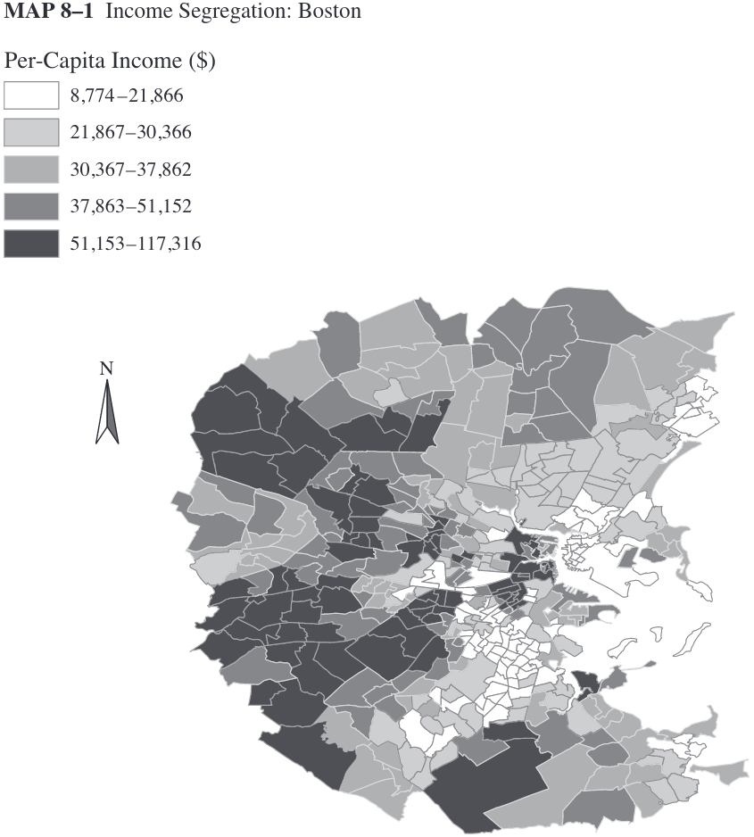
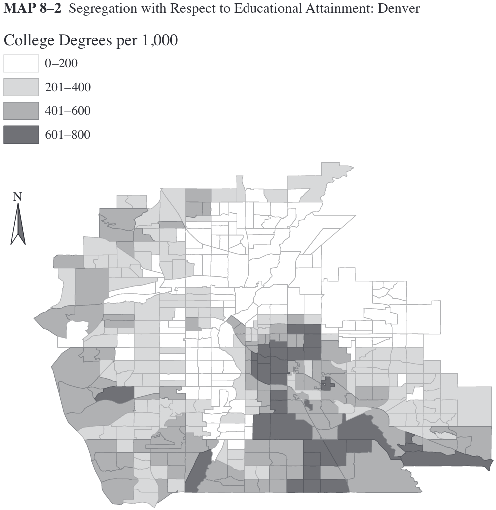
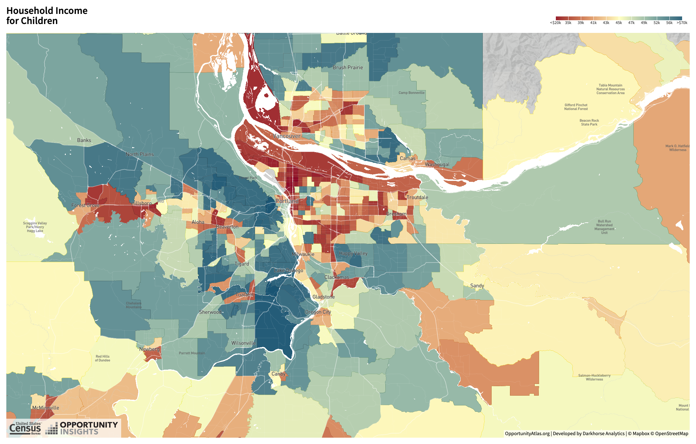

class: inverse, center, middle

```{R, setup, include = F}
options(htmltools.dir.version = FALSE)
pacman::p_load(
  broom, here, tidyverse, latex2exp, ggplot2, ggthemes, viridis, extrafont,
  gridExtra, kableExtra, dplyr, magrittr, knitr, parallel, tufte, emo, ggrepel,
  sf, hrbrthemes, lwgeom, maps, mapdata, spData, leaflet, huxtable, janitor,
  tidycensus
)
# Define colors
## source color script from local directory
## comment out and replace colors if user is not Andrew
source("~/Documents/scripts/colors/colors.R")
# XaringanExtra functions
## Tile view
xaringanExtra::use_tile_view()
## Scribble
xaringanExtra::use_scribble()
# Knitr options
opts_chunk$set(
  comment = "#>",
  fig.align = "center",
  fig.height = 7,
  fig.width = 10.5,
  warning = F,
  message = F
)
options(device = function(file, width, height) {
  svg(tempfile(), width = width, height = height)
})
# A simple theme for supply + demand curves
# A blank theme for ggplot
theme_empty <- theme_bw() + theme(
  line = element_blank(),
  rect = element_blank(),
  strip.text = element_blank(),
  axis.text = element_blank(),
  plot.title = element_blank(),
  axis.title = element_blank(),
  plot.margin = structure(c(0, 0, -0.5, -1), unit = "lines", valid.unit = 3L, class = "unit"),
  legend.position = "none"
)
theme_simple <- theme_bw() + theme(
  line = element_blank(),
  panel.grid = element_blank(),
  rect = element_blank(),
  strip.text = element_blank(),
  axis.text.x = element_text(size = 18, family = "STIXGeneral"),
  axis.text.y = element_blank(),
  axis.ticks = element_blank(),
  plot.title = element_blank(),
  axis.title = element_blank(),
  # plot.margin = structure(c(0, 0, -1, -1), unit = "lines", valid.unit = 3L, class = "unit"),
  legend.position = "none"
)
theme_axes_math <- theme_void() + theme(
  text = element_text(family = "MathJax_Math"),
  axis.title = element_text(size = 22),
  axis.title.x = element_text(hjust = .95, margin = margin(0.15, 0, 0, 0, unit = "lines")),
  axis.title.y = element_text(vjust = .95, margin = margin(0, 0.15, 0, 0, unit = "lines")),
  axis.line = element_line(
    color = "grey70",
    size = 0.25,
    arrow = arrow(angle = 30, length = unit(0.15, "inches")
  )),
  plot.margin = structure(c(1, 0, 1, 0), unit = "lines", valid.unit = 3L, class = "unit"),
  legend.position = "none"
)
theme_axes_serif <- theme_void() + theme(
  text = element_text(family = "MathJax_Main"),
  axis.title = element_text(size = 22),
  axis.title.x = element_text(hjust = .95, margin = margin(0.15, 0, 0, 0, unit = "lines")),
  axis.title.y = element_text(vjust = .95, margin = margin(0, 0.15, 0, 0, unit = "lines")),
  axis.line = element_line(
    color = "grey70",
    size = 0.25,
    arrow = arrow(angle = 30, length = unit(0.15, "inches")
  )),
  plot.margin = structure(c(1, 0, 1, 0), unit = "lines", valid.unit = 3L, class = "unit"),
  legend.position = "none"
)
theme_axes <- theme_void() + theme(
  text = element_text(family = "Fira Sans Book"),
  axis.title = element_text(size = 18),
  axis.title.x = element_text(hjust = .95, margin = margin(0.15, 0, 0, 0, unit = "lines")),
  axis.title.y = element_text(vjust = .95, margin = margin(0, 0.15, 0, 0, unit = "lines")),
  axis.line = element_line(
    color = grey_light,
    size = 0.25,
    arrow = arrow(angle = 30, length = unit(0.15, "inches")
  )),
  plot.margin = structure(c(1, 0, 1, 0), unit = "lines", valid.unit = 3L, class = "unit"),
  legend.position = "none"
)
theme_curves <- theme_ipsum() + theme(axis.line = element_line(),
        panel.grid.minor = element_blank())
```

# Lecture 06: Neighborhood Choice

--

.white[_"Love thy neighbor as yourself, but choose your neighborhood."_ .blue[kfjlsdjgjjjjjjjg] -Louise Beal]

---
class: inverse, middle
# Schedule

.pull-left[
.ul[.bigger[.hi-gold[Today:]]]

.hi-white[(i). Amenities + Public goods]

.hi-white[(ii). Neighborhood sorting model]

.hi-white[(iii). Racial segregation]
]

--

.pull-right[
.ul[.bigger[.hi-gold[Upcoming:]]]

  - .hi-white[Reading] (Chapter 4)
  
  - .hi-white[Problem set 01 due on Friday at Midnight]
  ]

---
# Housekeeping

---
# Introduction to neighborhood choice

We have a fairly simple model of .hi-orange[residential choice] (rental prices)

--

.qa[Q:] What factor(s) in the model determine housing demand?

--

.qa[A:] Bid-Rent model assumes commuting costs are the .hi-orange[only factor]

--

.hi[Is this all you consider when deciding where to live?]

--

  - What factors influence neighborhood decision choices?

--

.hi-blue[Examples:]

--

.pull-left[
- Schools
- Demographics
- Tax rates]
.pull-right[
- Public safety
- Air quality
- Natural beauty]

---
# Neighborhood choice: Amenities

.ul[.hi[Definition:]] .hii[Amenity] 

An _amenity_ is a .hi[location-specific] consumption good

--

.pull-left[
- Beaches
- Weather
- Public transport]
.pull-right[
- Parks
- Restaurants
- Recreation]

--

Different types of amenities
- Some are nonrival<sup>.hii[†]</sup>: Theaters, public transport 
- Some are nonexcludable<sup>.hii[††]</sup>: Parks
- Some are both nonrival and nonexcludable: National defense, sports teams, fireworks

.footnote[.hii[†] Nonrival goods: Accessible by all; usage does limit subsequent use <br> .hii[††] Nonexcludable goods: Impossible to exclude other from consuming]

---
# Neighborhood choice: Amenities

.hi[Two more refined definitions:]

.hi[(i). Exogenous Amenities:] Location-specific consumption good that exist .ul[are not] influenced by where people decide to live

--

  - .hi-gold[Exogenous:] "Deteremined outside of the model" (fall from the sky)
    
  - Weather, geographic characterisitics

--

.hi[(ii). Endogenous Amenities:] Location-specific consumption goods that .ul[are] influenced by location decisions of individuals

--

  - .hi-gold[Endogenous:] "Deteremined within the model"
  
  - School quality, crime, pollution

---
# Neighborhood choice: Amenities

To determine whether or not an amenity is .hi[exogenous] (.hii[endogenous]):

--

.center[_"Will choosing to live here impact the amenity?"_]

<br>

--

  - .hi[Exogenous] _Beaches exist regardless whether people live near by_
 
--

  - .hii[Endogenous] _Crime is a function of the individuals in the area_
  
--

<br>

.hi[Questions regarding differences between EXOGENOUS and ENDOGENOUS?]

---
class: inverse, middle, center
# Neighborhood choice + Sorting for public goods

---
# Neighborhood choice

.center[.hi[Why are city neighborhoods so heterogenous?]]

<br>

--

.center[.hi[What economics factor influence neighborhood sorting within a city?]]

<br>

--

.center[.hi[Let's answer these questions in a simple way.]]

<br>

.center[.blue[Modeling public good: Public parks]]

---
# Demand for public goods

.hi[Consider a simple sorting model for a single, non-rival public good]

--

Model a three-person city with one public good: .hi-blue[Public park]

- Cost .hi[$60 per acre] to build

- Cost is shared equally across all three citizens: .hi-blue[$20 per acre] each

--

Of the three citizen, demand for the park varies:

--

- Low demand: $\text{Lyla}: \color{#34b3ff} {P = 30 - 2*\text{acres}}$

- Mid demand: $\text{Gracie}: \color{#e64173}{P = 40 -2*\text{acres}}$

- High demand: $\text{Cooper}: \color{#6A5ACD} {P = 50 -2*\text{acres}}$

--

.hi-blue[Together they must vote for one park size in a binary election]

---
# Demand for public goods

```{R, inc_plot, echo=F,fig.height = 5, fig.width = 8, dev = "svg", cache=T}


cooper <- function(x) 50 - 2*x
gracie <- function(x) 40 - 2*x
lyla <- function(x) 30 - 2*x
tax <- function(x) 20

ggplot(data.frame(x=c(0, 20)), aes(x)) + 
  stat_function(fun= lyla, col = "#34B3FF")+
  stat_function(fun = gracie, col = red_pink)+
  stat_function(fun = cooper, col = "purple")+
  geom_vline(xintercept = 0)+
  geom_hline(yintercept = 0)+
  labs(x = "acres", y = "Price (WTP)")+
  ggthemes::theme_pander()


```

---
# Demand for public goods

```{R, demand2, echo=F,fig.height = 5, fig.width = 8, dev = "svg", cache=T}

ggplot(data.frame(x=c(0, 20)), aes(x)) + 
  stat_function(fun= lyla, col = "#34B3FF")+
  stat_function(fun = gracie, col = red_pink)+
  stat_function(fun = cooper, col = "purple")+
  stat_function(fun = tax, col = "#009A00")+
  geom_vline(xintercept = 0)+
  geom_hline(yintercept = 0)+
  labs(x = "acres", y = "Price (WTP)")+
  ggthemes::theme_pander()


```

---
# Demand for public goods

```{R, demand3, echo=F,fig.height = 5, fig.width = 8, dev = "svg", cache=T}

ggplot(data.frame(x=c(0, 20)), aes(x)) + 
  stat_function(fun= lyla, col = "#34B3FF")+
  stat_function(fun = gracie, col = red_pink)+
  stat_function(fun = cooper, col = "purple")+
  stat_function(fun = tax, col = "#009A00")+
  geom_segment(x = 5, xend =5 , y = 0, yend = 20,linetype = "dashed")+
  geom_text(x =5, y=0, label = "Q* Lyla", vjust=2)+
  geom_segment(x = 10, xend =10 , y = 0, yend = 20,linetype = "dashed")+
  geom_text(x =10, y=0, label = "Q* Gracie", vjust=2)+
  geom_segment(x = 15, xend = 15 , y = 0, yend = 20,linetype = "dashed")+
  geom_text(x =15, y=0, label = "Q* Cooper", vjust=2)+
  geom_vline(xintercept = 0)+
  geom_hline(yintercept = 0)+
  labs(x = "acres", y = "Price (WTP)")+
  ggthemes::theme_pander()


```

---
# Demand for public goods: Majority rule

For each citizen, optimal park size is found when $MB_{park} = MC_{park}$

--

Under .hi[majority rule] Gracie's optimal park wins

--

.center[.hii[Why?]]

```{r, echo=FALSE}
tib <- tibble(
  Election = c("5 acres vs 10 acres", "15 acres vs 10 acres"),
  ten_acre_votes = c("Gracie and Cooper", "Gracie and Lyla"),
  other_votes = c("Lyla", "Cooper")
)
```

```{r, echo=FALSE}
tib %>% kable(
  col.names = c("Election", "10 acre votes", "Other votes"),
  align = c("l", "l", "l")
) %>%
kable_styling(font_size = 28) %>%
row_spec(1:2, background = "white", color = slate)
```

--

Gracie is the .hii[median voter]

  - Splits the voting public in half

---
# Alternative to majority rule

Majority rule always leave two citizens unhappy: Cooper and Lyla

--

Suppose the city can be split into .hii[3 identical districts] with 3 citizen

- Each district votes on their own park

- Each citizen knowns each other's preferences

--

.hii[Key assumption:] Citizens pick which district to live in

--

.center[.hi[What is the implication?]]

--

.center[.hi[Similar types sort into the same neighborhood]]

--

.pull-left[
- Lylaville: 5 acre park
- Gracity: 10 acre park]
.pull-right[
- Cooperstown: 15 acre park]

---
# Alternative to majority rule

By .hi[voting with their feet] each citizen sorts themselves into homogenous communities with their preferred public good allocation (park size)

.hi[Now our city has three neighborhoods with homogenous types]

- Accomodates diversity in demand

--

.center[.hi[Is reality this simple?]]

--

.center[.hii[Nope]]

--

.hi[Let's add another layer of complexity:] .hii[Taxes]

---
# Alternative: Property tax

Up to this point, funding for the park is financed with a .hi[head tax]

--

More realistic to model neighborhood sorting using .hi[property taxes]

--

- Allow for variation in preferences + property values:

  - The higher your property value, the more taxes you pay for the park
    - $\tau = PV * 10$
  - .hi[3] different property values: 2, 10, 24
  - .hi[9] combos: Low-Low, Low-Mid, Low-High, Mid-Low...High-High
  
--

```{r, echo=FALSE}
tibb <- tibble(
  Outcome = c("Mixed municipality", "Exclusive small PV", "Exclusive mid PV", "Exclusive big PV"),
  Tax_rate = c("$10", "$60", "$12", "$5"),
  small = c("$20", "$120", "-", "-"),
  mid = c("$100", "-", "$120", "-"),
  big = c("$240", "-", "-", "$120")
)
```


```{r, echo=FALSE}
tibb %>% kable(
  col.names = c("Outcome", "Tax rate per dollar in PV", "Small PV", "Mid PV", "Big PV"),
  align = c("l", "c", "c", "c", "c")
) %>%
kable_styling(font_size = 18) %>%
row_spec(1:4, background = "white", color = slate)
```

---
# Alternative: Property tax

```{r, echo=FALSE}
tibb %>% kable(
  col.names = c("Outcome", "Tax rate per dollar in PV", "Small PV", "Mid PV", "Big PV"),
  align = c("l", "c", "c", "c", "c")
) %>%
kable_styling(font_size = 18) %>%
row_spec(1:4, background = "white", color = slate)
```

Citizen of PV similar type have incentive to sort together to reduce tax

--

In equilibrium citizen will form .hii[9 different neighborhoods]

.hi[Generates a fragmented system of local government in a metro area]

- Negative implications arise from this sorting

---
# Neighborhood sorting: Income

.center[

]

---
# Neighborhood sorting: Education

.center[

]

---
# Neighborhood sorting: Atlas

.center[

]

Source: [Oppurtunity Atlas](https://www.opportunityatlas.org/)

---
class: inverse, middle
# Neighborhood sorting: Externalities

---
# Neighborhood sorting: Externalities

.center[.hi[Do you _fully_ internalize the costs and benefits of where you decide to live?]]
  
.center[.blue[Is your choice of neighborhood free from externalities?]]

--

.center[.hii[Nope.]]

--

.hi[Examples?]

--

.pull-left[
- Social networks
- Jobs
- Good schools
- Culture]

--

.pull-right[
- Noise
- Drug use
- Litter
- Pollution
]

--

.hi[Neighborhood externalities tend to be massively important for youth]

.pull-left[
  - Peer effects]
.pull-right[
  - Role models]

---
# Becker-Murphy model

Focus on positive externalities for now

- .blue[Assume these increase with income and education]

--
  
.hi[Q:] What is the income mix of neighborhoods - segregated or integrated?

--

.ul[.hi[Becker-Murphy model:]]

--

- Two neighborhoods: A and B - 80 lots each

- Infinite number of households on the market. 

- Only difference between the neighborhoods is income mix

---
# Becker-Murphy model

Individual choices to move are determined by the _rent premium_

.hi[Rent Premium:] Difference in rent between A and B

- $RP = R(A)-R(B)$ (for neighborhood A)

--

- Rent premiums for workers (may) differ by type: $RP_{high} \neq RP_{low}$ 

  - .qa[ie:] Benefit of living close to high types might vary by type

--

.hi[Assume:] 

- Land will be allocated to the highest bidder

- Everyone in the same neighborhood pays the same rent/price

---
# Becker-Murphy model: Segregation EQ

.pull-left[
```{R, seg_eq1, echo=F,fig.height = 8, fig.width = 8, dev = "svg", cache=T}

u_1 <- function(x) sqrt(x)
u_2 <- function(x) 2*sqrt(x)


ggplot(data.frame(x=c(0, 8)), aes(x)) +
  stat_function(fun=u_2, col = "purple")+
  stat_function(fun= u_1, col = red_pink)+
  labs(x = "number of high income HH's in neighborhood A",y = "Rent premium = R(A)-R(B)")+
  ggthemes::theme_pander()+
  geom_vline(xintercept = 0)+
  geom_hline(yintercept = 0)+  
  geom_segment(x = 8, xend=8, y=0, yend=10, linetype = "dashed")+
  geom_text(x=4, y= 4, label = "premium (high)",vjust=2, hjust=1.5 )+
  geom_text(x=4, y= 2, label = "premium (low)",vjust=2)+
  geom_text(x = 0, y= 0, label = "40", vjust=1.5, hjust=-.5)+
  geom_text(x = 0, y= 0, label = "0", vjust=-.5, hjust=1)+
  geom_text(x = 8, y= 0, label = "80", vjust=1.5)+
  theme(axis.text.y=element_blank(),
        axis.ticks.y=element_blank(),
        axis.text.x=element_blank(),
        axis.ticks.x=element_blank(),
        plot.title = element_text(hjust = 0.5))

```
]

.pull-right[

Suppose 40 HH's start in A
$\Rightarrow$ .hi[Perfectly intergrated] equilibrium

$RP_{low} = RP_{high} = 0$ 

$\Rightarrow$ HH's indifferent between A & B

--

- .hii[EQ "Shock":] A few high income households move to A?

  - What happens?]

---
# Segregation Eq

.pull-left[
```{R, seg_eq3, echo=F,fig.height = 8, fig.width = 8, dev = "svg", cache=T}

u_1 <- function(x) sqrt(x)
u_2 <- function(x) 2*sqrt(x)

ggplot(data.frame(x=c(0, 8)), aes(x)) +
  stat_function(fun=u_2, col = "purple")+
  stat_function(fun= u_1, col = red_pink)+
  labs(x = "number of high income HH;s in neighborhood A",y = "Rent premium = R(A)-R(B)")+
  ggthemes::theme_pander()+
  geom_vline(xintercept = 0)+
  geom_hline(yintercept = 0)+  
  geom_segment(x = 8, xend=8, y=0, yend=10, linetype = "dashed")+
  geom_segment(x = 1, xend=1, y=0, yend=1, linetype = "dashed")+
  geom_segment(x = 1, xend=1, y=0, yend=2, linetype = "dashed")+
  geom_segment(x = 0, xend=1, y=1, yend=1, linetype = "dashed")+
  geom_segment(x = 0, xend=1, y=2, yend=2, linetype = "dashed")+
  geom_text(x = 0, y= 1, label = "RP(low)", vjust=-1, angle=90)+
  geom_text(x = 0, y= 2, label = "RP(high)", vjust = -1, angle =90)+
  geom_text(x = 1, y= 0, label = "45", vjust=2)+
  geom_text(x=4, y= 4, label = "premium (high)",vjust=2, hjust=1.5 )+
  geom_text(x=4, y= 2, label = "premium (low)",vjust=2)+
  geom_text(x = 0, y= 0, label = "40", vjust=1.5, hjust=-.5)+
  geom_text(x = 0, y= 0, label = "0", vjust=-.5, hjust=1)+
  geom_text(x = 8, y= 0, label = "80", vjust=1.5)+
  theme(axis.text.y=element_blank(),
        axis.ticks.y=element_blank(),
        axis.text.x=element_blank(),
        axis.ticks.x=element_blank(),
        plot.title = element_text(hjust = 0.5))

```
]

.pull-right[
If 5 high income HH's move into A, $RP(high) > RP(low)$

$\Rightarrow$ More favorable mix of neighbors

$\Rightarrow$ High income HH's are WTP more to move to A

$\Rightarrow$ Even more favorable mix

$\Rightarrow$ Neighborhood A is only high income HH's

  - Slope .purple[purple line] $>$ slope of .orange2[orange line]
]

--

Recall  .hi[A02: Self-reinforcing changes lead to extreme outcomes]

---
# Integration Eq
.pull-left[
```{R, int_eq_1, echo=F,fig.height = 5, fig.width = 8, dev = "svg", cache=T}

u_1 <- function(x) sqrt(x)
u_2 <- function(x) 2*sqrt(x)


ggplot(data.frame(x=c(0, 8)), aes(x)) +
  stat_function(fun=u_1, col = "purple")+
  stat_function(fun= u_2, col = red_pink)+
  labs(x = "number of high income HH's in neighborhood A",y = "Rent premium = R(A) - R(B)")+
  ggthemes::theme_pander()+
  geom_vline(xintercept = 0)+
  geom_hline(yintercept = 0)+  
  geom_segment(x = 8, xend=8, y=0, yend=10, linetype = "dashed")+
  geom_text(x=4, y= 4, label = "premium (low)",vjust=2, hjust=1.5 )+
  geom_text(x=4, y= 2, label = "premium (high)",vjust=2)+
  geom_text(x = 0, y= 0, label = "40", vjust=1.5, hjust=-.5)+
  geom_text(x = 8, y= 0, label = "80", vjust=1.5)+
  geom_text(x = 0, y= 0, label = "0", vjust=-.5, hjust=1)+
  theme(axis.text.y=element_blank(),
        axis.ticks.y=element_blank(),
        axis.text.x=element_blank(),
        axis.ticks.x=element_blank(),
        plot.title = element_text(hjust = 0.5))


```
]

.pull-right[
What happens in this case?

Notice: Slope .purple[purple line] $<$ slope of .orange2[orange line]

]

---
# Integration Eq
.pull-left[
```{R, int_eq2, echo=F,fig.height = 5, fig.width = 8, dev = "svg", cache=T}

u_1 <- function(x) sqrt(x)
u_2 <- function(x) 2*sqrt(x)


ggplot(data.frame(x=c(0, 8)), aes(x)) +
  stat_function(fun=u_1, col = "purple")+
  stat_function(fun= u_2, col = red_pink)+
  labs(x = "number of high income HH's in neighborhood A",y = "Rent premium = R(A)-R(B)")+
  ggthemes::theme_pander()+
  geom_vline(xintercept = 0)+
  geom_hline(yintercept = 0)+  
geom_segment(x = 8, xend=8, y=0, yend=10, linetype = "dashed")+
  geom_segment(x = 1, xend=1, y=0, yend=1, linetype = "dashed")+
  geom_segment(x = 1, xend=1, y=0, yend=2, linetype = "dashed")+
  geom_segment(x = 0, xend=1, y=1, yend=1, linetype = "dashed")+
  geom_segment(x = 0, xend=1, y=2, yend=2, linetype = "dashed")+
  geom_text(x = 0, y= 1, label = "RP(high)", vjust=-1, angle=90)+
  geom_text(x = 0, y= 2, label = "RP(low)", vjust = -1, angle =90)+
  geom_text(x = 1, y= 0, label = "45", vjust=2)+
  geom_text(x=4, y= 4, label = "premium (low)",vjust=2, hjust=1.5 )+
  geom_text(x=4, y= 2, label = "premium (high)",vjust=2)+
  geom_text(x = 0, y= 0, label = "40", vjust=1.5, hjust=-.5)+
  geom_text(x = 0, y= 0, label = "0", vjust=-.5, hjust=1)+
  geom_text(x = 8, y= 0, label = "80", vjust=1.5)+

  theme(axis.text.y=element_blank(),
        axis.ticks.y=element_blank(),
        axis.text.x=element_blank(),
        axis.ticks.x=element_blank(),
        plot.title = element_text(hjust = 0.5))


```
]

.pull-right[
What does the shock do in this case?

Notice: Slope .purple[purple line] $<$ slope of .orange2[orange line]

$\Rightarrow RP(High) < RP(Low)$

$\Rightarrow$ Pushed back to the original EQ

]

--

.hi[The starting EQ is the only EQ] $\Rightarrow$ .hii[Stable EQ]

---
# Integration Eq
.pull-left[
```{R, int_eq3, echo=F,fig.height = 5, fig.width = 8, dev = "svg", cache=T}

u_1 <- function(x) sqrt(x)
u_2 <- function(x) 2*sqrt(x)


ggplot(data.frame(x=c(0, 8)), aes(x)) +
  stat_function(fun=u_1, col = "purple")+
  stat_function(fun= u_2, col = red_pink)+
  labs(x = "number of high income HH's in neighborhood A",y = "Rent premium = R(A)-R(B)")+
  ggthemes::theme_pander()+
  geom_vline(xintercept = 0)+
  geom_hline(yintercept = 0)+  
geom_segment(x = 8, xend=8, y=0, yend=10, linetype = "dashed")+
  geom_segment(x = 1, xend=1, y=0, yend=1, linetype = "dashed")+
  geom_segment(x = 1, xend=1, y=0, yend=2, linetype = "dashed")+
  geom_segment(x = 0, xend=1, y=1, yend=1, linetype = "dashed")+
  geom_segment(x = 0, xend=1, y=2, yend=2, linetype = "dashed")+
  geom_text(x = 0, y= 1, label = "RP(high)", vjust=-1, angle=90)+
  geom_text(x = 0, y= 2, label = "RP(low)", vjust = -1, angle =90)+
  geom_text(x = 1, y= 0, label = "45", vjust=2)+
  geom_text(x=4, y= 4, label = "premium (low)",vjust=2, hjust=1.5 )+
  geom_text(x=4, y= 2, label = "premium (high)",vjust=2)+
  geom_text(x = 0, y= 0, label = "40", vjust=1.5, hjust=-.5)+
  geom_text(x = 0, y= 0, label = "0", vjust=-.5, hjust=1)+
  geom_text(x = 8, y= 0, label = "80", vjust=1.5)+
  theme(axis.text.y=element_blank(),
        axis.ticks.y=element_blank(),
        axis.text.x=element_blank(),
        axis.ticks.x=element_blank(),
        plot.title = element_text(hjust = 0.5))


```
]

.pull-right[

- Is the story the same here?

- Now, a small movement of high income HH's into A means $RP(High) < RP(low)$

- So we get pushed back to the initial equilibrium. In this case, intergration is the .hi[only equilibrium]

- Furthermore, integration is a .hi.purple[stable equilibrium]

]

---
# Integration Eq
.pull-left[
```{R, int_eq4, echo=F,fig.height = 5, fig.width = 8, dev = "svg", cache=T}

u_1 <- function(x) sqrt(x)
u_2 <- function(x) 2*sqrt(x)


ggplot(data.frame(x=c(0, 8)), aes(x)) +
  stat_function(fun=u_1, col = "purple")+
  stat_function(fun= u_2, col = red_pink)+
  labs(x = "number of high income HH's in neighborhood A",y = "Rent premium = R(A)-R(B)")+
  ggthemes::theme_pander()+
  geom_vline(xintercept = 0)+
  geom_hline(yintercept = 0)+  
geom_segment(x = 8, xend=8, y=0, yend=10, linetype = "dashed")+
  geom_segment(x = 1, xend=1, y=0, yend=1, linetype = "dashed")+
  geom_segment(x = 1, xend=1, y=0, yend=2, linetype = "dashed")+
  geom_segment(x = 0, xend=1, y=1, yend=1, linetype = "dashed")+
  geom_segment(x = 0, xend=1, y=2, yend=2, linetype = "dashed")+
  geom_text(x = 0, y= 1, label = "RP(high)", vjust=-1, angle=90)+
  geom_text(x = 0, y= 2, label = "RP(low)", vjust = -1, angle =90)+
  geom_text(x = 1, y= 0, label = "45", vjust=2)+
  geom_text(x=4, y= 4, label = "premium (low)",vjust=2, hjust=1.5 )+
  geom_text(x=4, y= 2, label = "premium (high)",vjust=2)+
  geom_text(x = 0, y= 0, label = "40", vjust=1.5, hjust=-.5)+
  geom_text(x = 0, y= 0, label = "0", vjust=-.5, hjust=1)+
  geom_text(x = 8, y= 0, label = "80", vjust=1.5)+
  theme(axis.text.y=element_blank(),
        axis.ticks.y=element_blank(),
        axis.text.x=element_blank(),
        axis.ticks.x=element_blank(),
        plot.title = element_text(hjust = 0.5))


```
.hi.orange[Note]: 80 high income HH's in A is not an EQ because $RP(low)>RP(high)$. So low incomes will outbid highs and move in

]

.pull-right[

- Is the story the same here?

- Now, a small movement of high income HH's into A means $RP(High) < RP(low)$

- So we get pushed back to the initial equilibrium. In this case, intergration is the .hi[only equilibrium]

- Furthermore, integration is a .hi.purple[stable equilibrium]

]

---
#Mixed Eq

.pull-left[
```{R, mixed_eq, echo=F,fig.height = 5, fig.width = 8, dev = "svg", cache=T}

u_1 <- function(x) sqrt(x)
u_2 <- function(x) 2*sqrt(x)
u_3 <- function(x) x^(.3)


  
ggplot(data.frame(x=c(0, 8)), aes(x)) +
  stat_function(fun=u_1, col = red_pink)+
  stat_function(fun= u_3, col = "green")+
  labs(x = "number of high income HH's in neighborhood A",y = "Rent premium = R(A)-R(B)")+
  ggthemes::theme_pander()+
  geom_vline(xintercept = 0)+
  geom_hline(yintercept = 0)+
  geom_segment(x = 8, xend=8, y=0, yend=10, linetype = "dashed")+
  geom_text(x = 0, y= 0, label = "40", vjust=1.5, hjust=-.5)+
  geom_text(x = 0, y= 0, label = "0", vjust=-.5, hjust=1)+
  geom_text(x = 8, y= 0, label = "80", vjust=1.5)+
  geom_text(x = 6, y = 1.2, label = "premium (high)")+
  geom_text(x = 6, y = 2.2, label = "premium (low)")+
  theme(axis.text.y=element_blank(),
  axis.ticks.y=element_blank(),
  axis.text.x=element_blank(),
  axis.ticks.x=element_blank(),
  plot.title = element_text(hjust = 0.5))

```
]

.pull-right[

- What about a story like this?

]


---
#Mixed Eq

.pull-left[
```{R, mixed_eq2, echo=F,fig.height = 5, fig.width = 8, dev = "svg", cache=T}

u_1 <- function(x) sqrt(x)
u_2 <- function(x) 2*sqrt(x)
u_3 <- function(x) x^(.3)


  
ggplot(data.frame(x=c(0, 8)), aes(x)) +
  stat_function(fun=u_1, col = red_pink)+
  stat_function(fun= u_3, col = "green")+
  labs(x = "number of high income HH's in neighborhood A",y = "Rent premium = R(A)-R(B)")+
  ggthemes::theme_pander()+
  geom_vline(xintercept = 0)+
  geom_hline(yintercept = 0)+
  geom_segment(x = 8, xend=8, y=0, yend=10, linetype = "dashed")+
  geom_text(x = 0, y= 0, label = "40", vjust=1.5, hjust=-.5)+
  geom_text(x = 0, y= 0, label = "0", vjust=-.5, hjust=1)+
  geom_text(x = 8, y= 0, label = "80", vjust=1.5)+
  geom_text(x = 6, y = 1.2, label = "premium (high)")+
  geom_text(x = 6, y = 2.2, label = "premium (low)")+
  theme(axis.text.y=element_blank(),
  axis.ticks.y=element_blank(),
  axis.text.x=element_blank(),
  axis.ticks.x=element_blank(),
  plot.title = element_text(hjust = 0.5))

```
]

.pull-right[

- What about a story like this?

- Integration eq (40 of each type in each nbhd) is still an equilibrium. Is it .hi[stable]?

]


---
#Mixed Eq

.pull-left[
```{R, mixed_eq3, echo=F,fig.height = 5, fig.width = 8, dev = "svg", cache=T}

u_1 <- function(x) sqrt(x)
u_2 <- function(x) 2*sqrt(x)
u_3 <- function(x) x^(.3)


  
ggplot(data.frame(x=c(0, 8)), aes(x)) +
  stat_function(fun=u_1, col = red_pink)+
  stat_function(fun= u_3, col = "green")+
  labs(x = "number of high income HH's in neighborhood A",y = "Rent premium = R(A)-R(B)")+
  ggthemes::theme_pander()+
  geom_vline(xintercept = 0)+
  geom_hline(yintercept = 0)+
  geom_segment(x = 1, xend=1, y=0, yend=1, linetype = "dashed")+
  geom_segment(x = 0, xend=1, y=1, yend=1, linetype = "dashed")+
  geom_segment(x = 8, xend=8, y=0, yend=10, linetype = "dashed")+
  geom_text(x = 0, y= 0, label = "40", vjust=1.5, hjust=-.5)+
  geom_text(x = 0, y= 0, label = "0", vjust=-.5, hjust=1)+
  geom_text(x = 8, y= 0, label = "80", vjust=1.5)+
  geom_text(x = 6, y = 1.2, label = "premium (high)")+
  geom_text(x = 6, y = 2.2, label = "premium (low)")+
  theme(axis.text.y=element_blank(),
  axis.ticks.y=element_blank(),
  axis.text.x=element_blank(),
  axis.ticks.x=element_blank(),
  plot.title = element_text(hjust = 0.5))

```
]

.pull-right[

- What about a story like this?

- Integration eq (40 of each type in each nbhd) is still an equilibrium. Is it .hi[stable]?

- No. A small deviation away means $RP(high) > RP(low)$. So highs outbid lows until $RP(high) = RP(low)$ at 45 highs in A and 35 lows. 

- Is 45 highs in A stable?

]


---
#Mixed Eq

.pull-left[
```{R, mixed_eq4, echo=F,fig.height = 5, fig.width = 8, dev = "svg", cache=T}

u_1 <- function(x) sqrt(x)
u_2 <- function(x) 2*sqrt(x)
u_3 <- function(x) x^(.3)


  
ggplot(data.frame(x=c(0, 8)), aes(x)) +
  stat_function(fun=u_1, col = red_pink)+
  stat_function(fun= u_3, col = "green")+
  labs(x = "number of high income HH's in neighborhood A",y = "Rent premium = R(A)-R(B)")+
  ggthemes::theme_pander()+
  geom_vline(xintercept = 0)+
  geom_hline(yintercept = 0)+
  geom_segment(x = 1, xend=1, y=0, yend=1, linetype = "dashed")+
  geom_segment(x = 0, xend=1, y=1, yend=1, linetype = "dashed")+
  geom_segment(x = 8, xend=8, y=0, yend=10, linetype = "dashed")+
  geom_text(x = 0, y= 0, label = "40", vjust=1.5, hjust=-.5)+
  geom_text(x = 0, y= 0, label = "0", vjust=-.5, hjust=1)+
  geom_text(x = 8, y= 0, label = "80", vjust=1.5)+
  geom_text(x = 6, y = 1.2, label = "premium (high)")+
  geom_text(x = 6, y = 2.2, label = "premium (low)")+
  theme(axis.text.y=element_blank(),
  axis.ticks.y=element_blank(),
  axis.text.x=element_blank(),
  axis.ticks.x=element_blank(),
  plot.title = element_text(hjust = 0.5))

```
]

.pull-right[

- What about a story like this?

- Integration eq (40 of each type in each nbhd) is still an equilibrium. Is it .hi[stable]?

- No. A small deviation away means $RP(high) > RP(low)$.  So highs outbid lows until $RP(high) = RP(low)$ at 45 highs in A and 35 lows. 

- Is 45 highs in A stable? Yes (you think about why)

]


---
#Mixed Eq

.pull-left[
```{R, mixed_eq5, echo=F,fig.height = 5, fig.width = 8, dev = "svg", cache=T}

u_1 <- function(x) sqrt(x)
u_2 <- function(x) 2*sqrt(x)
u_3 <- function(x) x^(.3)


  
ggplot(data.frame(x=c(0, 8)), aes(x)) +
  stat_function(fun=u_1, col = red_pink)+
  stat_function(fun= u_3, col = "green")+
  labs(x = "number of high income HH's in neighborhood A",y = "Rent premium = R(A)-R(B)")+
  ggthemes::theme_pander()+
  geom_vline(xintercept = 0)+
  geom_hline(yintercept = 0)+
  geom_segment(x = 1, xend=1, y=0, yend=1, linetype = "dashed")+
  geom_segment(x = 0, xend=1, y=1, yend=1, linetype = "dashed")+
  geom_segment(x = 8, xend=8, y=0, yend=10, linetype = "dashed")+
  geom_text(x = 0, y= 0, label = "40", vjust=1.5, hjust=-.5)+
  geom_text(x = 0, y= 0, label = "0", vjust=-.5, hjust=1)+
  geom_text(x = 8, y= 0, label = "80", vjust=1.5)+
  geom_text(x = 6, y = 1.2, label = "premium (high)")+
  geom_text(x = 6, y = 2.2, label = "premium (low)")+
  theme(axis.text.y=element_blank(),
  axis.ticks.y=element_blank(),
  axis.text.x=element_blank(),
  axis.ticks.x=element_blank(),
  plot.title = element_text(hjust = 0.5))

```
- .hi.orange[Note]: Full segregation here is _not_ an equilibrium for a similar reason to the last example
]

.pull-right[

- What about a story like this?

- Integration eq (40 of each type in each nbhd) is still an equilibrium. Is it .hi[stable]?

- No. A small deviation away means $RP(high) > RP(low)$.  So highs outbid lows until $RP(high) = RP(low)$ at 45 highs in A and 35 lows. 

- Is 45 highs in A stable? Yes (you think about why)

]


---
# Eq Defn

To be clear, an _equilibrium_ in this model is a point at which the rent premium is in balance across both groups

--

- This will hold when the rent premium curves intersect. Except at full segregation
  
--
  - If the $RP$ for the group listed on the axis is _.pink[higher]_ then this will also be an equilibrium because .hi[there is no tendency for change]
  
  - If the $RP$ for the group listed on the axis is _.purple[lower]_ then population dynamics move away from this point

--

---
# Stable vs Unstable Eq


1) An eq is .hi[stable] if a small movement away will encounter self - .hi[correcting] forces

--

  - An eq is stable if when you move away from it, the pop. dynamics push you back to where you came from

--

2) A eq is .hi.purple[unstable] if a small movement away will encounter self - .hi.purple[reinforcing] forces

--

  - That is, an eq is untable if when you move away from it, the population dynamics push you even farther than where you came from
  
---
# A Heuristic

1) Draw a verticle dashed line at every intersection point

2) For every region between the verticle dashed lines, it must be the case that one of the rent premium curves is above the other

  - If the rent prem curve for the group listed on the axis is .hi[higher], then this group will increase in number. Draw rightward arrows on the axis
  
  - If the rent prem curve for the group listed on the axis is .hi.purple[lower], then this group will decrease in number. Draw leftward arrows


---
# A Heuristic

3) If there are rightward arrows pushing toward 100% in one nbhd, then 100% (complete segregation) is an eq even if the rent prem curves do not intersect there

4) For every eq. value, look at its immediate vicinity

  - If there are arrows moving towards it, it is a .hi.purple[stable eq]
  
  - If there are arrows moving away from it on one or both sides, it is a .hi[unstable eq]
  

---
# Neighborhood Sorting


.hi[Externalities] for kids:

  - Good/bad role models as adults
  
  - Classmates in school: focused vs disruptive


--

.hi[Externalities] for adults:

  - Postive: job information, property valuation
  
  - Negative: property values 

--

In general: positive externalities increase with income and education level. Why?

---
# Neighborhood Sorting

These externalities give rise to the following questions:

1. Who gets desirable neighbors?

--

2. Will there be segregated or integrated neighborhoods?

--

3. Will there be sorting or mixing with respect to income, age, race, or some combination of those factors?

  - Is this sorting _de jure_, _de facto_, or both? More on this next time

--

4. What are the implications for the price of land in various neighborhoods?

---
class: inverse, middle
# Checklist

.pull-left[


1) .hi[Introduction to Amenities] `r emo::ji("check")`

  - Exogenous Amenities
  
  - Endogenous Amenities
  
2) .hi[Sorting for Public Goods] `r emo::ji("check")`


]

 .pull-right[
 
3) .hi[Neighborhood Sorting Intro]: `r emo::ji("check")`


]

---


<!-- --- -->
<!-- exclude: true -->

<!-- ```{R, generate pdfs, include = F} -->
<!-- system("decktape remark 02_goodsmarket_part1.html 02_goodsmarket_part1.pdf --chrome-arg=--allow-file-access-from-files") -->
<!-- ``` -->


