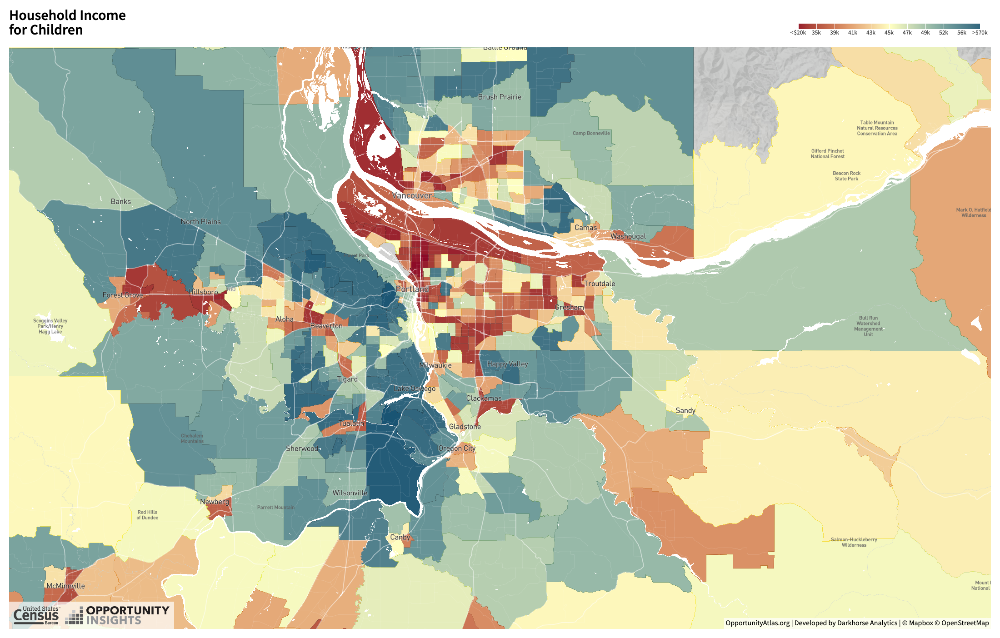

class: inverse, center, middle

```{R, setup, include = F}
options(htmltools.dir.version = FALSE)
pacman::p_load(
  broom, here, tidyverse, latex2exp, ggplot2, ggthemes, viridis, extrafont,
  gridExtra, kableExtra, dplyr, magrittr, knitr, parallel, tufte, emo, ggrepel,
  sf, hrbrthemes, lwgeom, maps, mapdata, spData, leaflet, huxtable, janitor,
  tidycensus
)
# Define colors
## source color script from local directory
## comment out and replace colors if user is not Andrew
source("~/Documents/scripts/colors/colors.R")
# XaringanExtra functions
## Tile view
xaringanExtra::use_tile_view()
## Scribble
xaringanExtra::use_scribble()
# Knitr options
opts_chunk$set(
  comment = "#>",
  fig.align = "center",
  fig.height = 7,
  fig.width = 10.5,
  warning = F,
  message = F
)
options(device = function(file, width, height) {
  svg(tempfile(), width = width, height = height)
})
# A simple theme for supply + demand curves
# A blank theme for ggplot
theme_empty <- theme_bw() + theme(
  line = element_blank(),
  rect = element_blank(),
  strip.text = element_blank(),
  axis.text = element_blank(),
  plot.title = element_blank(),
  axis.title = element_blank(),
  plot.margin = structure(c(0, 0, -0.5, -1), unit = "lines", valid.unit = 3L, class = "unit"),
  legend.position = "none"
)
theme_simple <- theme_bw() + theme(
  line = element_blank(),
  panel.grid = element_blank(),
  rect = element_blank(),
  strip.text = element_blank(),
  axis.text.x = element_text(size = 18, family = "STIXGeneral"),
  axis.text.y = element_blank(),
  axis.ticks = element_blank(),
  plot.title = element_blank(),
  axis.title = element_blank(),
  # plot.margin = structure(c(0, 0, -1, -1), unit = "lines", valid.unit = 3L, class = "unit"),
  legend.position = "none"
)
theme_axes_math <- theme_void() + theme(
  text = element_text(family = "MathJax_Math"),
  axis.title = element_text(size = 22),
  axis.title.x = element_text(hjust = .95, margin = margin(0.15, 0, 0, 0, unit = "lines")),
  axis.title.y = element_text(vjust = .95, margin = margin(0, 0.15, 0, 0, unit = "lines")),
  axis.line = element_line(
    color = "grey70",
    size = 0.25,
    arrow = arrow(angle = 30, length = unit(0.15, "inches")
  )),
  plot.margin = structure(c(1, 0, 1, 0), unit = "lines", valid.unit = 3L, class = "unit"),
  legend.position = "none"
)
theme_axes_serif <- theme_void() + theme(
  text = element_text(family = "MathJax_Main"),
  axis.title = element_text(size = 22),
  axis.title.x = element_text(hjust = .95, margin = margin(0.15, 0, 0, 0, unit = "lines")),
  axis.title.y = element_text(vjust = .95, margin = margin(0, 0.15, 0, 0, unit = "lines")),
  axis.line = element_line(
    color = "grey70",
    size = 0.25,
    arrow = arrow(angle = 30, length = unit(0.15, "inches")
  )),
  plot.margin = structure(c(1, 0, 1, 0), unit = "lines", valid.unit = 3L, class = "unit"),
  legend.position = "none"
)
theme_axes <- theme_void() + theme(
  text = element_text(family = "Fira Sans Book"),
  axis.title = element_text(size = 18),
  axis.title.x = element_text(hjust = .95, margin = margin(0.15, 0, 0, 0, unit = "lines")),
  axis.title.y = element_text(vjust = .95, margin = margin(0, 0.15, 0, 0, unit = "lines")),
  axis.line = element_line(
    color = grey_light,
    size = 0.25,
    arrow = arrow(angle = 30, length = unit(0.15, "inches")
  )),
  plot.margin = structure(c(1, 0, 1, 0), unit = "lines", valid.unit = 3L, class = "unit"),
  legend.position = "none"
)
theme_curves <- theme_ipsum() + theme(axis.line = element_line(),
        panel.grid.minor = element_blank())
```


# Lecture 6: Neighborhood Choice

---
class: inverse, middle

# Schedule

.pull-left[
.ul[.bigger[.hi-gold[Today:]]]

.hi-gold[(i). Amenities + Public goods]

.hi-gold[(ii). Neighborhood sorting model]

.hi-gold[(iii). Racial segregation]
]

--

.pull-right[
.ul[.bigger[.hi-gold[Upcoming:]]]

  - .hi-gold[Reading] (Chapter 4)
  
  - .hi-gold[Problem set 01 due on TBD*]
  ]

---

# Housekeeping

---

# Introduction to neighborhood choice

We have a fairly simple model of .hi-orange[residential choice] (rental prices)

--

.qa[Q:] What factor(s) in the model determine housing demand?

--

.qa[A:] Bid-Rent model assumes commuting costs are the .hi-orange[only factor]

--

.hi[Is this all you consider when deciding where to live?]

--

  - What factors influence neighborhood decision choices?

--

.hi-blue[Examples:]

--

.pull-left[
- Schools
- Demographics
- Tax rates]
.pull-right[
- Public safety
- Air quality
- Natural beauty]

---
# Neighborhood choice: Amenities

.ul[.hi[Definition:]] .hii[Amenity] 

An _amenity_ is a .hi[location-specific] consumption good

--

.pull-left[
- Beaches
- Weather
- Public transport]
.pull-right[
- Parks
- Restaurants
- Recreation]

--

Different types of amenities
- Some are nonrival<sup>.hii[†]</sup>: Theaters, public transport 
- Some are nonexcludable<sup>.hii[††]</sup>: Parks
- Some are both nonrival and nonexcludable: National defense, sports teams, fireworks

.footnote[.hii[†] Nonrival goods: Accessible by all; usage does limit subsequent use <br> .hii[††] Nonexcludable goods: Impossible to exclude other from consuming]

---
# Neighborhood choice: Amenities

.hi[Two more refined definitions:]

.hi[(i). Exogenous Amenities:] Location-specific consumption good that exist .hi-pink[are not] influenced by where people decide to live

--

  - .hi-gold[Exogenous:] "Deteremined outside of the model" (fall from the sky)
    
  - Weather, geographic characterisitics

--

.hi[(ii). Endogenous Amenities:] Location-specific consumption goods that .hi-pink[are] influenced by location decisions of individuals

--

  - .hi-gold[Endogenous:] "Deteremined within the model"
  
  - School quality, crime, pollution

---
# Neighborhood choice: Amenities

To determine whether or not an amenity is .hi[exogenous] (.hii[endogenous]):

--

.center[_"Will choosing to live here impact the amenity?"_]

<br>

--

  - .hi[Exogenous] _Beaches exist regardless whether people live near by_
 
--

  - .hii[Endogenous] _Crime is a function of the individuals in the area_
  
--

<br>

.hi[Questions regarding differences between EXOGENOUS and ENDOGENOUS?]

---
class: inverse, middle, center
# Sorting for Public Goods

---

# Neighborhood sorting: Income

.center[

]

---
# Neighborhood sorting: Education

.center[

]

---
# Demand for public goods

.hi[Consider a simple sorting model for a single, non-rival public good]

--

Model a three-person city with one public good: .hi-blue[Public park]

- Cost .hi[$60 per acre] to build

- Cost is shared equally across all three citizens: .hi-blue[$20 per acre] each

--

Of the three citizen, demand for the park varies:

--

- Low demand: $\text{Lyla}: \color{#34b3ff} {P = 30 - 2*\text{acres}}$

- Mid demand: $\text{Gracie}: \color{#e64173}{P = 40 -2*\text{acres}}$

- High demand: $\text{Cooper}: \color{#6A5ACD} {P = 50 -2*\text{acres}}$

--

.hi-blue[Together they must vote for one park size]

---
# Demand for public goods

```{R, inc_plot, echo=F,fig.height = 5, fig.width = 8, dev = "svg", cache=T}


cooper <- function(x) 50 - 2*x
gracie <- function(x) 40 - 2*x
lyla <- function(x) 30 - 2*x
tax <- function(x) 20

ggplot(data.frame(x=c(0, 20)), aes(x)) + 
  stat_function(fun= lyla, col = "purple")+
  stat_function(fun = gracie, col = red_pink)+
  stat_function(fun = cooper, col = "#34B3FF" )+
  geom_vline(xintercept = 0)+
  geom_hline(yintercept = 0)+
  labs(x = "acres", y = "Price (WTP)")+
  ggthemes::theme_pander()


```

---
# Demand for public goods

```{R, demand2, echo=F,fig.height = 5, fig.width = 8, dev = "svg", cache=T}

ggplot(data.frame(x=c(0, 20)), aes(x)) + 
  stat_function(fun= lyla, col = "purple")+
  stat_function(fun = gracie, col = red_pink)+
  stat_function(fun = cooper, col = "#34B3FF" )+
  stat_function(fun = tax, col = "#009A00")+
  geom_vline(xintercept = 0)+
  geom_hline(yintercept = 0)+
  labs(x = "acres", y = "Price (WTP)")+
  ggthemes::theme_pander()


```

---
# Demand for public goods

```{R, demand3, echo=F,fig.height = 5, fig.width = 8, dev = "svg", cache=T}

ggplot(data.frame(x=c(0, 20)), aes(x)) + 
  stat_function(fun= lyla, col = "purple")+
  stat_function(fun = gracie, col = red_pink)+
  stat_function(fun = cooper, col = "#34B3FF" )+
  stat_function(fun = tax, col = "#009A00")+
  geom_segment(x = 5, xend =5 , y = 0, yend = 20,linetype = "dashed")+
  geom_text(x =5, y=0, label = "Q* Lyla", vjust=2)+
  geom_segment(x = 10, xend =10 , y = 0, yend = 20,linetype = "dashed")+
  geom_text(x =10, y=0, label = "Q* Gracie", vjust=2)+
  geom_segment(x = 15, xend = 15 , y = 0, yend = 20,linetype = "dashed")+
  geom_text(x =15, y=0, label = "Q* Cooper", vjust=2)+
  geom_vline(xintercept = 0)+
  geom_hline(yintercept = 0)+
  labs(x = "acres", y = "Price (WTP)")+
  ggthemes::theme_pander()


```

---

# Demand for public goods: Majority rule

For each citizen, optimal park size is found when $MB_{park} = MC_{park}$

--

Under .hi[majority rule] Gracie's optimal park wins

--

.center[.hii[Why?]]


Make kable

--

Gracie is the .hii[median voter]

  - Splits the voting public in half
  
--

Majority rule always leave two citizens unhappy: Cooper and Lyla


---
# Alternative to majority rule

Suppose the city can be split into .hii[3 identical districts] with 3 citizen

- Each district votes on their own park

- Each citizen knowns each other's preferences

--

.hii[Key assumption:] Citizens pick which district to live in

--

.center[.hi[What is the implication?]]

--

.center[.hi[Similar types sort into the same neighborhood]]

--

.pull-left[
- Lylaville: 5 acre park
- Gracity: 10 acre park]
.pull-right[
- Cooperstown: 15 acre park]

---
# Alternative to majority rule

By .hi[voting with their feet] each citizen sorts themselves into homogenous communities with their preferred public good allocation (park size)

.hi[Now our city has three neighborhoods with homogenous types]

- Accomodates diversity in demand

--

.center[.hi[Is reality this simple?]]

--

.center[.hii[Nope]]

--

.hi[Let's add another layer of complexity:] .hii[Taxes]

---
# Alternative to majority rule

Up to this point, funding for the park is financed with a .hi[head tax]

--

A realistic way to model neighborhood sorting is to us .hi[property taxes] instead

-- 

---

# Map 1

.center[

]

Source: [Oppurtunity Atlas](https://www.opportunityatlas.org/)

---

# Amenities as Public Goods

Some amenities, like city parks, are _local public goods_. Does everyone care about these parks equally?


--

Probably not

--

.hi.slate[Example]: 

  - Consider a 3 citizen city each with differing demands (Max WTP) for parks
  
    - Saurabh has low demand, Sam has medium demand, Jenny has high demand

--

- Park Costs .hi[$60 per acre] to build

--

   - One way to fund: .hi.orange[share the burden] equally via a _per capita tax_ (each person pays 20 bucks p acre)

--

--


---


# Some Math

Let's be a bit more specific. Suppose the demand curves for each person are given by:


--

- $\text{Saurabh}:\color{#6A5ACD} {P = 50 -2*\text{acres}}$
 
- $\text{Sam}: \color{#e64173}{P = 40 -2*\text{acres}}$

- $\text{Jenny}: \color{#34b3ff}{P = 30 - 2*\text{acres}}$

--

--

.qa[Q]: Derive the number of acres of parks for each individuals with a $\color{#009A00}{20}$ dollar per person per acre tax


---


# Flat Tax

Tough decisions to make when deciding how much to build

--

- Any thoughts on how to allocate the resource? 

  - How much do we charge people?
  
  - How much do we build?
  
--

.hi[Discuss]

---


# Majority Rule and Median Voter

One way to make the collective choice of how many acres of parks to build: .hi.orange[majority rule]

  - Have a series of .hi[binary elections] (.pink[multiple votes, each vote there is only one option])
  
  - This election will always result in the winning option being the median voter (Sam)


--

What is the issue with this theory/model of park dev?

--

  - We see variation in size of parks built .hi.purple[IRL]
  
--

  - How do we rectify this?

--

---


# A twist

Now suppose there is a city with .hi[3 identical districts], each with 3 citizens (Saurabh, Sam, Jenny)'s

--

 - Each district votes on their own park
  
 - Each citizen knows the preferences for parks of other citizens

--


--

_Key Assumption_: .hi[Citizens pick which district to to live]. What is the implication?

--

--


- Similar types sort into the same neighborhood

--

- Ie, Saurabh and other low demand types recognize that if they move into the same district they have the highest chance of getting the level of parks they desire
  


---


# A twist

So, we have 3 neighborhoods with _homogenous types_. What does this do?

--

<center>
<font size="12"> Accomodate Diversity in Demand </font>
</center>

--

- In this perfect world, everybody gets what they want. Is reality this simple?

--

<center>
<font size="12"> Nope </font>
</center>

--


---


# Reality

## Real Cities

- Usually tax property - not a flax per capita tax

--

- Variation in property value also causes municipal formation (ie, .hi.orange[people sort on income], _.orange[not just preference for public goods]_)

--

--

## Real People

  - Care about a diverse set of things (not just parks). These usually don't overlap perfectly

--

  - Also: people do not know .hi[full set of preferences] of others

--

  - __Reality__: Not everyone gets what they want! `r emo::ji("frowning_face")`


--

---


class: inverse, middle
# Checklist

.pull-left[


1) .hi[Introduction to Amenities] `r emo::ji("check")`

  - Exogenous Amenities
  
  - Endogenous Amenities
  
2) .hi.purple[Sorting for Public Goods] 

- Demand for public goods

- Simple model with public goods and taxes

]


.pull-right[

3) .hi.purple[Neighborhood Choice Intro]:


]


---


# Neighborhood Sorting

I will motivate this with a .qa[question]:

--

  - Do you _fully_ internalize the costs and benefits of where you decide to live?
  
  - Put differently: Is your choice of neighborhood free from externalities?

--


.qa[Short Answer]: Nope. These externalities are different for adults and children


---


# Neighborhood Sorting


.hi[Externalities] for kids:

  - Good/bad role models as adults
  
  - Classmates in school: focused vs disruptive


--

.hi[Externalities] for adults:

  - Postive: job information, property valuation
  
  - Negative: property values 

--

In general: positive externalities increase with income and education level. Why?

---


# Neighborhood Sorting

These externalities give rise to the following questions:

1. Who gets desirable neighbors?

--

2. Will there be segregated or integrated neighborhoods?

--

3. Will there be sorting or mixing with respect to income, age, race, or some combination of those factors?

  - Is this sorting _de jure_, _de facto_, or both? More on this next time

--

4. What are the implications for the price of land in various neighborhoods?

--


---


class: inverse, middle
# Checklist

.pull-left[


1) .hi[Introduction to Amenities] `r emo::ji("check")`

  - Exogenous Amenities
  
  - Endogenous Amenities
  
2) .hi[Sorting for Public Goods] `r emo::ji("check")`


]

 .pull-right[
 
3) .hi[Neighborhood Sorting Intro]: `r emo::ji("check")`


]

---


<!-- --- -->
<!-- exclude: true -->

<!-- ```{R, generate pdfs, include = F} -->
<!-- system("decktape remark 02_goodsmarket_part1.html 02_goodsmarket_part1.pdf --chrome-arg=--allow-file-access-from-files") -->
<!-- ``` -->


