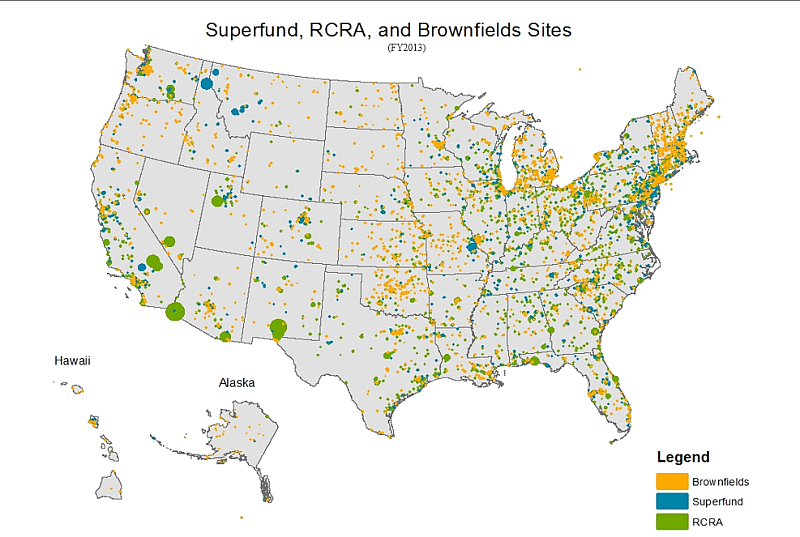
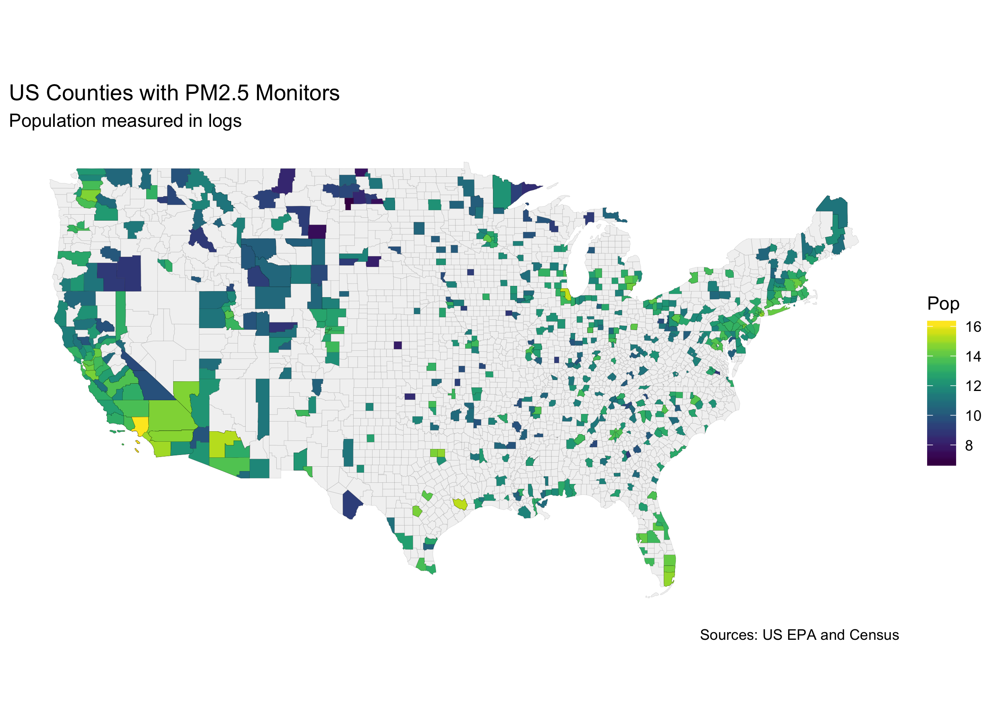
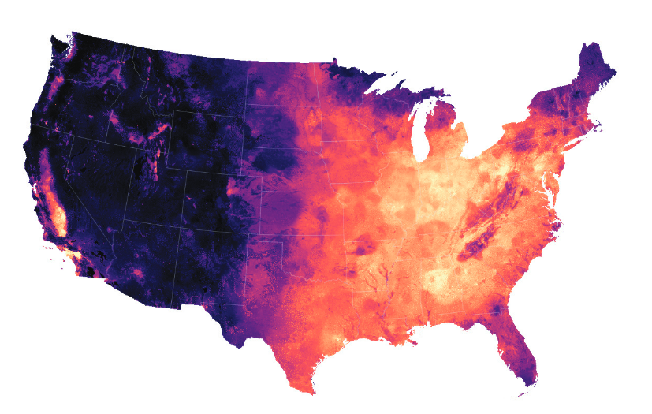
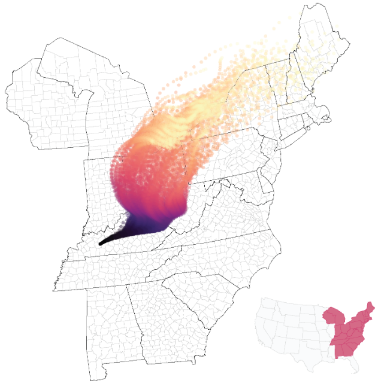
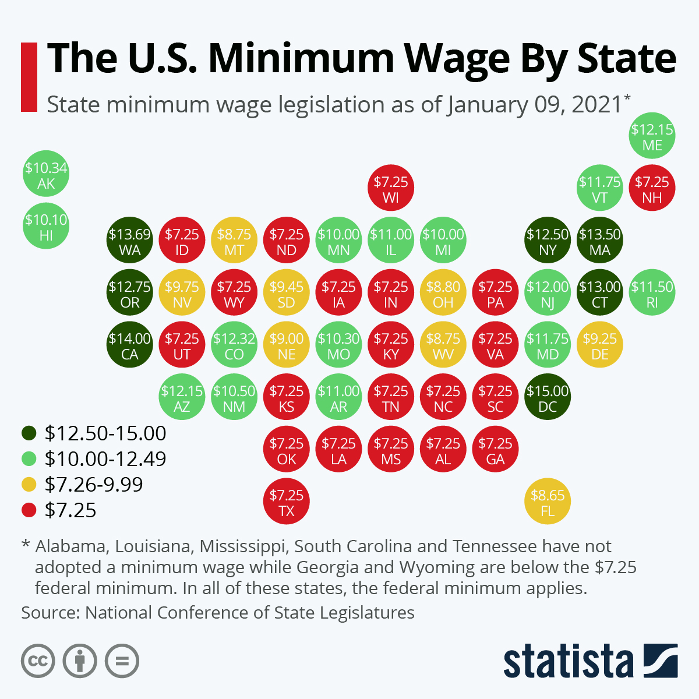

class: inverse, center, middle

```{R, setup, include = F}
options(htmltools.dir.version = FALSE)
pacman::p_load(
  broom, here, tidyverse, latex2exp, ggplot2, ggthemes, viridis, extrafont,
  gridExtra, kableExtra, dplyr, magrittr, knitr, parallel, tufte, emo, ggrepel,
  sf, hrbrthemes, lwgeom, maps, mapdata, spData, leaflet, huxtable, janitor,
  tidycensus
)
# Define colors
## source color script from local directory
## comment out and replace colors if user is not Andrew
source("~/Documents/scripts/colors/colors.R")
# XaringanExtra functions
## Tile view
xaringanExtra::use_tile_view()
## Scribble
xaringanExtra::use_scribble()
# Knitr options
opts_chunk$set(
  comment = "#>",
  fig.align = "center",
  fig.height = 7,
  fig.width = 10.5,
  warning = F,
  message = F
)
options(device = function(file, width, height) {
  svg(tempfile(), width = width, height = height)
})
# A simple theme for supply + demand curves
# A blank theme for ggplot
theme_empty <- theme_bw() + theme(
  line = element_blank(),
  rect = element_blank(),
  strip.text = element_blank(),
  axis.text = element_blank(),
  plot.title = element_blank(),
  axis.title = element_blank(),
  plot.margin = structure(c(0, 0, -0.5, -1), unit = "lines", valid.unit = 3L, class = "unit"),
  legend.position = "none"
)
theme_simple <- theme_bw() + theme(
  line = element_blank(),
  panel.grid = element_blank(),
  rect = element_blank(),
  strip.text = element_blank(),
  axis.text.x = element_text(size = 18, family = "STIXGeneral"),
  axis.text.y = element_blank(),
  axis.ticks = element_blank(),
  plot.title = element_blank(),
  axis.title = element_blank(),
  # plot.margin = structure(c(0, 0, -1, -1), unit = "lines", valid.unit = 3L, class = "unit"),
  legend.position = "none"
)
theme_axes_math <- theme_void() + theme(
  text = element_text(family = "MathJax_Math"),
  axis.title = element_text(size = 22),
  axis.title.x = element_text(hjust = .95, margin = margin(0.15, 0, 0, 0, unit = "lines")),
  axis.title.y = element_text(vjust = .95, margin = margin(0, 0.15, 0, 0, unit = "lines")),
  axis.line = element_line(
    color = "grey70",
    size = 0.25,
    arrow = arrow(angle = 30, length = unit(0.15, "inches")
  )),
  plot.margin = structure(c(1, 0, 1, 0), unit = "lines", valid.unit = 3L, class = "unit"),
  legend.position = "none"
)
theme_axes_serif <- theme_void() + theme(
  text = element_text(family = "MathJax_Main"),
  axis.title = element_text(size = 22),
  axis.title.x = element_text(hjust = .95, margin = margin(0.15, 0, 0, 0, unit = "lines")),
  axis.title.y = element_text(vjust = .95, margin = margin(0, 0.15, 0, 0, unit = "lines")),
  axis.line = element_line(
    color = "grey70",
    size = 0.25,
    arrow = arrow(angle = 30, length = unit(0.15, "inches")
  )),
  plot.margin = structure(c(1, 0, 1, 0), unit = "lines", valid.unit = 3L, class = "unit"),
  legend.position = "none"
)
theme_axes <- theme_void() + theme(
  text = element_text(family = "Fira Sans Book"),
  axis.title = element_text(size = 18),
  axis.title.x = element_text(hjust = .95, margin = margin(0.15, 0, 0, 0, unit = "lines")),
  axis.title.y = element_text(vjust = .95, margin = margin(0, 0.15, 0, 0, unit = "lines")),
  axis.line = element_line(
    color = grey_light,
    size = 0.25,
    arrow = arrow(angle = 30, length = unit(0.15, "inches")
  )),
  plot.margin = structure(c(1, 0, 1, 0), unit = "lines", valid.unit = 3L, class = "unit"),
  legend.position = "none"
)
theme_curves <- theme_ipsum() + theme(axis.line = element_line(),
        panel.grid.minor = element_blank())
```


# Lecture 11: Place Based Policies

---
class: inverse, middle
# Schedule

.pull-left[
.ul[.bigger[.hi-gold[Today:]]]

.hi-white[(i). Place-based policies]

- .white[General utility framework]

]

--

.pull-right[
.ul[.bigger[.hi-gold[Upcoming:]]]

  - .hi-white[Reading] (Chapter 6)
  
  - .hi-white[Problem set 02 will be posted by Thursday night]
  
]

---
class: inverse, center, middle
# Place-based polcies

---
# Place-based polcies

.hi[.ul[Definition:] Place-based policies] - Location specific policies/laws

- What are some examples? 

--

.pull-left[
  - State and Local Taxes
- State/City minimum wage
- Abortion restrictions
- Air quality monitoring]
.pull-right[
  - Zoning & Land Use Restrictions
- Enterprise Zones
- Medicinal and recreational marijuana laws]

--

.hi[Federal policies] that are .hii[uniform across all states] _are not_ place-based

- Harder to migrate across .hii[international borders] than state borders

---
class: inverse, center, middle
# Place-based polcies: Examples


---
# Place-based polcies: Enterpise zones

.hi[.ul[Definition:] Enterprise zone]: 

> A geographic area that has been granted .pink[tax breaks, regulatory exemptions, or other public assistance] in order to encourage private economic development and job creation

Examples:

  - Jersey City, NJ since 1983
  
  - China: Shanghai and Shenzen (Special Economic Zones (SEZ))
  
---
# Place-based polcies: Brownfields

.hi[.ul[Definition:] Brownfield]: 

> A geographic area that has previously been developed land that is not currently in use due to industrial and/or commerical pollution

--

Examples include abandoned business such as:
.pull-left[
- Gas stations
- Dry cleaning
- Factories]
.pull-right[
- Mills
- Foundries
]

--

There are several Brownfields in the [Eugene/Springfield area](https://ofmpub.epa.gov/apex/cimc/f?p=CIMC:73::::73:P71_WELSEARCH:97405%7CZipcode%7C%7C%7C%7Ctrue%7Cfalse%7Cfalse%7Cfalse%7Cfalse%7Cfalse%7C(BF_ASSESS_IND%3D%27Y%27)

- [Ninkasi brewing in 2012 over took a brownfield to expand brewing operations in 2012](https://youtu.be/D4RcUacsW3U?t=97)


---
# Place-based polcies: Brownfields
.center[

]

---
# Place-based polcies: Brownfields

Brownfields are tremendously expensive to clean up

Furthermore, since the land is no longer being used it is not contributing to local economies

--

[High health costs associated with living near a brownfield](https://michellemmarcus.files.wordpress.com/2019/09/marcus_lust_092319.pdf)

  - Recent publication found that petroleum leaks from underground storage tanks lead to increases in the probability of low birth weights and preterm birth by .hi[7-8 percent]
  
--

Cleaning these up raises .pink[amenity value] of the neighborhood

--

Property values around brownfields are far lower than comparable land
  - What happens to property values? Go up; gentrify

---
# Place-based polcies: Air quality

_December 2, 1970_: Environmental Protection Agency  (EPA) is Established  

  - Included the Clean Air Act
    - Regulates county level air quality with a vast system of air quality monitors
  
--

.hi[Following years]: amendments to the CAA (expanding scale and scope of EPA)

--

.pull-left[

- .hi[1990:] Additional power granted to state/local authorities to enforce air quality standards
- .hi[1997:] PM 2.5 (particulate matter of 2.5 micrograms or less) standards placed

]

--

.pull-right[
- .hi[2005:] PM2.5 standards enforced
- .hi[2011:] Standards for greenhouse gases]

---
# Place-based polcies: Air quality

Particulate Matter (.hi.orange[PM]) in the US is regulated at the .hi.green[county level]<sup>.pink[†]</sup>

.footnote[
.pink[†] For more details, look [here](https://www.epa.gov/pm-pollution)
]

--

If a county exceeds certain threshold for .hi.orange[PM] , all firms over a certain size need to pay a pretty big fine
  - Exceptions for fires, other natural events


---
# Place-based polcies: Air quality



---
# Place-based polcies: Air quality



- [Di et al. (2016)](https://europepmc.org/backend/ptpmcrender.fcgi?accid=PMC5761665&blobtype=pdf)

---
# Place-based polcies: Air quality

Does air quality monitoring make sense at a local level? Why or why not?

--

.center[

]

---

# Place-based polcies: Minimum wage

.center[

]

Federal Minimum Wage: $7.25$ (not a place based policy)

---
# Place-based polcies: Discussion

.center[.hi[Why do we care about place-based policies?]]

--

TotC give really good intuition in the chapter about Detroit.

--

.center[.hii[People are mobile and respond to changes in incentives]]

--

Place-based policies influence location decisions

--

.hi[Question]: Why do federal policies impact cities differently?

--

Min wage: might be .hi[binding] in some states, others not
  
- Some labor markets might be competitive. Others not
    
--
  
- Federal Income Tax: Cost of Living varies by state.

---
class: inverse, middle, center
# Utility framework

---
# Utility framework

This next section of the class may be a little more difficult

--

Scratching the surface of how to .hii[model the effects] of a place-based policy

- Need to set up a ton of stuff first 

--

- Some of these examples are based on [Mark Colas'](https://sites.google.com/site/markyaucolas/home?authuser=0) notes

  - Learn more about this in his 400 urban economics class


---
# Utility framework

We talked a little bit about .hi[utility] earlier in the term. What is it?

--

An abstract notion of people's preferences. .hi.orange[Why do we care about this?]

--

We want to think about policies and impact of policies and people location decisions

- Need to think about the changes a policy might have on someone's .hi[incentives]

--

.hi[Recall:] .hii[Higher levels of utility] are more desirable than low levels of utility


---
# Utility framework

.hi[Example]: Preferences over left-shoes and right-shoes may be expressed with the following utility function:

\begin{align*}
U(\text{left shoes},\text{right shoes}) = \min\left\{ \text{left shoes}, \text{right shoes}   \right\}
\end{align*}

.qa[Q:] In words, what does this say?

--

.qa[A:] I don't care about consuming more shoes unless I get more of both left and right shoes.

--

.qa[Q:] Give the above utility function, which bundle would I rather consume?

\begin{align*}
\text{bundle 1}: (10000,1) \hspace{2in}
\text{bundle 2}: (2,2)
\end{align*}

--

.qa[A:] $U(10000,1) = 1 < U(2,2) = 2$, so I would rather consume bundle 2

---
# Utility framework

.hi[Main point:] Utility is used to rank outcomes

--

.hi[Remember:] Utility is .hii[ordinal] _not_ .hi-gold[cardinal]

--

This means: we can only speak to the ordering of outcomes, not the levels 

- Many utility functions give equivalent preference rankings

--

.hi[What if utility over shoes was:]

\begin{align*}
U_2(\text{left shoes},\text{right shoes}) = 10*\min\left\{ \text{left shoes}, \text{right shoes}   \right\}
\end{align*}

.qa[Q:] Does this represent the same underlying preferences as before?

--

.qa[A:] Yes, because $U_2(10000,1) = 10*1 = 10 < U_2(2,2)  = 10*2 = 20$ 
  
- So the bundle $(2,2)$ is still preferred to $(10000,1)$

---
# Utility framework: Locations

.center[.hi[Could we write a utility function over locations?]]

--

.center[.hii[Yes!]]

--

What would a locational utility function take as .hi[inputs?]

--

What do people make location decisions on? 

--

For now, assume people only care about 3 features of locations:

--
  
.center[.hi[wages], .hii[rents], .hi-gold[amenites]]

--

These all vary across locations, right? (first part of this class)

--

Let $w_j$, $r_j$, and $a_j$ denote wages, rents, and amenities in location $j$

---
# Utility framework: Locations

Let $w_j$, $r_j$, and $a_j$ denote wages, rents, and amenities in location $j$ 

- $j = SF$, for example 

--

.hi[General form]: $U(w_j, r_j,a_j) = U_j$

- This says utility in location $j$ is a function of wages, rents, and amenities, in location $j$

--

In practice, could write down an infinite number of functions for $U(\cdot)$

--

.hi[Usual assumptions:]
.pull-left[
- Higher wages are better
- Lower rents are better]
.pull-right[
- More amenities are better]

--

.center[.hii[Is this reasonable?]]

---
# Utility framework: Locations

.hi[Example:] Assume linear utility functions and everyone is identical:

--

\begin{align*}
U(w_j, r_j, a_j) = w_j - .5*r_j + a_j
\end{align*}

--

Suppose our two locations are SF and OAK again. If:

-  $w_{SF} = 10, r_{SF} = 8, a_{SF} = 4$
  
-  $w_{OAK} = 8, r_{OAK} = 3, a_{OAK} = 1$

--

.qa[Q] How do workers sort across the cities?

--

- $U(w_{SF}, r_{SF}, a_{SF}) = 10 - .5*8 + 4 = 10$

- $U(w_{OAK}, r_{OAK}, a_{OAK}) = 8 - .5*3 + 1 = 7.5$

--

.center[Well 10 > 7.5 so... everyone moves to SF]

---
# Utility framework: Locations

.center[.hi[Is it reasonable that everyone would move to SF? What are we missing?]]

--

.center[.hi[Was that last example an example in locational equilibrium?]]

--

.center[.hii[No!]]

In .hi[locational equilibrium], utility is .hii[equalized across locations]

--

Can't have: $U(w_{SF}, r_{SF}, a_{SF}) > U(w_{OAK}, r_{OAK}, a_{OAK})$

--

<br>

.center[.hi[How can we use locational eq to "fix up" our last example?]]

--

.center[We can .hii[allow rents] (or wages or both) .hii[to adjust] such that utility is equivalent across the two cities]


---
# Utility framework: Locations

.hi[Another Problem:] People move and utility is equal across all locations

--

.hi[Thus far], we assume .hii[wages] and .hi-gold[rents] are exogenous
- Fall from the sky, do not change with location decisions

--

.center[This is a .hi[bad assumption] right?]

--

Let rents, but not wages, adjust to individual location decisions

- Make rents .hii[endogenous] to the model

---
# Utility framework: Rents

Rents in every city given by:

--

\begin{align*}
r_j(L_j) = 2\times L_j
\end{align*}

--

- $r_j(L_j)$: rents _are a function_ of the population (not multiplied)

- $L_j$ is the pop in city $j$; choosing 2 was arbitrary

--

Suppose we have two cities $1$ and $2$, with 7 people total: $L_1 + L_2 = 7$

--

.hi[Utility:] $U(w_{j}, r_{j}(L_j), a_{j}) = w_j - .5\times r_j(L_j) + a_j$

.hii[Wages:] $w_1 = 12$, $w_2 = 7$

.hi-gold[Rents:] $r_j(L_j) = 2*L_j$

.hi-pink[Amenities:] $a_1 = a_2 = 0$


---
# Utility framework: Rents example

Suppose we have two cities $1$ and $2$, with 7 people total: $L_1 + L_2 = 7$

--

.hi[Utility:] $U(w_{j}, r_{j}(L_j), a_{j}) = w_j - .5\times r_j(L_j) + a_j$

.hii[Wages:] $w_1 = 12$, $w_2 = 7$

.hi-gold[Rents:] $r_j(L_j) = 2*L_j$

.hi-pink[Amenities:] $a_1 = a_2 = 0$

--

.qa[Qs:] How many people live in each city? What are rents in each city? 

.hi[Note:] You have .hi[two equations] and .hi[two unknowns] (namely, $L_1$ and $L_2$)
  
  - $U(w_{1}, r_{1}(L_1), a_{1}) = U(w_{2}, r_{2}(L_1), a_{2})$ (from locational eq) 
    
  - $L_1 + L_2 = 7$ you know the total population

---
# Utility framework: Rents example

Locational eq gives:

--

\begin{align*}
w_1 - .5*r_1(L_1) &= w_2 - .5*r_1(L_2)\\
12 - .5*(2*L_1) &= 7 - .5*(2*L_2)\\
-L_1 &= -5 - L_2\\
L_1 &= 5 + L_2
\end{align*}

--

Population must sum to 7. Thus:

\begin{align*}
L_1 + L_2 &= 7\\
5+ L_2 + L_2 &= 7\\
2*L_2 &= 2\\
L_2 = 1 \implies L_1 = 6
\end{align*}

---
# Utility framework: Place based policies

Ok, how do we tie this back into .hi[place-based] policies?

.hi[Example]

--

Initial equilibrium: $U(w_{j}, r_{j}(L_j),a_{j}) = k$ for all cities $j$

--

Suppose $SF$ implements a 30%, flat, income tax

  - Post-tax wage in city $SF$ is now $w^{tax}_{SF} = 0.7*w_{SF}$ 
  
  - Assume .hi[wages are fixed], but .hii[rents adjust to population]

--

Utility in city $j$ is: 

\begin{align*}
U(w^{tax}_{SF}, r_{SF}(L_{SF}),a_{SF}) < U(w_{SF}, r_{SF}(L_{SF}),a_{SF})
\end{align*}

--

If utility is .hi[increasing in wages], then an income-tax lowers utility.

---
# Utility framework: Equilibrium

.center[Can it be an equilibrium if:]

\begin{align*}
U(w^{tax}_{SF}, r_{SF}(L_{SF}),a_{SF}) < U(w_{SF}, r_{SF}(L_{SF}),a_{SF})
\end{align*}

--

.center[.hii[No!]]

--

Because $U(w_{SF}, r_{SF}(L_{SF}),a_{SF}) = k$

So $U(w^{tax}_{SF}, r_{SF}(L_{SF}),a_{SF}) \neq k$

--

Thus people move .hi[away from SF] and rents fall

So utility goes up in SF until $U(w^{tax}_{SF}, r_{SF}(L_{SF}),a_{SF}) = k$

---

# Extensions

This flexible way of modeling gives us many options for modeling place based policies

--

- Other kind of subsidies/taxes: goes into $w_j$

- Rent subsidies or property taxes: impacts $r_j$

--

- .qa[Q]: How would you model an increase in public school quality?

---
class: inverse, middle, center
# Fin


