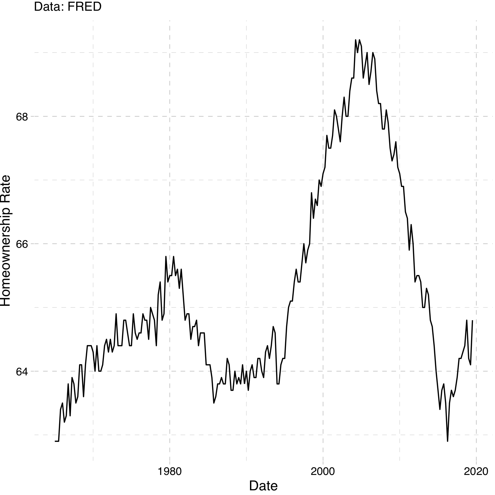

class: inverse, center, middle
  
```{R, setup, include = F}
options(htmltools.dir.version = FALSE)
pacman::p_load(
  broom, here, tidyverse, latex2exp, ggplot2, ggthemes, viridis, extrafont,
  gridExtra, kableExtra, dplyr, magrittr, knitr, parallel, tufte, emo, ggrepel,
  sf, hrbrthemes, lwgeom, maps, mapdata, spData, leaflet, huxtable, janitor,
  tidycensus
)
# Define colors
## source color script from local directory
## comment out and replace colors if user is not Andrew
source("~/Documents/scripts/colors/colors.R")
# XaringanExtra functions
## Tile view
xaringanExtra::use_tile_view()
## Scribble
xaringanExtra::use_scribble()
# Knitr options
opts_chunk$set(
  comment = "#>",
  fig.align = "center",
  fig.height = 7,
  fig.width = 10.5,
  warning = F,
  message = F
)
options(device = function(file, width, height) {
  svg(tempfile(), width = width, height = height)
})
# A simple theme for supply + demand curves
# A blank theme for ggplot
theme_empty <- theme_bw() + theme(
  line = element_blank(),
  rect = element_blank(),
  strip.text = element_blank(),
  axis.text = element_blank(),
  plot.title = element_blank(),
  axis.title = element_blank(),
  plot.margin = structure(c(0, 0, -0.5, -1), unit = "lines", valid.unit = 3L, class = "unit"),
  legend.position = "none"
)
theme_simple <- theme_bw() + theme(
  line = element_blank(),
  panel.grid = element_blank(),
  rect = element_blank(),
  strip.text = element_blank(),
  axis.text.x = element_text(size = 18, family = "STIXGeneral"),
  axis.text.y = element_blank(),
  axis.ticks = element_blank(),
  plot.title = element_blank(),
  axis.title = element_blank(),
  # plot.margin = structure(c(0, 0, -1, -1), unit = "lines", valid.unit = 3L, class = "unit"),
  legend.position = "none"
)
theme_axes_math <- theme_void() + theme(
  text = element_text(family = "MathJax_Math"),
  axis.title = element_text(size = 22),
  axis.title.x = element_text(hjust = .95, margin = margin(0.15, 0, 0, 0, unit = "lines")),
  axis.title.y = element_text(vjust = .95, margin = margin(0, 0.15, 0, 0, unit = "lines")),
  axis.line = element_line(
    color = "grey70",
    size = 0.25,
    arrow = arrow(angle = 30, length = unit(0.15, "inches")
  )),
  plot.margin = structure(c(1, 0, 1, 0), unit = "lines", valid.unit = 3L, class = "unit"),
  legend.position = "none"
)
theme_axes_serif <- theme_void() + theme(
  text = element_text(family = "MathJax_Main"),
  axis.title = element_text(size = 22),
  axis.title.x = element_text(hjust = .95, margin = margin(0.15, 0, 0, 0, unit = "lines")),
  axis.title.y = element_text(vjust = .95, margin = margin(0, 0.15, 0, 0, unit = "lines")),
  axis.line = element_line(
    color = "grey70",
    size = 0.25,
    arrow = arrow(angle = 30, length = unit(0.15, "inches")
  )),
  plot.margin = structure(c(1, 0, 1, 0), unit = "lines", valid.unit = 3L, class = "unit"),
  legend.position = "none"
)
theme_axes <- theme_void() + theme(
  text = element_text(family = "Fira Sans Book"),
  axis.title = element_text(size = 18),
  axis.title.x = element_text(hjust = .95, margin = margin(0.15, 0, 0, 0, unit = "lines")),
  axis.title.y = element_text(vjust = .95, margin = margin(0, 0.15, 0, 0, unit = "lines")),
  axis.line = element_line(
    color = grey_light,
    size = 0.25,
    arrow = arrow(angle = 30, length = unit(0.15, "inches")
  )),
  plot.margin = structure(c(1, 0, 1, 0), unit = "lines", valid.unit = 3L, class = "unit"),
  legend.position = "none"
)
theme_curves <- theme_ipsum() + theme(axis.line = element_line(),
        panel.grid.minor = element_blank())
```


# Lecture 11: Housing Policy


---
class: inverse, middle
# Schedule

.pull-left[
.ul[.bigger[.hi-gold[Today:]]]

.hi-white[(i). Intro to housing markets]

.hi-white[(i). Rental markets]

- .white[Monopolists]

]

--

.pull-right[
.ul[.bigger[.hi-gold[Upcoming:]]]

  - .hi-white[Reading] (Chapter 7)
  
  - .hi-white[Problem set 02 will be posted tonight or tomorrow morning]
  
]


---
# Housing markets 

Distinguish the following two markets:

- .hi[Rental Market:] Supply and Demand for rentals

- .hii[Housing Market:] Supply and Demand for houses

--

Why is it important to distinguish these? Aren't they both markets for living spaces? .hi[Discuss]

--

 - A house is an asset. A month of rent is not
  
 - Homeowners are much less mobile than renters
  
---

# Homeownership

.center[.hi[Why is buying a home different than buying a pair of jeans?]]

--

.center[.hii[Houses are a major investment and store of value (equity)]]

--

Homeownership remains a key component of household wealth
- The value is subject to some uncertainty
 
--

<br>
 
Purchasing a home is a .hi[dynamic] (forward-looking) decision

Jeans (a pure consumption good) is not really a store of value

--

.center[.hi[We will focus on renters. But first let's take a look at some data]]

---
# Rentals vs Homeowners

.center[

]

--

.smallerer[Why such a big spike?]

---
# Housing prices (nominal)

.center[

]

---
# Housing inventory

.center[

]

---
# Housing crisis (summarized)

.center[.hi[What caused the housing market crash in 2007?]]

--

.center[.hii[Among many other things, subprime mortgages]]

--

Mortgage lenders took too much risk by extending loans the millions of Americans who could not afford them

--

These high risk, subprime loans were bundled into different "troughs" with lower risk loans and sold them to banks

--

Rating agencies didn't fully understand the risk associated with these loans and granted high grades (AA) to highly risky investment products

--

When housing prices stopped growing, and high interest rates set in on adjustable loans, massive amounts of people defaulted

--

People shorted the banks on their investments and it lead to a massive financial crisis


---
class: inverse, middle, center
# Rental markets

---
# Rental market model

Just like labor markets, each city has its own market for rental units 
- Consists of suppliers (absentee landlords) 
- Individuals making optimal housing demand decisions

--

.hi[Important:] Firms (landlords) supply housing to households

--

.hi[Assumptions:]

--

.hii[(i).] No individual landlord can influence the price of rents

--

.hii[(ii).] Landlords decide how much housing to provide

--

.hii[(iii).] The amount of housing they provide will again come from profit maximization


---
# Rental market model: Perf Comp

Profit function given by:

\begin{align*}
\pi(Q) = P*Q - TC(Q)
\end{align*}

--

.hi[Note:] Now cost is a function of quantity

--

Implicitly we are assuming that at any quantity, the firm will use the optimal level of labor and capital

--

Marginal profit equals zero , $\frac{\Delta \pi(Q)}{\Delta Q}= 0$:

--

\begin{align*}
 \frac{P*\Delta Q}{\Delta Q} - \frac{\Delta TC(Q)}{\Delta Q} = 0
\end{align*}

---
count: false
# Rental market model: Perf Comp

Profit function given by:

\begin{align*}
\pi(Q) = P*Q - TC(Q)
\end{align*}

.hi[Note:] Now cost is a function of quantity

Implicitly we are assuming that at any quantity, the firm will use the optimal level of labor and capital

Marginal profit equals zero , $\frac{\Delta \pi(Q)}{\Delta Q}= 0$:

\begin{align*}
 \frac{P*\Delta Q}{\Delta Q} - \frac{\Delta TC(Q)}{\Delta Q} &= 0\\
 P &= \frac{\Delta TC(Q)}{\Delta Q}
\end{align*}

---
count: false
# Rental market model: Perf Comp

Profit function given by:

\begin{align*}
\pi(Q) = P*Q - TC(Q)
\end{align*}

.hi[Note:] Now cost is a function of quantity

Implicitly we are assuming that at any quantity, the firm will use the optimal level of labor and capital

Marginal profit equals zero , $\frac{\Delta \pi(Q)}{\Delta Q}= 0$:

\begin{align*}
 \frac{P*\Delta Q}{\Delta Q} - \frac{\Delta TC(Q)}{\Delta Q} &= 0\\
 P &= \frac{\Delta TC(Q)}{\Delta Q}\\
 P &= MC(Q)
\end{align*}

---
count: false
# Rental market model: Perf Comp

Profit function given by:

\begin{align*}
\pi(Q) = P*Q - TC(Q)
\end{align*}

.hi[Note:] Now cost is a function of quantity

Implicitly we are assuming that at any quantity, the firm will use the optimal level of labor and capital

Marginal profit equals zero , $\frac{\Delta \pi(Q)}{\Delta Q}= 0$:

\begin{align*}
 \frac{P*\Delta Q}{\Delta Q} - \frac{\Delta TC(Q)}{\Delta Q} &= 0\\
 P &= \frac{\Delta TC(Q)}{\Delta Q}\\
 P &= MC(Q)
\end{align*}

.center[.hi[Increasing marginal costs leads to upward sloping supply curves!]]

---
class: inverse, center, middle

# Monopoly

---
# Rental market model: Monopoly

Now let's consider the .hi[monopoly] situation:

--

.hi[Assume:]

--

.hii[(i).] One seller of the good (rental units)

--

.hii[(ii).] The monopolist has market power; ability to set prices

--

.hii[(iii).] The monopolist is a profit maximizer

---
# Rental market model: Monopoly

Equilibrium relies on the assumption that firms maximize profits

--

Now TR is a function of quantity

\begin{equation*}
TR = P(Q)*Q
\end{equation*}

--

Quantity of houses that the monopolist produces changes the market price

--

$P(Q)$ in this context is called the inverse demand function
  
--

.hi[Profit is given by:]

\begin{align*}
\pi(Q) = P(Q)*Q - TC(Q)
\end{align*}
  


---
# Rental market model: Monopoly

Profit Maximization gives us the familiar $\frac{\Delta \pi(Q)}{\Delta Q} = 0$

--

\begin{align*}
\frac{\Delta P(Q)*Q}{\Delta Q} - \frac{\Delta TC(Q)}{\Delta Q} = 0 
\end{align*}
  
---
count: false
# Rental market model: Monopoly

Profit Maximization gives us the familiar $\frac{\Delta \pi(Q)}{\Delta Q} = 0$

\begin{align*}
\frac{\Delta P(Q)*Q}{\Delta Q} - \frac{\Delta TC(Q)}{\Delta Q} &= 0 \\
MR(Q) &= MC(Q)
\end{align*}

--

.hi[Note:] Now, $\frac{\Delta P(Q)*Q}{\Delta Q} \neq P$.

---
# Simple monopoly example

---
# Monopoly Graph

--

```{R, m1, echo=F,fig.height = 4, fig.width = 7, dev = "svg", cache=T}
demandm <- function(x) 10 - 2*x
mr_m <- function(x) 10 - 4*x
supply <- function(x) 5+2*x

ggplot(data.frame(x=c(0, 3)), aes(x)) +
  stat_function(fun= demandm, col = "purple")+
  stat_function(fun = mr_m, col = red_pink)+
  stat_function(fun = supply, col = "#34B3FF" )+
  geom_vline(xintercept = 0)+
  geom_hline(yintercept = 0)+
  labs(x = "acres", y = "Price")+
  ggthemes::theme_pander()+
  annotate(x = 2.3, y = 2, label = "marginal revenue", "text")+
  annotate(x = 2.3, y = 6, label = "Demand", "text")+
  annotate(x = 2.3, y = 9, label = "Supply (marginal cost)", "text")


```

---
count: false
# Monopoly Graph

```{R, m2, echo=F,fig.height = 4, fig.width = 7, dev = "svg", cache=T}
ggplot(data.frame(x=c(0, 3)), aes(x)) +
  stat_function(fun= demandm, col = "purple")+
  stat_function(fun = mr_m, col = red_pink)+
  stat_function(fun = supply, col = "#34B3FF" )+
  geom_vline(xintercept = 0)+
  geom_hline(yintercept = 0)+
  labs(x = "acres", y = "Price")+
  ggthemes::theme_pander()+
  annotate(x = 2.3, y = 2, label = "Marginal Revenue", "text")+
  annotate(x = 2.3, y = 6, label = "Demand", "text")+
  annotate(x = 2.3, y = 9, label = "Supply (marginal cost)", "text")+
  geom_segment(aes(x = 5/6, xend = 5/6, y = 0, yend = supply(5/6)), linetype = "dashed")+
  geom_segment(
    aes(x = 5/6, xend = 5/6, y = 0, yend = demandm(5/6)),
    linetype = "dashed")+
  annotate(
    x = 5/6 , y = -.15, label = "Q_m", "text"
    )
```

---
count: false
# Monopoly Graph

```{R, m3, echo=F,fig.height = 4, fig.width = 7, dev = "svg", cache=T}

ggplot(data.frame(x=c(0, 3)), aes(x)) +
  stat_function(fun= demandm, col = "purple")+
  stat_function(fun = mr_m, col = red_pink)+
  stat_function(fun = supply, col = "#34B3FF" )+
  geom_vline(xintercept = 0)+
  geom_hline(yintercept = 0)+
  labs(x = "acres", y = "Price")+
  ggthemes::theme_pander()+
  annotate(x = 2.3, y = 2, label = "Marginal Revenue", "text")+
  annotate(x = 2.3, y = 6, label = "Demand", "text")+
  annotate(x = 2.3, y = 9, label = "Supply (marginal cost)", "text")+
  geom_segment(aes(x = 5/6, xend = 5/6, y = 0, yend = supply(5/6)), linetype = "dashed")+
  geom_segment(aes(x = 5/6, xend = 5/6, y = 0, yend = demandm(5/6)), linetype = "dashed")+
  annotate(x = 5/6 , y = -.15, label = "Q_m", "text")+
  annotate(x =-.08 , y = demandm(5/6), label = "P_m", "text")+
  geom_segment(aes(x = 0, xend = 5/6, y = demandm(5/6), yend = demandm(5/6)), linetype = "dashed")


```

---
class: inverse, middle, center
# Rental markets model

.hi-white[How to model a rental market across multiple cities?]

---
# Rents Across Cities

.hi[Key question:] What causes rental curves to vary across cities?

--
  
Supply curves across cities are impacted by: local construction costs, land available for development, and land-use regulations

--

.hi[Local construction costs]: shifts intercept (labor is more expensive for all firms in one area vs another)

.hii[Land available for development] and .hi-gold[land use regulations:] slope (changes in the marginal cost) of developing land. 

--

.center[.hi[Why?]]

--

.qa[A]: Less land available to develop $\rightarrow$ .hi[oppurtunity cost of developing increases] for each next plot of land. Prices get bid up faster. Similar intuition with land-use regulations

---
# Urban Housing Supply Curves

```{R, supply1, echo=F,fig.height = 5, fig.width = 8, dev = "svg", cache=T}

housing_one <- function(x) 4 + 5*x
housing_two <- function(x) 1 + 5*x
housing_three <- function(x) 4 + 8*x


ggplot(data.frame(x=c(0, 10)), aes(x)) + 
  stat_function(fun= housing_one, col = "purple") +
  ylim(0,20)+
  xlim(0,5)+
  geom_vline(xintercept =0, size = 0.5) +
  geom_hline(yintercept =0, size = 0.5) +  
  labs(x = "Quantity of Housing", y = "Rents")+
  ggthemes::theme_pander()

```

---
# Urban Housing Supply Curves

```{R, supply2, echo=F,fig.height = 5, fig.width = 8, dev = "svg", cache=T}

housing_one <- function(x) 4 + 5*x
housing_two <- function(x) 1 + 5*x
housing_three <- function(x) 4 + 8*x


ggplot(data.frame(x=c(0, 10)), aes(x)) + 
  stat_function(fun= housing_one, col = "purple") +
    stat_function(fun= housing_two, col = red_pink) +
  ylim(0,20)+
  xlim(0,5)+
  geom_vline(xintercept =0, size = 0.5) +
  geom_hline(yintercept =0, size = 0.5) +  
  labs(x = "Quantity of Housing", y = "Rents")+
  ggthemes::theme_pander()

```

 .hi-pink[pink]: lower construction cost (lower intercept)


---
# Urban Housing Supply Curves

```{R, supply3, echo=F,fig.height = 5, fig.width = 8, dev = "svg", cache=T}

housing_one <- function(x) 4 + 5*x
housing_two <- function(x) 1 + 5*x
housing_three <- function(x) 4 + 8*x

ggplot(data.frame(x=c(0, 10)), aes(x)) + 
  stat_function(
    fun= housing_one,
    col = "purple"
    ) +
    stat_function(
      fun= housing_three, 
      col = "black"
      ) +
  ylim(0,20)+
  xlim(0,5)+
  geom_vline(
    xintercept =0,
    size = 0.5
    ) +
  geom_hline(
    yintercept =0, 
    size = 0.5
    ) +  
  labs(
    x = "Quantity of Housing",
    y = "Rents"
    )+
  ggthemes::theme_pander()

```


__Black__: higher land use regs or less available land for development

---
# Two Policies

- We will focus on two policies:

.hi[(i).] Rent Control

.hi[(ii).] Land-use restrictions

--

- We will also look at how these could interact

---
class: inverse, middle, center
# Rent control

---
# Rent control

.ul[.hi[Definition:]] .hii[Rent Control:]

> A _price ceiling_ set on rental units

--

.hi[Price Ceiling:] Max allowed price on the market

--

Brief History (US):

- Started around WW1. Expanded during WWII
  
--

- 1970: Nixon puts 90-day freeze on prices to combat inflation

--

- _Mostly_ a .hi[place based policy]. 
  - SF, NY, LA, Oakland, DC, Berkeley, West Hollywood
  - Oregon: first state to have .pink[state-wide rent control]

---
# Rent Control 


---
# Rent Control in Oregon

In 2019: Oregon passes .hi[state-wide] rent control 

--

Limits annual rent increases to inflation + 7% (inflation is usually 2-3%)

--

If tenants leave on their .hi[own-accord], landlords can increase rent without limit

--

.center[.hi[Question:] Are the ramifications from state-wide rent-control different than local rent control?]

---
class: inverse, middle, center
# Land Use Restrictions

---
# Land Use Restrictions

Land use restrictions limit what one can do with developable land. Examples:


---
count: false
# Land Use Restrictions

Land use restrictions limit what one can do with developable land. Examples:

1. Density Restrictions


---
count: false
# Land Use Restrictions

Land use restrictions limit what one can do with developable land. Examples:

1. Density Restrictions

2. Min Lot Sizes


---
count: false
# Land Use Restrictions

Land use restrictions limit what one can do with developable land. Examples:

1. Density Restrictions

2. Min Lot Sizes

3. Park Requirements


---
count: false

# Land Use Restrictions

Land use restrictions limit what one can do with developable land. Examples:

1. Density Restrictions

2. Min Lot Sizes

3. Park Requirements

4. Sidewalk and street size requirements

---
count: false

# Land Use Restrictions

Land use restrictions limit what one can do with developable land. Examples:

1. Density Restrictions

2. Min Lot Sizes

3. Park Requirements

4. Sidewalk and street size requirements

5. Height Restrictions

Not all of these are bad things. But they do make developing land more expensive.

---
# Wharton Index


Higher values of the Wharton index $\implies$ tighter land use restrictions

---
# Example


---


# A Model

Do Land-Use regs and rent control interact? Absolutely! Let's model it

--

\begin{align*}
P(Q_d) &= 20 - 2*Q_d\\
P(Q_s) &= 8 + Q_s\\
\end{align*}

Compute the equilibrium. Graph it, if that is helpful

--

- Now suppose the government ratchets up land-use regs. New supply is given by:

\begin{align*}
P(Q_s^{new}) = 8 + 2*Q_s^{new}
\end{align*}

---
# Example

Old eq: $Q^* = 4$, $P^* = 12$

New eq: $Q^* = 3$, $P^* = 15$


Government comes in and says the rents are too high. Rent control set at $12$ per unit. Now you have:

\begin{align*}
12 = 8+2*Q_s \implies Q_s = 2
\end{align*}


---
count: false
# Example

Old eq: $Q^* = 4$, $P^* = 12$

New eq: $Q^* = 3$, $P^* = 15$


Government comes in and says the rents are too high. Rent control set at $12$ per unit. Now you have:

\begin{align*}
12 = 8+2*Q_s &\implies Q_s = 2\\
12 = 20 - 2*Q_d &\implies Q_d = 4
\end{align*}

---
count: false
# Example

Old eq: $Q^* = 4$, $P^* = 12$

New eq: $Q^* = 3$, $P^* = 15$


Government comes in and says the rents are too high. Rent control set at $12$ per unit. Now you have:

\begin{align*}
12 = 8+2*Q_s &\implies Q_s = 2\\
12 = 20 - 2*Q_d &\implies Q_d = 4
\end{align*}

So we have a .pink[shortage] of two units at the .hi.purple[old] equilibrium price. `r emo::ji("anguished")`

---
# A Note

We wont have time (but it might be good practice) for you to think through what would happen if the market was a .hi[monopoly]


---
count: false
# A Note

We won't have time (but it might be good practice) for you to think through what would happen if the market was a .hi[monopoly]

  - Similar to the .hi.purple[monopsonist], rent control can actually .pink[lower prices] in a completely .purple[monopolized] housing market


---
count: false
# A Note

We won't have time (but it might be good practice) for you to think through what would happen if the market was a .hi[monopoly]

  - Similar to the .hi.purple[monopsonist], rent control can actually .pink[lower prices] in a completely .purple[monopolized] housing market

  - Let's take a (quick) look at some recent empirical evidence

---
# Empirics

__Empirical Evidence__: [Diamond et. al (2019)](https://web.stanford.edu/~diamondr/DMQ.pdf)

  - 1979: Rent control in SF put in place for all standing buildings with 5 apartments or more
  

---
count: false
# Empirics

__Empirical Evidence__: [Diamond et. al (2019)](https://web.stanford.edu/~diamondr/DMQ.pdf)

  - 1979: Rent control in SF put in place for all standing buildings with 5 apartments or more
  
    - New buildings exempt (to promote developers to continue building)
  


---
count: false
# Empirics

__Empirical Evidence__: [Diamond et. al (2019)](https://web.stanford.edu/~diamondr/DMQ.pdf)

  - 1979: Rent control in SF put in place for all standing buildings with 5 apartments or more
  
    - New buildings exempt (to promote developers to continue building)
  
    - Small multi-family apartment buildings ("mom & pop") exempted
    
  
---
count: false
# Empirics

__Empirical Evidence__: [Diamond et. al (2019)](https://web.stanford.edu/~diamondr/DMQ.pdf)

  - 1979: Rent control in SF put in place for all standing buildings with 5 apartments or more
  
    - New buildings exempt (to promote developers to continue building)
  
    - Small multi-family apartment buildings ("mom & pop") exempted
    
  - 1994: Exemption for small multi-family buildings removed. All apartments .hi[built before 1980] subject to rent control
    
  
---
# Empirics: Findings

In this study:

- .hi.slate[Treatment]: Those living in small apartment complexes (5 or less) built in 1979 or before


---
count: false
# Empirics: Findings

In this study:

- .hi.slate[Treatment]: Those living in small apartment complexes (5 or less) built in 1979 or before

- .hi.slate[Control]: Those living in small apartments complexes (5 or less) built after 1979 (not subject to rent control)


---
count: false
# Empirics: Findings

In this study:

- .hi.slate[Treatment]: Those living in small apartment complexes (5 or less) built in 1979 or before

- .hi.slate[Control]: Those living in small apartments complexes (5 or less) built after 1979 (not subject to rent control)

A fair comparison? Maybe concerned that those living in apartments built before or after 1979 are systematically different.

---
count: false
# Empirics: Findings

In this study:

- .hi.slate[Treatment]: Those living in small apartment complexes (5 or less) built in 1979 or before

- .hi.slate[Control]: Those living in small apartments complexes (5 or less) built after 1979 (not subject to rent control)

A fair comparison? Maybe concerned that those living in apartments built before or after 1979 are systematically different

- .hi.slate[Main Findings]: 

1) .purple[Renter mobility] was reduced by about 20%


---
count: false
# Empirics: Findings

In this study:

- .hi.slate[Treatment]: Those living in small apartment complexes (5 or less) built in 1979 or before

- .hi.slate[Control]: Those living in small apartments complexes (5 or less) built after 1979 (not subject to rent control)

A fair comparison? Maybe concerned that those living in apartments built before or after 1979 are systematically different

- .hi.slate[Main Findings]: 

1) .purple[Renter mobility] was reduced by about 20%

2) .pink[Housing Supply] was reduced by about 15%

---
# So What?

__Moral of the story__: Yes, in SF:

.pull-left[

]


---
count: false
# So What?

__Moral of the story__: Yes, in SF:


]

.pull-right[
  - Are rent controls the best fix?]


---
count: false
# So What?

__Moral of the story__: Yes, in SF:


.pull-right[
  - Are rent controls the best fix? 
       - In SF, probably not]


---
count: false
# So What?

__Moral of the story__: Yes, in SF:


.pull-right[
  - Are rent controls the best fix? 
      - In SF, probably not
      - Evidence that land-use regs are voted for by older, whiter homewoners: [here](https://www.housingpolitics.com/research/who_participates_in_local_government.pdf)]


---
class: inverse, middle
# Checklist

.pull-left[
1) .hi[Introduction] `r emo::ji("check")`
2) .hi[Two Models] `r emo::ji("check")`
  - Competitive Model
  - Monopoly Model]

.pull-right[
3) .hi[Cross-City Variation] `r emo::ji("check")`
4) .hi[Two Policies] `r emo::ji("check")`
  - Land-Use Regulations
  - Rent Control]

---

exclude: true


<!-- --- -->
<!-- exclude: true -->

<!-- ```{R, generate pdfs, include = F} -->
<!-- system("decktape remark 02_goodsmarket_part1.html 02_goodsmarket_part1.pdf --chrome-arg=--allow-file-access-from-files") -->
<!-- ``` -->


