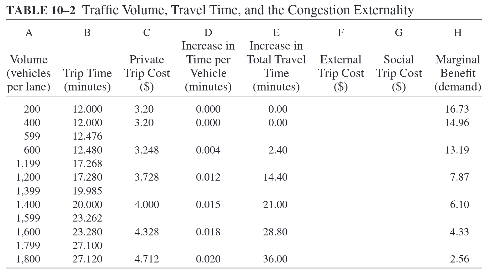

class: inverse, center, middle
  
```{R, setup, include = F}
options(htmltools.dir.version = FALSE)
pacman::p_load(
  broom, here, tidyverse, latex2exp, ggplot2, ggthemes, viridis, extrafont,
  gridExtra, kableExtra, dplyr, magrittr, knitr, parallel, tufte, emo, ggrepel,
  sf, hrbrthemes, lwgeom, maps, mapdata, spData, leaflet, huxtable, janitor,
  tidycensus
)
# Define colors
## source color script from local directory
## comment out and replace colors if user is not Andrew
source("~/Documents/scripts/colors/colors.R")
# XaringanExtra functions
## Tile view
xaringanExtra::use_tile_view()
## Scribble
xaringanExtra::use_scribble()
# Knitr options
opts_chunk$set(
  comment = "#>",
  fig.align = "center",
  fig.height = 7,
  fig.width = 10.5,
  warning = F,
  message = F
)
options(device = function(file, width, height) {
  svg(tempfile(), width = width, height = height)
})
# A simple theme for supply + demand curves
# A blank theme for ggplot
theme_empty <- theme_bw() + theme(
  line = element_blank(),
  rect = element_blank(),
  strip.text = element_blank(),
  axis.text = element_blank(),
  plot.title = element_blank(),
  axis.title = element_blank(),
  plot.margin = structure(c(0, 0, -0.5, -1), unit = "lines", valid.unit = 3L, class = "unit"),
  legend.position = "none"
)
theme_simple <- theme_bw() + theme(
  line = element_blank(),
  panel.grid = element_blank(),
  rect = element_blank(),
  strip.text = element_blank(),
  axis.text.x = element_text(size = 18, family = "STIXGeneral"),
  axis.text.y = element_blank(),
  axis.ticks = element_blank(),
  plot.title = element_blank(),
  axis.title = element_blank(),
  # plot.margin = structure(c(0, 0, -1, -1), unit = "lines", valid.unit = 3L, class = "unit"),
  legend.position = "none"
)
theme_axes_math <- theme_void() + theme(
  text = element_text(family = "MathJax_Math"),
  axis.title = element_text(size = 22),
  axis.title.x = element_text(hjust = .95, margin = margin(0.15, 0, 0, 0, unit = "lines")),
  axis.title.y = element_text(vjust = .95, margin = margin(0, 0.15, 0, 0, unit = "lines")),
  axis.line = element_line(
    color = "grey70",
    size = 0.25,
    arrow = arrow(angle = 30, length = unit(0.15, "inches")
  )),
  plot.margin = structure(c(1, 0, 1, 0), unit = "lines", valid.unit = 3L, class = "unit"),
  legend.position = "none"
)
theme_axes_serif <- theme_void() + theme(
  text = element_text(family = "MathJax_Main"),
  axis.title = element_text(size = 22),
  axis.title.x = element_text(hjust = .95, margin = margin(0.15, 0, 0, 0, unit = "lines")),
  axis.title.y = element_text(vjust = .95, margin = margin(0, 0.15, 0, 0, unit = "lines")),
  axis.line = element_line(
    color = "grey70",
    size = 0.25,
    arrow = arrow(angle = 30, length = unit(0.15, "inches")
  )),
  plot.margin = structure(c(1, 0, 1, 0), unit = "lines", valid.unit = 3L, class = "unit"),
  legend.position = "none"
)
theme_axes <- theme_void() + theme(
  text = element_text(family = "Fira Sans Book"),
  axis.title = element_text(size = 18),
  axis.title.x = element_text(hjust = .95, margin = margin(0.15, 0, 0, 0, unit = "lines")),
  axis.title.y = element_text(vjust = .95, margin = margin(0, 0.15, 0, 0, unit = "lines")),
  axis.line = element_line(
    color = grey_light,
    size = 0.25,
    arrow = arrow(angle = 30, length = unit(0.15, "inches")
  )),
  plot.margin = structure(c(1, 0, 1, 0), unit = "lines", valid.unit = 3L, class = "unit"),
  legend.position = "none"
)
theme_curves <- theme_ipsum() + theme(axis.line = element_line(),
        panel.grid.minor = element_blank())
```


# Lecture 14: Automobiles

---
class: inverse, middle
# Schedule

.pull-left[
.ul[.bigger[.hi-gold[Today:]]]

.hi-white[(i). US automobile use]

.hi-white[(ii). Externalities]

.hi-white[(iii). Congestion Pricing]

]

--

.pull-right[
.ul[.bigger[.hi-gold[Upcoming:]]]

  - .hi-white[Reading:] (Chapter 8)
  
  - .hi-white[Book Report:] Due August 15
  
  - .hi-white[PS02:] Due August 15
  
]

---
# Automobile use data

---
# Auto use in the US

.pull-left[

]

--

.pull-right[
.hi[Facts about American auto use:]
- 88 percent of commuters use the car
- Only 5 percent of commuters use public transit at the national level
- Only 2 metro areas have public transit use above 10 percent
  - NYC
  - Chicago]


---
# Vehicle Miles Traveled

*iframe src="https://fred.stlouisfed.org/graph/graph-landing.php?g=FW1b&width=800&height=475" scrolling="no" frameborder="0" style="overflow:hidden; "target=_self"; width:800px; height:525px;" allowTransparency="true" loading="lazy"></iframe>

---

# US: People like Cars

*iframe src="https://ourworldindata.org/grapher/road-vehicles-per-1000-inhabitants-vs-gdp-per-capita" loading="lazy" style="width: 100%; height: 500px; "target=_self"; border: 0px none;"></iframe>

---
# Carbon Emissions

*iframe src="https://ourworldindata.org/grapher/road-vehicles-per-1000-inhabitants-vs-gdp-per-capita" loading="lazy" style="width: 100%; "target=_self"; height: 500px; border: 0px none;"></iframe>

---
# Climate crisis

A recent [UN scientific report](https://www.ipcc.ch/report/ar6/wg1/#SPM) leaves no doubt that humans are responsible for the current climate crisis

--

Increased frequency of extreme weather including:

.pull-left[
- Wildfires
- Winter storms
- Hurricanes]
.pull-right[
- Heat waves
- Floods
- Droughts
]

--

Other consequences include:

.pull-left[
- Mass extinctions
- Changes in ocean currents]
.pull-right[
- Loss of habitat (reefs, rainforest, ice sheets)
- Sea level rise
]

---
# Climate crisis


---
# Carbon emissions

*iframe src="https://ourworldindata.org/grapher/co-emissions-per-capita?tab=chart&country=USA~BRA~Europe+%28excl.+EU-27%29~IND~RUS~CHN~JPN" loading="lazy" style="width: 100%; "target=_self"; height: 500px; border: 0px none;"></iframe>

---


# Carbon emissions

*iframe src="https://ourworldindata.org/grapher/annual-co2-emissions-per-country?tab=chart&country=USA~CHN~EU-28~IND~RUS~JPN~BRA" loading="lazy" style="width: 100%; height: 500px; "target=_self"; border: 0px none;"></iframe>

---
# Policy questions


--
  
.center[.hi[Currently per capita CO2 emissions in develping countries skyrocket?]]

--
  
.center[.hii[The future of global carbon emissions depends heavily on how car ownership rates evolve in China and other emerging economies]]

--

<br>

.center[.hi[How do we reduce CO2 per capita emissions?]]

--

.center[.hii[What axiom can we apply to improve our understanding of usage?]]

--

.center[.hi[Do drivers fully internalize the costs of CO2 emissions?]]

---
class: inverse, middle
# Externalities

---

# Externalities

.hi[Recall Axoim 3:] .hii[Externalities cause inefficiency]

--

What are some externalities from driving?

--
.pull-left[
- Congestion
- Environmental Damage
- Collisions]
.pull-right[
- Blight (parking lots instead of parks)
- Noise Pollution]

--

.hi[How costly is congestion?]

Typical commuter spends .hi[47 hours per year] in traffic
- Very high in some metro areas (LA: 93, SF: 72, Atlanta: 67)
- Estimated gasoline cost due to congestion delays: .hi[5 billion per year]
- Time + Gas cost estimate: .hi[63 billion per year]


---
# Externalities

--

.smallerer[
.hi[.ul[Definition:] Marginal Social Cost] (MSC)
> Added cost to _society_ from one extra unit of production/consumption

.hi[Note:] $MSC \neq  MC$
]

--

.smallerer[.hi[.ul[Definition:] Marginal Private Cost] (MPC)

> Added cost to _agent_ from one extra unit of production/consumption

.hi[MSC is the marginal cost (private) plus the marginal external cost (social)]
]

--

.smallerer[
.hi[.ul[Definition:] Marginal Social Benefit] (MSB)

> Added benefit to _society_ from one extra unit of production

]

--

.smallerer[
.hi[.ul[Definition:] Marginal Private Benefit] (MPB)


19 / 34

> Added benefit to _society_ from one extra unit of production

]

---
# Externalities: Example

Consider the market for .hi[gasoline]

--

Using gasoline in cars causes air pollution and generates greenhouse gases

--

Gasoline producers pays its input suppliers and workers but does not consider the external costs to society
- MSC > MPC

---

# Congestion externalities

Let's start by assuming the only externality from driving is congestion

.hi[Consider a commute within a metro area with the following characteristics:]
- Distance ( $d$ ): Let the commute distance be 10 miles $d = 10$
- Monetary travel cost ( $m$ ): Monetary costs are \$0.2 per mile $m = 0.2$
- Time cost ( $c$ ): Opportunity cost of time is \$0.1 per minute $c = 0.1$

--

Thus the total cost of the trip is $(m + c)\cdot 10$

---
# Congestion externalities

.center[

]

---
# Congestion externalities

--

.center[

]

---
class: inverse, middle
# Congestion pricing

---
# Congestion pricing

How do we fix .hi[Congestion?]

--

.hii[Popular Answer:] Build more roads

--
  
Building more roads $\Rightarrow$ more space for cars $\Rightarrow$ congestion will decrease

--

.qa[Q]: What assumption must we make when stating

.center["_building roads will reduce congestion_"]

--

.qa[A]: The number of drivers will remain the same after the road is built

--

.hi[Is this true?]

---
# My nightmare: LA Traffic 


---
# Congestion pricing: Cost incentives

Obvious when we think about the incentives of drivers

--

.hi[(i).] People avoid driving because it is costly
- Time cost
- Gas cost
- Matinence cost

--

.hi[(ii).] Building a new road makes it less costly
- Time cost $\downarrow$

--

.hi[(iii).] On the .hi[margin], people will start to drive when the new road is built

---
# Tangent: How do traffic jams start?

What actually causes congestion/traffic?


--

<center>

*iframe width="560" height="315" src="https://www.youtube.com/embed/7wm-pZp_mi0" title="YouTube video player" frameborder="0" allow="accelerometer; autoplay; clipboard-write; encrypted-media; gyroscope; picture-in-picture" allowfullscreen></iframe>

</center>

[Overbreaking](https://youtu.be/iHzzSao6ypE)

---
# Externalities: Pigouvian taxes

Roads: Not a great solution. Better idea?

--

No more monkies driving on the roads? Tech isnt there yet.

--

.center[.hi[Pigouvian taxes]]

--

.hi[Main insight:] 

The social cost of driving exceeds private cost

So how can we raise the MPC such that $MPC = MSC$

--

.center[.hi[How can we do this?] .hii[Tax them.]]

--

The pigouvian tax specific to reducing road congestion is .hi[congestion pricing]
  
---
# Externalities: Pigouvian taxes

Many cities across the globe have enacted or are planning to enact congestion pricing

.pull-left[
- London
- Singapore
- Milan]
.pull-right[
- Stockholm
- Bejing
- NYC, LA, SF (coming soon)
]

--

.hi[Results:]

Following enactment of congestion pricing in London:

- Traffic was reduced by 15%
- Reduced travel times in the city by 30%

---
# Congestion pricing: London

.center[

]

---
# Congestion pricing: London

.center[

]

---
# Congestion pricing: London

.center[

]

---


# Model with Pigouvian Taxes


---

# Peak vs. Off Period Taxes


---
# Mechanisms

Model demonstrated congestion taxes reduce traffic volume. How?

--

.hi[(i).] Modal substition: switch to carpool, public transit

--

.hi[(ii).] Switch to off-peak travel

--

.hi[(ii).] Switch route

--

.hi[(iv).] Location decisions: change residence or workplace


---
# Discussion

Congestion taxes sound like a good idea, right? What are the problems?

--

- Roads aren't always congested. So tax needs to be time-varying. Gets very complicated

- Are all autos charged the same amount (semis and prius?)

--

How can this idea be adapted to combat the .hi[climate crisis?]

--

.center[.hii[Put a tax on carbon]]
 


