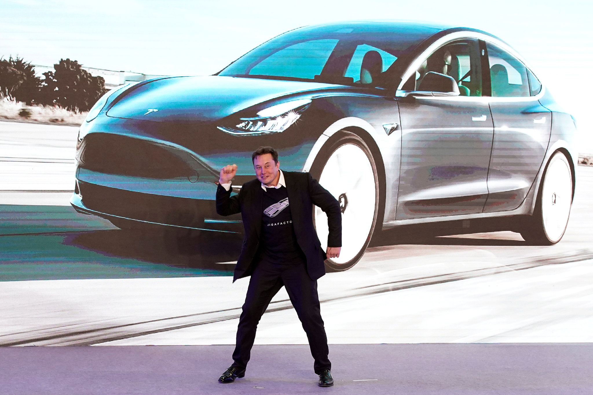
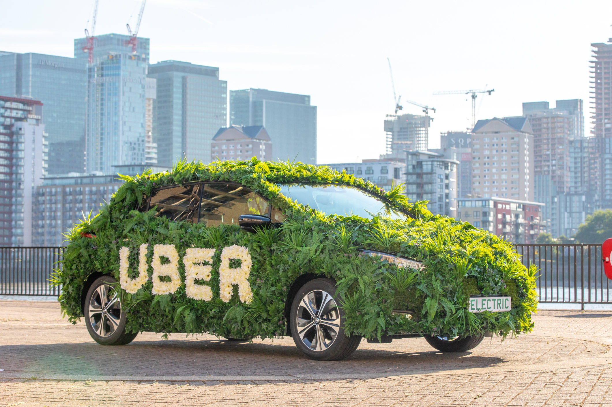

class: inverse, center, middle
  
```{R, setup, include = F}
options(htmltools.dir.version = FALSE)
pacman::p_load(
  broom, here, tidyverse, latex2exp, ggplot2, ggthemes, viridis, extrafont,
  gridExtra, kableExtra, dplyr, magrittr, knitr, parallel, tufte, emo, ggrepel,
  sf, hrbrthemes, lwgeom, maps, mapdata, spData, leaflet, huxtable, janitor,
  tidycensus
)
# Define colors
## source color script from local directory
## comment out and replace colors if user is not Andrew
source("~/Documents/scripts/colors/colors.R")
# XaringanExtra functions
## Tile view
xaringanExtra::use_tile_view()
## Scribble
xaringanExtra::use_scribble()
# Knitr options
opts_chunk$set(
  comment = "#>",
  fig.align = "center",
  fig.height = 7,
  fig.width = 10.5,
  warning = F,
  message = F
)
options(device = function(file, width, height) {
  svg(tempfile(), width = width, height = height)
})
# A simple theme for supply + demand curves
# A blank theme for ggplot
theme_empty <- theme_bw() + theme(
  line = element_blank(),
  rect = element_blank(),
  strip.text = element_blank(),
  axis.text = element_blank(),
  plot.title = element_blank(),
  axis.title = element_blank(),
  plot.margin = structure(c(0, 0, -0.5, -1), unit = "lines", valid.unit = 3L, class = "unit"),
  legend.position = "none"
)
theme_simple <- theme_bw() + theme(
  line = element_blank(),
  panel.grid = element_blank(),
  rect = element_blank(),
  strip.text = element_blank(),
  axis.text.x = element_text(size = 18, family = "STIXGeneral"),
  axis.text.y = element_blank(),
  axis.ticks = element_blank(),
  plot.title = element_blank(),
  axis.title = element_blank(),
  # plot.margin = structure(c(0, 0, -1, -1), unit = "lines", valid.unit = 3L, class = "unit"),
  legend.position = "none"
)
theme_axes_math <- theme_void() + theme(
  text = element_text(family = "MathJax_Math"),
  axis.title = element_text(size = 22),
  axis.title.x = element_text(hjust = .95, margin = margin(0.15, 0, 0, 0, unit = "lines")),
  axis.title.y = element_text(vjust = .95, margin = margin(0, 0.15, 0, 0, unit = "lines")),
  axis.line = element_line(
    color = "grey70",
    size = 0.25,
    arrow = arrow(angle = 30, length = unit(0.15, "inches")
  )),
  plot.margin = structure(c(1, 0, 1, 0), unit = "lines", valid.unit = 3L, class = "unit"),
  legend.position = "none"
)
theme_axes_serif <- theme_void() + theme(
  text = element_text(family = "MathJax_Main"),
  axis.title = element_text(size = 22),
  axis.title.x = element_text(hjust = .95, margin = margin(0.15, 0, 0, 0, unit = "lines")),
  axis.title.y = element_text(vjust = .95, margin = margin(0, 0.15, 0, 0, unit = "lines")),
  axis.line = element_line(
    color = "grey70",
    size = 0.25,
    arrow = arrow(angle = 30, length = unit(0.15, "inches")
  )),
  plot.margin = structure(c(1, 0, 1, 0), unit = "lines", valid.unit = 3L, class = "unit"),
  legend.position = "none"
)
theme_axes <- theme_void() + theme(
  text = element_text(family = "Fira Sans Book"),
  axis.title = element_text(size = 18),
  axis.title.x = element_text(hjust = .95, margin = margin(0.15, 0, 0, 0, unit = "lines")),
  axis.title.y = element_text(vjust = .95, margin = margin(0, 0.15, 0, 0, unit = "lines")),
  axis.line = element_line(
    color = grey_light,
    size = 0.25,
    arrow = arrow(angle = 30, length = unit(0.15, "inches")
  )),
  plot.margin = structure(c(1, 0, 1, 0), unit = "lines", valid.unit = 3L, class = "unit"),
  legend.position = "none"
)
theme_curves <- theme_ipsum() + theme(axis.line = element_line(),
        panel.grid.minor = element_blank())
```


# Lecture XVI: Automobiles, continued

---


name: schedule
# Schedule

## Today

--

1) .hi.purple[Collisions]

2) .hi.purple[Energy-Efficient Vehicles (EEVs)]


--

--


---


# Externalities:

## Last time:

0. People in the US own a lot of cars

---


count: false

# Externalities:

## Last time:

0. People in the US own a lot of cars

1. Many externalities from driving

2. Congestion and solutions

---


count: false

# Externalities:

## Last time:

0. People in the US own a lot of cars

1. Many externalities from driving

2. Congestion and solutions

## Today

  - Collisions
  


---


count: false

# Externalities:

## Last time:

0. People in the US own a lot of cars

1. Many externalities from driving

2. Congestion and solutions

## Today

  - Collisions
  
  - Energy Efficient Vehicle Subsidies (and why we care about them in Urban Econ)


---


# Cost of Collisions

## Direct Costs 


---


count: false
# Cost of Collisions

## Direct Costs 

  - 3.1 million injuries

  - 40,000 deaths

  - $300 billion


---


count: false
# Cost of Collisions

## Direct Costs 

  - 3.1 million injuries

  - 40,000 deaths

  - $300 billion


## Indirect Costs 

- .hi[External costs] (via congestion)


---


count: false
# Cost of Collisions

## Direct Costs 

  - 3.1 million injuries

  - 40,000 deaths

  - $300 billion


## Indirect Costs 

- .hi[External costs] (via congestion)

- 4.4 cents per mile

- 5 billion USD lost from accident delays (estimated)


---


# Vehicle Safety Act of 1966

VSA of 66 mandated all vehicles include:


---


count: false
# Vehicle Safety Act of 1966

VSA of 66 mandated all vehicles include:


1. Seat belts

2. Head Restraints

---


count: false
# Vehicle Safety Act of 1966

VSA of 66 mandated all vehicles include:


1. Seat belts

2. Head Restraints

3. Shatter-proof windshields

4. Collapsible steering column


---


count: false
# Vehicle Safety Act of 1966

VSA of 66 mandated all vehicles include:


1. Seat belts

2. Head Restraints

3. Shatter-proof windshields

4. Collapsible steering column


__Question:__ What changes in behavior should we expect? .hi.puprle[Discuss]

---


# Vehicle Safety Act of 1966

## Consequences

1. Only a small reduction in death rates from automobile collisions


---


count: false
# Vehicle Safety Act of 1966

## Consequences

1. Only a small reduction in death rates from automobile collisions

2. Rate at which collisions occurred increased


---


count: false
# Vehicle Safety Act of 1966

## Consequences

1. Only a small reduction in death rates from automobile collisions

2. Rate at which collisions occurred increased

3. Death rate for pedestrians and bicyclists increased


---


count: false
# Vehicle Safety Act of 1966

## Consequences

1. Only a small reduction in death rates from automobile collisions

2. Rate at which collisions occurred increased

3. Death rate for pedestrians and bicyclists increased


__Question__: Should we be surprised? Why might this have happened? .hi.purple[Discuss]

---


# Vehicle Safety Act of 1966

These consequences are indeed foreseeable. What happened?


---


count: false
# Vehicle Safety Act of 1966

These consequences are indeed foreseeable. What happened?

 - Marginal cost of driving recklessly decreased
  

---


count: false
# Vehicle Safety Act of 1966

These consequences are indeed foreseeable. What happened?

- Marginal cost of driving recklessly decreased
  
  - Conditional on being in an accident, you were now more likely to survive
    


---


count: false
# Vehicle Safety Act of 1966

These consequences are indeed foreseeable. What happened?

- Marginal cost of driving recklessly decreased
  
  - Conditional on being in an accident, you were now more likely to survive
    
  - So more people drove recklessly, then everything else follows (more accidents, more peds/bicyclists killed)


---


#VSA: Graph


```{R, vsa, echo=F,fig.height = 5, fig.width = 8, dev = "svg", cache=T}

mc_pre <- function(x) 5+2*x
mc_post <- function(x) 5+x
mb <- function(x) 10 - x

ggplot(data.frame(x=c(0, 8)), aes(x)) +
  stat_function(fun=mc_pre, col = "purple")+
  stat_function(fun=mb)+
  ggthemes::theme_pander()+
  geom_vline(xintercept =0)+
  geom_hline(yintercept =0)+
  labs(x = "Speed", y=  "Cost")
  

```
.hi.purple[MC no VSA]
---


count: false
#VSA: Graph


```{R, vsa3, echo=F,fig.height = 5, fig.width = 8, dev = "svg", cache=T}

mc_pre <- function(x) 5+2*x
mc_post <- function(x) 5+x
mb <- function(x) 10 - x

ggplot(data.frame(x=c(0, 8)), aes(x)) +
  stat_function(fun=mc_pre, col = "purple")+
  stat_function(fun=mc_post, col = red_pink)+
  stat_function(fun=mb)+
  ggthemes::theme_pander()+
  geom_vline(xintercept =0)+
  geom_hline(yintercept =0)+
  labs(x = "Speed", y=  "Cost")
  

```
.hi.purple[MC no VSA]
.hi[MC VSA]

---


# So what?

So what can we do? 


---


count: false
# So what?

So what can we do? 

## Pigou strikes again


---


count: false
# So what?

So what can we do? 

## Pigou strikes again

  - Vehicle miles traveled (VMT) tax: tax per mile driven
  


---


count: false
# So what?

So what can we do? 

## Pigou strikes again

  - Vehicle miles traveled (VMT) tax: tax per mile driven
  
  - Include external collision cost per mile
  
  - Shuts down gap between social cost and private cost of driving


---


# Pigou strikes again: Graph


```{R, pigou, echo=F,fig.height = 5, fig.width = 8, dev = "svg", cache=T}


s_1 = function(x) 4
s_2 = function(x) 4.5
demand = function(x) 6 - x


ggplot(data.frame(x=c(0, 3)), aes(x)) +
  stat_function(fun=s_1, col = "purple")+
  stat_function(fun=s_2, col = red_pink)+
  stat_function(fun=demand)+
  ggthemes::theme_pander()+
  geom_vline(xintercept =0)+
  geom_hline(yintercept =0)+
  labs(x = "Miles", y = "Accident Cost (dollars)")+
  geom_segment(aes(x = 1.5, xend = 1.5, y= 0, yend = 4.5), linetype = "dashed")+
  geom_segment(aes(x = 2, xend = 2, y= 0, yend = 4), linetype = "dashed")+
  annotate(x = .5, y = 4.1, label = "Marginal Private Cost","text")+
  annotate(x = .5, y = 4.6, label = "Marginal Social Cost", "text")

  

```

- Marginal external cost is gap between MSC and MPC. 
- Pigouvian tax: set tax equal to size of gap. e,g: MPC + tax = MSC

---


class: inverse, middle
# Checklist

.col-left[
1) .hi[Collisions] `r emo::ji("check")`


2) .hi.purple[EEVs] 

]


---


# Carbon Emissions

Last externality we will discuss:


--

## Carbon Emissions from Driving

--

  - Solutions: 
  
    1. Energy Efficient Vehicle (EEVs) Subsidies
    
    2. Gasoline (or carbon) tax
    
    3. VMT tax


---


#EEVs


```{R, musk, out.width = "90%", out.height = "90%", echo = F}

```


---


#EEVs


```{R, uber, out.width = "90%", out.height = "90%", echo = F}

```


---


# EEVs

So what's all the hype?


---


count: false
# EEVs

So what's all the hype?

- Energy-efficient vehicles consume less gasoline per mile traveled 

 

---


count: false
# EEVs

So what's all the hype?

- Energy-efficient vehicles consume less gasoline per mile traveled 

  - Private fixed cost is usually higher, but variable cost is lower
    


---


count: false
# EEVs

So what's all the hype?

- Energy-efficient vehicles consume less gasoline per mile traveled 

  - Private fixed cost is usually higher, but the variable cost is lower
    
    - e.g. Sticker price for EEV is more, but cheaper to drive
    


---


count: false
# EEVs

So what's all the hype?


- Energy-efficient vehicles consume less gasoline per mile traveled 

  - Private fixed cost is usually higher, but the variable cost is lower
    
    - e.g. Sticker price for EEV is more, but cheaper to drive
    
  - Social cost is lower (fewer carbon emissions per mile driven)


---

# EEVs

.hi.purple[Question]: If an individual switches from an SUV to a prius, will their carbon emissions from driving fall? .hi.purple[Discuss]


--

_Key Assumption_: We can be certain carbon emissions fall if the individual drives the same amount with both cars

  - Is this a reasonable thing to assume?

--

- Probably not, as the cost per mile driven is less than the SUV

---

# EEVs

__Key Insight__:

--

<center>
<font size="15"> People drive more when it becomes cheaper to do so </font>
</center>

--

.hi.purple[Questions]: 

  1. What happens to congestion if we subsidize electric/hybrid vehicles? 
  2. What happens to carbon emissions?

---


# EEVs: Congestion Graph


---

# EEVs: Subsidy Graph


---


# EEVs: Carbon Emissions

Predicting carbon emissions is tougher


---


count: false
# EEVs: Carbon Emissions

Predicting carbon emissions is tougher

1. If we subsidize .hi[hybrid vehicles]

  - Lower $CO_2$/mile but more miles...so unclear
  


---


count: false
# EEVs: Carbon Emissions

Predicting carbon emissions is tougher

1. If we subsidize .hi[hybrid vehicles]

  - Lower $CO_2$/mile but more miles...so unclear
  
2. If we subsidize .hi[electric vehicles]

  - Depends where electricity comes from
  
    - Some electricity is very $CO_2$ intensive, others not


---


count: false
# EEVs: Carbon Emissions

Predicting carbon emissions is tougher

1. If we subsidize .hi[hybrid vehicles]

  - Lower $CO_2$/mile but more miles...so unclear
  
2. If we subsidize .hi[electric vehicles]

  - Depends where electricity comes from
  
    - Some electricity is very $CO_2$ intensive, others not


In either case: what key __elasticity__ might you be interested in knowing to answer this question?


---


# EEVs: Carbon Emissions

Want 1. miles driven to the price of hybrid vehicles and 2. Average carbon emissions of all vehicles driven to a change in the price of EEVs

.hi.slate[Example]: 


---


count: false
# EEVs: Carbon Emissions

Want 1. miles driven to the price of hybrid vehicles and 2. Average carbon emissions of all vehicles driven to a change in the price of EEVs

.hi.slate[Example]: 

- Suppose $\varepsilon_{\text{miles,price EEV}} = -3$

  - As the price of a hybrid falls by 1%, the miles driven increases by 3%

---


count: false
# EEVs: Carbon Emissions

Want 1. miles driven to the price of hybrid vehicles and 2. Average carbon emissions of all vehicles driven to a change in the price of EEVs

.hi.slate[Example]: 

- Suppose $\varepsilon_{\text{miles,price EEV}} = -3$

  - As the price of a hybrid falls by 1%, the miles driven increases by 3%
  
  - We are saying people will drive more in EEVs relative to regular cars. Price falls, more people buy/drive EEVs so total mileage goes up
  
- Assume $\varepsilon_{\text{CEPM ,price EEV}} = .1$: CEPM is __C__arbon __E__missions __P__er __M__ile

  -


---


count: false
# EEVs: Carbon Emissions

Want 1. miles driven to the price of hybrid vehicles and 2. Average carbon emissions of all vehicles driven to a change in the price of EEVs

.hi.slate[Example]: 

- Suppose $\varepsilon_{\text{miles,price EEV}} = -3$

  - As the price of a hybrid falls by 1%, the miles driven increases by 3%
  
  - We are saying people will drive more in EEVs relative to regular cars. Price falls, more people buy/drive EEVs so total mileage goes up
  
- Assume $\varepsilon_{\text{CEPM ,price EEV}} = .1$: CEPM is __C__arbon __E__missions __P__er __M__ile

  - Why is the sign different (+)? Price of eev falls $\implies$ more people drive EEVs $\implies$ average carbon intensity of cars on road fall (so they move in the same direction)

---


# Example, continued

Ok, so we had $\varepsilon_{\text{miles,price EEV}} = -3$, and $\varepsilon_{\text{CEPM ,price EEV}} = 1$


---


count: false
# Example, continued

Ok, so we had $\varepsilon_{\text{miles,price EEV}} = -3$, and $\varepsilon_{\text{CEPM ,price EEV}} = 1$

.qa[Question]: Before an EEV subsidy, the total miles driven in a city was 1000 and the carbon emissions per mile is 2 lbs.

---


count: false
# Example, continued

Ok, so we had $\varepsilon_{\text{miles,price EEV}} = -3$, and $\varepsilon_{\text{CEPM ,price EEV}} = 1$

.qa[Question]: Before an EEV subsidy, the total miles driven in a city was 1000 and the carbon emissions per mile are 2 lbs.

  - What happens to overall emissions when the government subsidizes EEV's leading to a 1% decrease in the equilibrium price?
  

---


count: false
# Example, continued

Ok, so we had $\varepsilon_{\text{miles,price EEV}} = -3$, and $\varepsilon_{\text{CEPM ,price EEV}} = 1$

.qa[Question]: Before an EEV subsidy, the total miles driven in a city was 1000 and the carbon emissions per mile are 2 lbs.

  - What happens to overall emissions when the government subsidizes EEV's leading to a 1% decrease in the equilibrium price?
  
__Total Emissions Prior__: $1000*2 = 2000 \text{lbs}$


---


count: false
# Example, continued

Ok, so we had $\varepsilon_{\text{miles,price EEV}} = -3$, and $\varepsilon_{\text{CEPM ,price EEV}} = 1$

.qa[Question]: Before an EEV subsidy, the total miles driven in a city was 1000 and the carbon emissions per mile are 2 lbs.

  - What happens to overall emissions when the government subsidizes EEV's leading to a 1% decrease in the equilibrium price?
  
__Total Emissions Prior__: $1000*2 = 2000 \text{lbs}$

- Miles after: $1000*1.03 =  1,030$ (price goes down so miles go up)
---


count: false
# Example, continued

Ok, so we had $\varepsilon_{\text{miles,price EEV}} = -3$, and $\varepsilon_{\text{CEPM ,price EEV}} = 1$

.qa[Question]: Before an EEV subsidy, the total miles driven in a city was 1000 and the carbon emissions per mile are 2 lbs.

  - What happens to overall emissions when the government subsidizes EEV's leading to a 1% decrease in the equilibrium price?
  
__Total Emissions Prior__: $1000*2 = 2000 \text{lbs}$

- Miles after: $1000*1.03 =  1,030$ (price goes down so miles go up)

- Emissions per mile after: $2*.99 = 1.98$


---


count: false
# Example, continued

Ok, so we had $\varepsilon_{\text{miles,price EEV}} = -3$, and $\varepsilon_{\text{CEPM ,price EEV}} = 1$

.qa[Question]: Before an EEV subsidy, the total miles driven in a city was 1000 and the carbon emissions per mile are 2 lbs.

  - What happens to overall emissions when the government subsidizes EEV's leading to a 1% decrease in the equilibrium price?
  
__Total Emissions Prior__: $1000*2 = 2000 \text{lbs}$

- Miles after: $1000*1.03 =  1,030$ (price goes down so miles go up)

- Emissions per mile after: $2*.99 = 1.98$

__Total Emissions Post__: $1,030 * 1.98 = 2,039.4 \text{lbs}$

So total emissions went _up_ `r emo::ji("exploding_head")` (in this example)

---


# Evidence


Newer evidence of distributional concerns over EEV subsidies<sup>.hi[†]</sup>

.footnote[
.hi[†] This comes from a study done by [Holland et. al](https://www.nber.org/papers/w21291)

]

---


count: false
# Evidence


Newer evidence of distributional concerns over EEV subsidies<sup>.hi[†]</sup>

.footnote[
.hi[†] This comes from a study done by [Holland et. al](https://www.nber.org/papers/w21291)

]

__Basic idea__: energy demand increases, but gasoline demand falls


---


count: false
# Evidence


Newer evidence of distributional concerns over EEV subsidies<sup>.hi[†]</sup>

.footnote[
.hi[†] This comes from a study done by [Holland et. al](https://www.nber.org/papers/w21291)
]

__Basic idea__: energy demand increases, but gasoline demand falls

- Poorer individuals live near power plants (negative amenity)


---


count: false
# Evidence

Newer evidence of distributional concerns over EEV subsidies<sup>.hi[†]</sup>

.footnote[
.hi[†] This comes from a study done by [Holland et. al](https://www.nber.org/papers/w21291)
]

__Basic idea__: energy demand increases, but gasoline demand falls

- Poorer individuals live near power plants (negative amenity)

- Higher electricity demand deteriorates air quality around power plants

  - will vary by type of plant. If you have clean energy, this isn't a concern


---


count: false
# Evidence


Newer evidence of distributional concerns over EEV subsidies<sup>.hi[†]</sup>

.footnote[
.hi[†] This comes from a study done by [Holland et. al](https://www.nber.org/papers/w21291)

]

__Basic idea__: energy demand increases, but gasoline demand falls

- Poorer individuals live near power plants (negative amenity)

- Higher electricity demand deteriorates air quality around power plants

  - will vary by type of plant. If you have clean energy, this isn't a concern


---


class: inverse, middle
# Checklist

.col-left[
1) .hi[Collisions] `r emo::ji("check")`


2) .hi[EEVs] `r emo::ji("check")`

]


---

exclude: true

<!-- --- -->
<!-- exclude: true -->

<!-- ```{R, generate pdfs, include = F} -->
<!-- system("decktape remark 02_goodsmarket_part1.html 02_goodsmarket_part1.pdf --chrome-arg=--allow-file-access-from-files") -->
<!-- ``` -->


